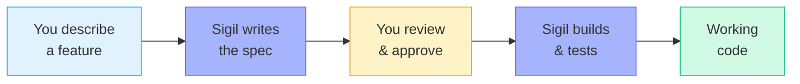
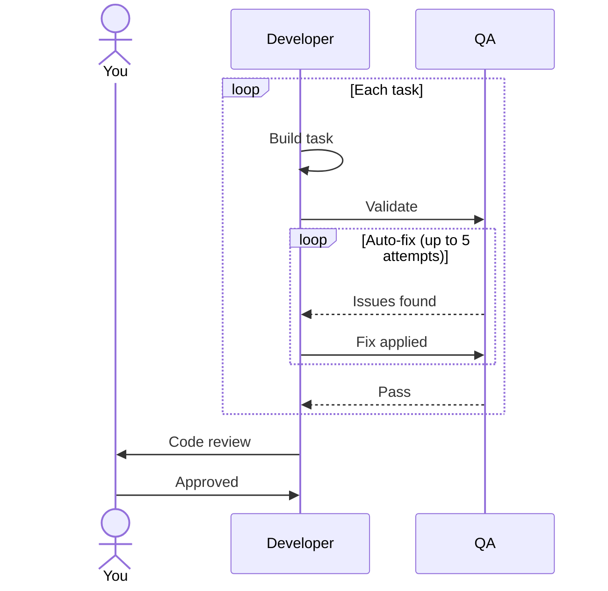
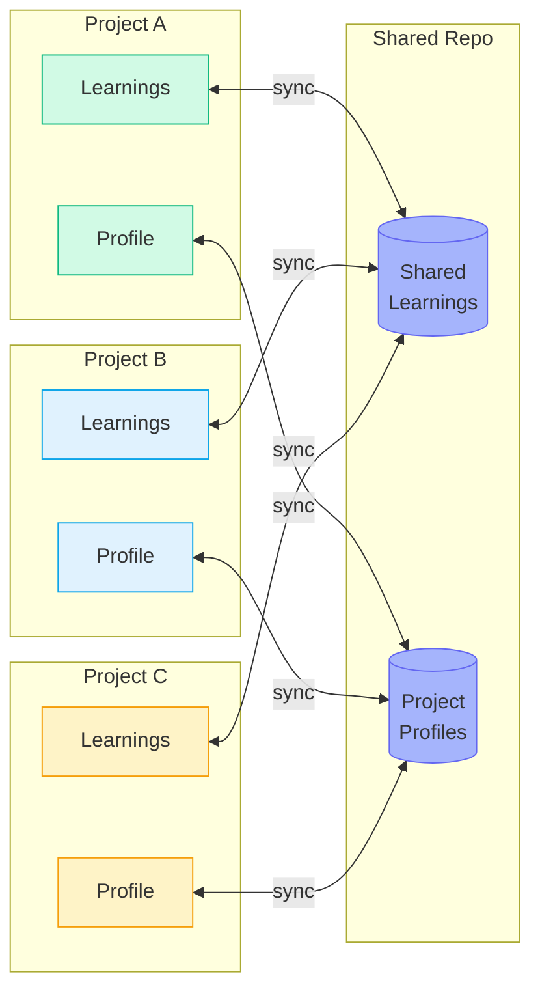

# Sigil OS

**Inscribe it. Ship it.**

**Specification-driven development for Claude Code — built for product managers, works for engineers too.**

Sigil is a plugin for Claude Code, Anthropic's AI coding tool. Transform natural language descriptions into implemented, tested features through structured workflows.

> **v0.23.1** · Active development — expect breaking changes between minor versions.

---

## What Is Sigil?

Sigil is like having a technical team that speaks your language. You describe what you want to build in plain English, and Sigil's agents write specs, plan implementation, and generate code — with checkpoints along the way where you review and approve before anything ships. Simple requests get fast-tracked; complex ones get full specification-and-review workflows automatically.



### Two Ways to Work

Sigil adapts to how you think. During setup, you pick a track that shapes the entire experience.

| | Non-Technical (default) | Technical |
|---|---|---|
| **Best for** | Product managers, founders, solo builders | Engineers, tech leads |
| **Communication** | Plain English, no jargon | Agent names, file paths, trade-offs |
| **Technical decisions** | Handled automatically | Surfaced for your input |
| **Progress** | "3 of 8 steps done" | "T003/T008 implementing (api-developer)" |
| **Specialists** | Work silently in the background | Named in output so you can see who's doing what |

Switch anytime with `/sigil-config set user_track technical` (or `non-technical`). Your track is a personal setting — it won't affect your teammates.

---

## Installation

Sigil requires Claude Code with a Pro, Max, or API plan. See [Anthropic's setup guide](https://docs.anthropic.com/en/docs/claude-code) to install Claude Code if you haven't already.

Once Claude Code is installed, add Sigil:

```bash
claude plugin marketplace add araserel/sigil-os
```

```bash
claude plugin install sigil@sigil-os
```

Verify it worked:

```bash
claude plugin list
```

You should see `sigil` in the list.

Something not working? See the [Troubleshooting Guide](sigil-plugin/docs/troubleshooting.md).

**Quick checklist:**

- [ ] `claude --version` shows a version number
- [ ] `claude plugin list` shows `sigil`
- [ ] `/sigil status` shows the Sigil dashboard

---

## Quick Start

After installing the plugin, set up your first project in four commands:

```
cd your-project
claude
/sigil-setup
/sigil "Add a contact form with email validation"
```

`/sigil-setup` creates your project's constitution (rules that guide Sigil), optionally generates a project profile, and configures enforcement. You only run it once per project.

`/sigil "..."` starts building. Sigil assesses complexity, selects the right workflow track, and assigns specialized agents to handle specification, planning, implementation, and review.

See the [Quick Start Guide](sigil-plugin/docs/quick-start.md) for a detailed walkthrough.

### How the Build Loop Works

Once Sigil starts building, each task goes through a validate-and-fix cycle before moving on. After all tasks pass, you review the final result.



---

## Commands

### Core

| Command | Purpose |
|---------|---------|
| `/sigil` | Show status and menu |
| `/sigil "description"` | Start building a feature |
| `/sigil continue` | Resume where you left off |
| `/sigil help` | Show all commands |

### Setup & Configuration

| Command | Purpose |
|---------|---------|
| `/sigil-setup` | Initialize Sigil in a new project |
| `/sigil-config` | View or change configuration (track, mode) |
| `/sigil-constitution` | View or edit project rules |
| `/sigil-profile` | Generate or view project profile |
| `/sigil-connect` | Link project to shared context repo |

### Utilities

| Command | Purpose |
|---------|---------|
| `/sigil-handoff` | Generate engineer review package |
| `/sigil-learn` | View, search, or review learnings |
| `/sigil-update` | Check for plugin updates |

See the [Command Reference](sigil-plugin/docs/command-reference.md) for detailed usage.

### Sharing Context Across Projects

Connect multiple projects to a shared GitHub repo. Learnings and project profiles sync automatically so each project benefits from what the others have learned.



See the [Shared Context Setup Guide](sigil-plugin/docs/shared-context-setup.md) to get started.

---

## Documentation

- [Quick Start Guide](sigil-plugin/docs/quick-start.md)
- [User Guide](sigil-plugin/docs/user-guide.md)
- [Command Reference](sigil-plugin/docs/command-reference.md)
- [Shared Context Setup](sigil-plugin/docs/shared-context-setup.md) — share learnings and context across multiple repositories

### Migrating from Global Install?

If you previously used `install-global.sh`, see the [Migration Guide](sigil-plugin/docs/migration-from-global.md).

---

## Development

See [CLAUDE.md](CLAUDE.md) for development instructions, repository structure, and contributing guidelines.

---

Built for [Claude Code](https://www.anthropic.com/claude-code) by Anthropic.
