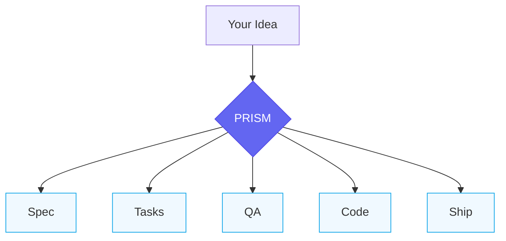

# Prism

**One idea. Clear outcomes.**



Like light through a prism, your single idea separates into clear, actionable parts — specifications, tasks, quality checks, working code. Each output distinct. Nothing lost in translation.

---

## What It Does

Prism bridges the gap between business requirements and working code:

```
Your idea → Structured spec → Implementation plan → Working code
```

You describe what you want in plain English. Prism's AI agents transform that into engineering-ready specifications, implementation plans, and coordinated development tasks — with human checkpoints at every critical decision.

---

## Who It's For

**Primary users:** Product Managers, Product Owners, business analysts — anyone who knows *what* to build but not *how* to code it.

**How it helps:**
- Write specs without knowing technical details
- Get clear visibility into what's being built
- Stay in control with plain-English summaries at each stage
- Hand off to engineers only when needed (not for routine decisions)

---

## Quick Example

```
You: "Users should be able to reset their password via email"

Prism:
  1. Clarifies requirements (edge cases, security needs)
  2. Creates a detailed spec document
  3. Breaks it into implementation tasks
  4. Coordinates development with quality checks
  5. Summarizes progress in plain English at each step
```

You review and approve at key checkpoints. The AI handles the technical translation.

---

## Key Features

| Feature | What It Means |
|---------|---------------|
| **Plain-English Workflow** | Describe features in your words, not code |
| **Human Oversight Tiers** | Auto/Review/Approve levels based on risk |
| **Quality Gates** | Built-in code review, security checks, QA validation |
| **Session Continuity** | Pick up where you left off across sessions |
| **Constitutional Guardrails** | Project rules that can't be bypassed |

---

## How It Works

Prism runs on [Claude Code](https://docs.anthropic.com/en/docs/claude-code) and uses a multi-agent architecture:

```
┌─────────────────────────────────────────────────────────────┐
│                      ORCHESTRATOR                           │
│              (routes requests to specialists)               │
└─────────────────────────────────────────────────────────────┘
                              │
        ┌─────────────────────┼─────────────────────┐
        ▼                     ▼                     ▼
  ┌───────────┐        ┌───────────┐        ┌───────────┐
  │  Business │        │   Task    │        │    QA     │
  │  Analyst  │        │  Planner  │        │ Engineer  │
  └───────────┘        └───────────┘        └───────────┘
        │                     │                     │
        ▼                     ▼                     ▼
   Specs & Plans      Implementation        Quality Gates
```

Each agent has specialized skills and knows when to ask for human input.

---

## Getting Started

### Prerequisites

- [Claude Code](https://docs.anthropic.com/en/docs/claude-code) installed and authenticated
- A project directory for your work
- 10 minutes for initial setup

### Installation

See **[Installation Guide](docs/installation.md)** for step-by-step setup.

### Your First Spec

See **[Quick Start Guide](docs/quick-start.md)** for a 30-minute tutorial.

---

## Documentation

| Document | Description |
|----------|-------------|
| [Quick Start](docs/quick-start.md) | 30-minute hands-on tutorial |
| [User Guide](docs/user-guide.md) | Complete guide for PMs and POs |
| [Command Reference](docs/command-reference.md) | All available commands |
| [Troubleshooting](docs/troubleshooting.md) | Common issues and solutions |
| [Glossary](docs/glossary.md) | Plain-English definitions of terms |
| [Examples](docs/examples/) | Real-world workflow examples |

### For Contributors

| Document | Description |
|----------|-------------|
| [Contributing](docs/contributing.md) | How to extend the system |
| [Future Considerations](docs/future-considerations.md) | Planned enhancements |

---

## Project Structure

```
prism-os/
├── CLAUDE.md              # Main system configuration
├── .claude/
│   ├── commands/          # Slash commands (/prism, /spec, etc.)
│   ├── agents/            # AI agent definitions
│   ├── skills/            # Reusable skill modules
│   └── chains/            # Multi-step workflows
├── templates/             # Document templates
├── memory/                # Project state & constitution
├── specs/                 # Your feature specifications
├── docs/                  # Documentation
└── tools/                 # Utilities (linter, etc.)
```

---

## Workflow Validation

Prism OS includes a linter to validate system consistency:

```bash
# Check for broken references
python3 tools/workflow-linter.py

# Full diagnostic with suggestions
python3 tools/workflow-linter.py --verbose --fix-suggestions
```

---

## Philosophy

**Specs before code.** Every feature starts with a clear specification that both humans and AI can understand.

**Humans stay in control.** AI handles translation and coordination; humans make decisions.

**Plain English by default.** Technical details are available when needed, but never required.

**Quality is non-negotiable.** Built-in review gates catch issues before they ship.

---

## Status

**Version:** 1.0
**Stability:** Ready for use
**Tested:** Workflow validation complete (Phase 7)

---

## Acknowledgments

Built with [Claude Code](https://www.anthropic.com/claude-code) by Anthropic.

Inspired by spec-driven methodologies including GitHub's spec-kit and BMAD method, adapted for non-technical users and AI-powered workflows.
