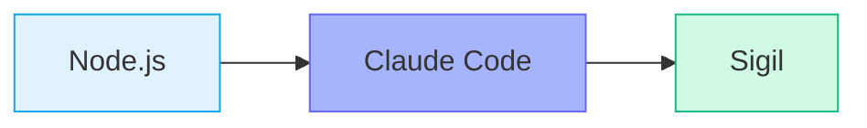

# Sigil OS

**Inscribe it. Ship it.**

A sigil is a symbol charged with intent — a mark that transforms thought into action. Sigil OS works the same way: you describe what you want, and it inscribes the specs, plans, and code to ship it. No guesswork, no ceremony, just structured intent made real.

**Specification-driven development for non-technical users of Claude Code.**

Transform natural language descriptions into implemented, tested features through structured workflows.

---

## Installation

Sigil is an add-on for Claude Code, Anthropic's AI coding tool. Three building blocks stack on top of each other to make it work:



### What You Need First

Open your **terminal** (the app where you type commands). On Mac, search for "Terminal." On Windows, search for "PowerShell."

**Step 1 — Check for Node.js**

Node.js is a free tool that runs programs on your computer. Type this and press Enter:

```bash
node --version
```

You should now see a number like `v18.x.x` or higher. If you get an error, [download Node.js here](https://nodejs.org/) and install it first.

**Step 2 — Install Claude Code**

This command downloads Claude Code. Copy and paste it into your terminal:

```bash
npm install -g @anthropic-ai/claude-code
```

Then check that it worked:

```bash
claude --version
```

You should now see a version number on screen. You also need a Claude Pro, Max, or API plan — [sign up here](https://www.anthropic.com/pricing) if you don't have one.

> **Note:** See [Anthropic's setup guide](https://docs.anthropic.com/en/docs/claude-code) if you run into trouble with Claude Code.

### Install Sigil

Now you are ready to add Sigil. Run these two commands one at a time:

```bash
claude plugin marketplace add araserel/sigil-os
```

```bash
claude plugin install sigil@sigil-os
```

Then check that it worked:

```bash
claude plugin list
```

You should now see `sigil` in the list that prints out.

> **Tip:** You can also run these from inside Claude Code by typing `/plugin marketplace add araserel/sigil-os` and `/plugin install sigil@sigil-os`.

### Set Up Your First Project

After installing, open your project folder in Claude Code:

```bash
claude
```

Then type this command to create your project's **constitution** (a short file of rules that guide how Sigil works in your project):

```
/constitution
```

Answer three quick rounds of questions about your project. Sigil fills in the details for you.

You should now see a new `memory/constitution.md` file in your project folder.

### Check That Everything Works

Type this inside Claude Code:

```
/sigil status
```

You should now see the Sigil dashboard. It shows the version number and every command you can use.

**Quick checklist:**

- [ ] `node --version` shows v18 or higher
- [ ] `claude --version` shows a version number
- [ ] `claude plugin list` shows `sigil`
- [ ] `/sigil status` shows the Sigil dashboard

> **Note:** Something not working? See the [full Installation Guide](sigil-plugin/docs/installation.md) for step-by-step fixes.

---

## Quick Start

Once installed, describe what you want to build:

```
/sigil "Add a user login page with email and password"
```

Sigil guides you through:
1. **Specification** — Captures requirements
2. **Clarification** — Resolves ambiguities
3. **Planning** — Creates implementation plan
4. **Tasks** — Breaks plan into actionable items
5. **Implementation** — Writes and validates code
6. **Review** — Security and code review

### Key Commands

| Command | Purpose |
|---------|---------|
| `/sigil` | Show status and next steps |
| `/sigil "description"` | Start building a new feature |
| `/sigil continue` | Resume where you left off |
| `/connect` | Share learnings across projects |
| `/profile` | Generate or view your project profile |
| `/sigil-update` | Check for plugin updates |

---

## Updating

```
/plugin update sigil@sigil-os
```

Or use the familiar command:
```
/sigil-update
```

---

## Documentation

- [Quick Start Guide](sigil-plugin/docs/quick-start.md)
- [User Guide](sigil-plugin/docs/user-guide.md)
- [Command Reference](sigil-plugin/docs/command-reference.md)
- [Shared Context Setup](sigil-plugin/docs/shared-context-setup.md)

### Migrating from Global Install?

If you previously used `install-global.sh`, see the [Migration Guide](sigil-plugin/docs/migration-from-global.md).

---

## For Contributors

### Repository Structure

| Path | Purpose |
|------|---------|
| `sigil-plugin/` | **The plugin** — distributable product |
| `CLAUDE.md` | Development instructions |
| `STATUS.md` | Implementation status |
| `tools/` | Development utilities (linter, etc.) |
| `tests/` | Test files |

### Development Setup

```bash
# Clone the repository
git clone https://github.com/araserel/sigil-os.git
cd sigil-os

# Install locally for testing
claude plugin marketplace add ./
claude plugin install sigil@sigil-os

# Run the linter
python3 tools/workflow-linter.py --verbose
```

### Key Files

| File | Purpose |
|------|---------|
| `sigil-plugin/.claude-plugin/plugin.json` | Plugin manifest |
| `sigil-plugin/commands/` | Slash commands |
| `sigil-plugin/agents/` | Agent definitions |
| `sigil-plugin/skills/` | Skill implementations |
| `sigil-plugin/hooks/` | Lifecycle hooks |

---

## Links

- [Plugin Documentation](sigil-plugin/docs/README.md)
- [Development Status](STATUS.md)
- [Project Roadmap](PROJECT_PLAN.md)

---

Built with [Claude Code](https://www.anthropic.com/claude-code) by Anthropic.
