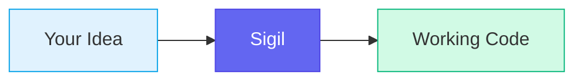
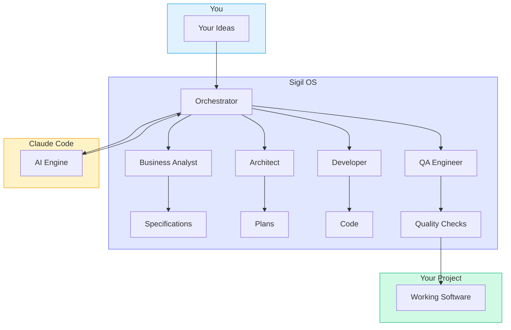
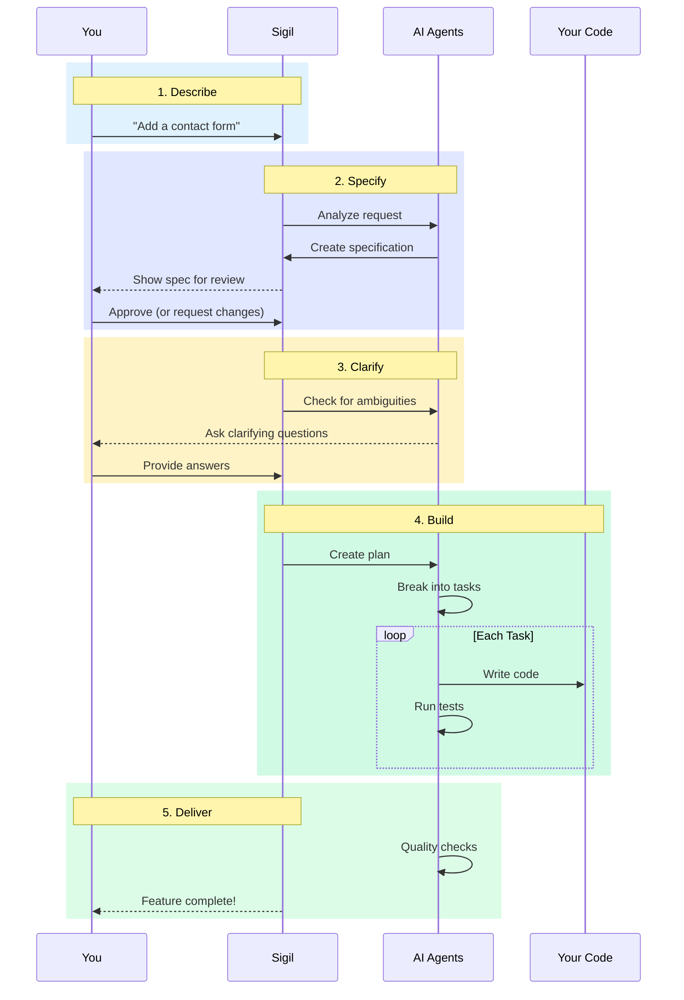

# Quick Start Guide

> Go from idea to working code in plain English. No coding required.

---

## What is Sigil?

Sigil is like having a technical team that speaks your language. You describe what you want to build in plain English, and Sigil turns that into working software — with checkpoints along the way where you review and approve.

Think of it like this: You're the architect describing your dream house. Sigil is the construction crew that builds it, but checks in with you at each major step to make sure they understood correctly.



---

## Prerequisites

You need **Claude Code** and **Git** installed.

### Install Claude Code

Claude Code is Anthropic's AI coding assistant. Sigil runs inside it.

**macOS / Linux / WSL:**

```bash
curl -fsSL https://claude.ai/install.sh | bash
```

**Windows:**

Download the installer from the [Claude Code releases page](https://github.com/anthropics/claude-code/releases).

Verify it worked:

```bash
claude --version
```

You need a Claude Pro, Max, or API plan. Sign in:

```bash
claude auth login
```

> **Note:** See [Anthropic's docs](https://docs.anthropic.com/en/docs/claude-code) for more setup help.

### Starting from Zero?

If you have an idea but no code yet — that's perfect. Sigil is designed for exactly this. After installing Sigil, run `/sigil`. It will detect you're starting fresh and guide you through **Discovery** — a conversation that helps you choose a tech stack. You don't need to know what framework or database to use.

---

## Installation

Sigil is a Claude Code plugin (a set of tools that run inside Claude Code, the AI coding assistant). Installation takes about 30 seconds.

### Step 1: Add the Marketplace

```bash
claude plugin marketplace add araserel/sigil-os
```

### Step 2: Install the Plugin

```bash
claude plugin install sigil@sigil-os
```

### Step 3: Verify

Start Claude Code and run:

```
/sigil status
```

You should see the Sigil status dashboard. That's it — Sigil is ready.

### What Sigil Adds to Your Project

When you run `/sigil` for the first time, it creates these project files:

| Folder | What It Contains |
|--------|------------------|
| `.sigil/` | Project rules, state, and learnings |
| `.sigil/config.yaml` | Your personal settings (gitignored — each user has their own) |
| `.sigil/specs/` | Feature specifications you create |
| `SIGIL.md` | Enforcement rules (auto-generated, shared) |

> **Note:** The plugin itself is managed by Claude Code. Only your project-specific files live in your repository.

---

## Initialize Your Project

Before building features, tell Sigil about your project. This is a one-time setup.

### Step 1: Start Claude Code

From your project folder:
```bash
claude
```

This opens an interactive session with Claude Code. You'll see a prompt where you can type commands.

### Step 2: Run Setup

Type:
```
/sigil-setup
```

Sigil first asks about your role:

```
What best describes your role?

1. Product / Business — Plain English, technical decisions handled automatically
2. Engineering / Technical — Shows implementation details and trade-offs

> 1
```

Then guides you through 3 quick rounds to set up your project principles:

```
Round 1: I scanned your project and found:
- Language: TypeScript
- Framework: Next.js
- Database: PostgreSQL

Is this correct? Anything to add or change?
> Looks good

Round 2: What kind of project is this?
1. MVP / Prototype — Ship fast, add polish later
2. Production App — Balance speed with stability
3. Enterprise — Maximum rigor
> 2

Round 3: A few optional preferences (say "skip" for defaults):
- Should I ask before adding external services? (Yes/No)
- Should the app work offline? (Yes/No)
- Accessibility: Works for everyone, or standard?
> skip
```

That's it — Sigil handles all the technical details automatically based on your choices.

### What This Creates

Your answers become your project's **constitution** — rules that Sigil follows for all features:

```
Technology Stack
├── Language: TypeScript
├── Framework: Next.js
├── Database: PostgreSQL
└── Quality: Production App

Standards (auto-configured)
├── Test Coverage: 60%+ minimum
├── Code Style: Prettier + ESLint
├── Security: Auth required, secrets in env vars
└── Accessibility: WCAG 2.1 AA
```

---

## Start Your First Feature

Now the fun part — building something!

### What `/sigil` Does Automatically

Every time you run `/sigil`, Sigil runs a quick health check in the background. It makes sure your setup is correct and your project files are up to date. You don't need to do anything. If something needs your attention, Sigil tells you.

### Step 1: Describe What You Want

In your Claude Code session, just describe the feature in plain English:

```
/sigil "Add a contact form where visitors can send messages to our support team"
```

Or simply type naturally:
```
I want to add a contact form to the website
```

Sigil understands both.

### Step 2: Watch Sigil Create the Specification

Sigil analyzes your request and creates a structured specification — a detailed description of what will be built.

```mermaid
sequenceDiagram
    participant You
    participant Sigil
    participant Spec as Specification

    You->>Sigil: "Add a contact form"
    Sigil->>Sigil: Analyze request
    Sigil->>Spec: Create specification
    Sigil-->>You: Show spec for review

    Note over You,Sigil: ⏸️ Checkpoint: Review & Approve

    You->>Sigil: "Looks good" or "Change X"
    Sigil->>Sigil: Continue to planning...
```



You'll see something like:

```
Creating specification for: Contact Form
━━━━━━━━━━━━━━━━━━━━━━━━━━━━━━━━━━━━━━━━━━━━━━━━━━━━

Track: Standard (feature with moderate complexity)

User Scenarios (P1 = Must Have)
├── US-001 [P1]: As a visitor, I can submit a message
├── US-002 [P1]: As a visitor, I see confirmation my message was sent
└── US-003 [P2]: As a visitor, I receive an email copy

Requirements
├── FR-001 [P1]: Form accepts name, email, message
├── FR-002 [P1]: Form validates email format
├── FR-003 [P1]: Success message shown on submit
└── NFR-001 [P1]: Form works on mobile devices

Does this match what you want? (Y/n)
```

### Step 3: Review and Approve

This is your checkpoint. Read through the specification and:

- **If it looks right:** Type `Y` or `yes` or just press Enter
- **If something's wrong:** Describe what needs to change
- **If you have questions:** Just ask

For example:
```
> The form should also have a phone number field

Got it. I'll add an optional phone number field to the specification.
```

### Step 4: Answer Clarification Questions

Sigil may ask follow-up questions to remove ambiguity:

```
Clarification Questions
━━━━━━━━━━━━━━━━━━━━━━━━━━━━━━━━━━━━━━━━━━━━━━━━━━━━

Q1: How should the form prevent spam?
   A) CAPTCHA (user solves a puzzle)
   B) Honeypot field (invisible trap for bots) ← Recommended
   C) Rate limiting (max submissions per hour)

Your choice (A/B/C):
```

Just type your choice (like `B`). Sigil updates the specification with your answer.

---

## Watch Sigil Build

After you approve the specification, Sigil automatically:

1. Creates an implementation plan
2. Breaks it into tasks
3. Starts building

```
You Approve Spec
      │
      ▼
  Create Plan
      │
      ▼
  Break into Tasks
      │
      ▼
  ┌─── Per-Task Loop ───────────────────────┐
  │                                          │
  │   Build Task ──▶ Quality Check           │
  │                     │                    │
  │               Pass? ├──Yes──▶ Next Task  │
  │                     │                    │
  │                    No                    │
  │                     │                    │
  │               Fix & Recheck              │
  │               (up to 5 times)            │
  │                                          │
  └──────────────────────────────────────────┘
      │
      ▼
  Code Review ──▶ Done!
```

### What You'll See in the Terminal

As Sigil works, you'll see progress updates:

```
📋 Feature: Contact Form
━━━━━━━━━━━━━━━━━━━━━━━━━━━━━━━━━━━━━━━━━━━━━━━━━━━━

✅ Specification - Complete (5 requirements)
✅ Clarification - 2 questions resolved
✅ Planning      - Complete
🔄 Tasks        - 4/7 complete

Current: Building form validation logic

[████████░░░░░░░░] 57%
```

### Check Status Anytime

If you want a detailed status update:
```
/sigil status
```

Or just ask:
```
What's the progress?
```

### Stepping Away?

You can close the terminal and come back later. Your progress is saved. When you return:
```bash
claude
```

Then:
```
/sigil continue
```

Sigil picks up exactly where it left off.

---

## Done! Now What?

When Sigil finishes, you'll see:

```
✅ Feature Complete: Contact Form
━━━━━━━━━━━━━━━━━━━━━━━━━━━━━━━━━━━━━━━━━━━━━━━━━━━━

All tasks completed successfully!

Files Created:
├── src/components/ContactForm.tsx
├── src/app/api/contact/route.ts
├── src/lib/validations/contact.ts
└── tests/contact-form.test.ts

Quality Checks:
├── ✅ All tests passing (12/12)
├── ✅ No linting errors
└── ✅ Accessibility validated

Next steps:
1. Review the changes in your code editor
2. Test the feature manually
3. Commit when ready: git add . && git commit -m "Add contact form"
```

### Review the Changes

Open your code editor and look at the new files. Even if you don't understand the code, you can:
- Check that file names make sense
- See that tests exist
- Look for any comments Sigil added

### Test the Feature

If your project has a development server:
```bash
npm run dev
```

Then open your browser and try the new feature.

### What Sigil Learned

During implementation, Sigil automatically captured lessons for future features:
- **Patterns** — Reusable rules it discovered while building
- **Gotchas** — Traps it encountered and how to avoid them
- **Decisions** — Why certain choices were made

Run `/sigil-learn` to see what was captured. These learnings help future features go smoother — Sigil remembers what worked and avoids past mistakes.

### Commit Your Changes

When you're happy with the feature, save it to your project history:

```bash
git add .
git commit -m "Add contact form feature"
```

> **New to Git?** Here's what these commands do:
> - `git add .` — Stages all changed files (tells Git "I want to save these")
> - `git commit -m "..."` — Saves a snapshot with a description
>
> Think of it like saving a document, but with a note about what changed.

**Want Sigil to handle commits?** Just ask:
```
Commit these changes with a good message
```

Sigil will create an appropriate commit message and run the commands for you.

---

## If Something Goes Wrong

Don't worry — things don't always go perfectly. Here's how to handle common situations.

### Sigil Gets Stuck

If Sigil seems frozen or you're not sure what's happening:

```
/sigil status
```

This shows exactly where things stand. You might see:
```
⚠️ Blocked: Waiting for clarification

Question pending: "Should the form require all fields?"
```

Just answer the question to continue.

### The Spec Doesn't Match What You Want

Before approving, you can request changes:

```
Actually, I don't want the email confirmation feature.
Just show a success message on the page.
```

Sigil will update the specification and show it again for approval.

### Tests Are Failing

After each task is built, Sigil runs quality checks and automatically tries to fix any failures (up to 5 attempts per task). If it can't fix an issue, you'll see:

```
⚠️ Escalation: Test failures require attention

Failing: tests/contact-form.test.ts
- Expected: Form submits successfully
- Actual: API returns 500 error

This may require manual investigation.
Options:
1. Let me try a different approach
2. Skip this test for now
3. Get help from a developer

Your choice (1/2/3):
```

Choose option 1 to let Sigil try again, or option 3 if you want to involve a developer.

### You Made a Mistake

You can always start over:

```
/sigil "Add a contact form"
```

This creates a new specification from scratch.

---

## Updating Sigil

When new versions are released, update with a single command.

From within Claude Code:
```
/sigil-update
```

Or from your terminal:
```bash
claude plugin update sigil@sigil-os
```

Your project files (`.sigil/`, `.sigil/specs/`) are not affected by updates. Only the plugin components are updated.

After updating, start a new Claude Code session and run `/sigil` to verify.

---

## Command Cheat Sheet

These four commands cover most use cases:

| Command | What It Does |
|---------|--------------|
| `/sigil` | Show status and what to do next |
| `/sigil "..."` | Start building a feature from your description |
| `/sigil continue` | Resume work on an in-progress feature |
| `/sigil-constitution` | Set up or update project rules |

You don't have to remember commands. Just say what you mean — "I want to add user login" works as well as `/sigil "Add login"`.

For the full list of commands, see the [Command Reference](command-reference.md).

---

## How It Works (Optional Reading)

> **Skip this section** if you just want to build things. Come back when you're curious about what's happening under the hood.

<details>
<summary>Click to expand: Architecture Overview</summary>

Here's how all the pieces fit together:



**You** describe what you want in plain English.

**Sigil** routes your request to specialized AI agents:
- **Business Analyst** — Turns your description into a specification
- **Architect** — Designs how the code should be structured
- **Developer** — Writes the actual code
- **QA Engineer** — Checks each task right after the Developer finishes it (not at the end)

**Claude Code** powers these agents with advanced language understanding.

**Your Project** receives working, tested code.

</details>

<details>
<summary>Click to expand: The Full Workflow</summary>

Here's the complete journey from idea to working code:



</details>

---

## What's Next?

You've built your first feature. Here's how to keep going:

- **Build another feature:** Just describe it and Sigil handles the rest
- **See a complex example:** Read the [User Authentication Walkthrough](examples/user-auth-feature/README.md)
- **Learn all commands:** See the [Command Reference](command-reference.md)
- **Troubleshoot issues:** Check the [Troubleshooting Guide](troubleshooting.md)
- **Understand the terms:** Browse the [Glossary](glossary.md)

---

*You're now ready to build software with Sigil. Just describe what you want — and watch it happen.*
