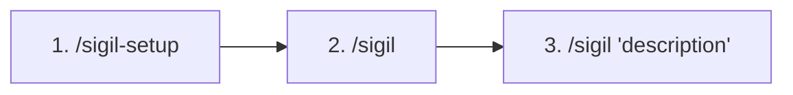
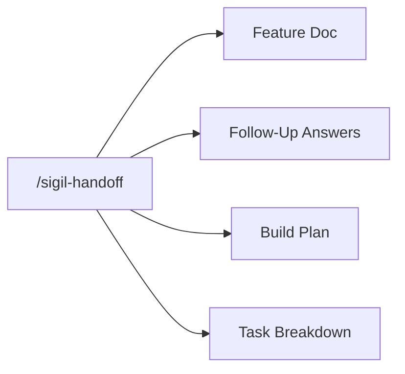
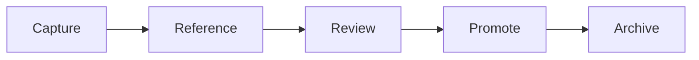

# Sigil User Guide

> Your complete guide to building features with Sigil. Written for Product Managers, Product Owners, and business stakeholders.

This guide walks you through every part of Sigil. Start here if you are new. Come back later when you need a refresher.

---

## How to Use This Guide

**New to Sigil?** Start with Part 1, then try the [Quick-Start Tutorial](quick-start.md).

**Looking for something specific?** Jump to any section using the table of contents below.

**Need a quick command lookup?** See the [Command Reference](command-reference.md).

---

## Table of Contents

1. [Getting Started](#part-1-getting-started)
2. [Configuration](#part-15-configuration)
3. [Creating Features](#part-2-creating-features)
4. [Understanding Technical Output](#part-3-understanding-technical-output)
5. [Working with Your Team](#part-4-working-with-your-team)
6. [Status and Tracking](#part-5-status-and-tracking)
7. [Specialists](#part-55-specialists)
8. [Troubleshooting](#part-6-troubleshooting)
9. [Appendices](#appendices)

---

## Part 1: Getting Started

### What Is Sigil?

Sigil helps you write clear, complete feature descriptions. You describe what you want in plain words. Sigil turns that into structured documents engineers can act on.

Here is what Sigil does for you:

1. Organizes your requirements into a formal document
2. Asks follow-up questions to fill in gaps
3. Creates a build plan for engineers
4. Breaks the plan into small, trackable tasks

The result: engineers can start building with no confusion and fewer follow-up questions.

### Design Principles

Sigil follows 7 core ideas that shape how it works.

**1. Write the description first**

A written feature description (called a "specification" or "spec") is the single source of truth. Before any code is written, Sigil creates a document that says what will be built, why it matters, and what success looks like. Good descriptions lead to good code.

**2. Guided choices**

You should never face a technical choice without context. When a decision is needed, Sigil shows your options in plain words with trade-offs. You pick based on business needs. The system handles the rest.

**3. Right-sized workflows**

A small bug fix does not need a 30-page document. A brand-new product needs more than a 5-minute sketch. Sigil picks the right level of detail for each job. This level of detail is called a "track" (a workflow path based on feature size).

| Track | Best For | Depth |
|-------|----------|-------|
| **Quick Flow** | Bug fixes, small tweaks | Short description, then tasks, then build |
| **Standard** | Features, improvements | Full description, clarify, plan, tasks, build, check |
| **Enterprise** | New systems, big changes | Extended description, research, architecture, plan, tasks, build, check, review |
| **Discovery** | Brand-new projects | Problem, limits, options, decision, foundation document |

**4. Project rulebook**

Each project has a set of fixed rules called a "constitution" (your project's rulebook of standards and required technologies). For example: "We use TypeScript." or "All data connections require login." The system follows these rules without being reminded.

**5. Human oversight**

Routine work runs on its own. Big decisions pause for you. Sigil uses three levels of control:

- **Auto** -- Safe, reversible actions happen right away.
- **Review** -- Scope or design changes are flagged for you to check.
- **Approve** -- Production releases and security changes wait for your sign-off.

**6. Visible progress**

If you cannot see it, you cannot manage it. You can check exactly where work stands at any time. You see which stage, which task, and what is stuck.

**7. Built for everyone**

All generated code, screens, and documents meet accessibility standards (WCAG 2.1 AA, a set of rules that make software usable by people with disabilities). This is checked during the quality-check stage (called "QA," meaning quality assurance -- the step where output is tested against requirements).

### Key Concepts

Get familiar with these terms before you begin.

| Term | What It Means |
|------|---------------|
| **Specification** | A written document that says what a feature should do, who uses it, and how to tell it works. Often shortened to "spec" (short for specification). |
| **Constitution** | Your project's rulebook of standards and required technologies that every feature must follow |
| **Track** | The workflow path based on feature size: Quick (small), Standard (medium), Enterprise (large) |
| **Phase** | A stage in the workflow: Assess, Specify, Clarify, Plan, Tasks, Implement, or Review. (Validation runs automatically within Implement after each task.) |
| **Priority** | How important a requirement is: P1 (must have), P2 (should have), P3 (nice to have) |

### What Happens Behind the Scenes

When you run `/sigil`, several things happen in the background to keep your project healthy.

- **Preflight check** -- Each `/sigil` run checks that Sigil is set up correctly. If anything is missing or outdated, it tells you what needs attention.
- **Enforcement rules** -- Sigil adds operating rules to your project's `CLAUDE.md` file. These keep agents on the right workflow and respect your rulebook. You do not need to manage this.
- **Context freshness check** -- Sigil confirms that the recorded project state matches your actual files. If your project says "Specify" but a plan already exists, Sigil corrects the recorded stage to match reality.
- **Pre-run updates** -- Before each skill runs, it updates your project state file so records stay current.

### Your First Session

Follow these steps when you start Sigil for the first time.



1. **Set up your project.**
   ```
   /sigil-setup
   ```
   Creates the project structure, walks you through your project rulebook, and configures enforcement. If you work across multiple projects, setup also asks whether to connect to a shared context repository. Connecting during setup means your organization's shared standards (security policies, coding conventions, etc.) are written into your rulebook automatically.

2. **Check the current status.**
   ```
   /sigil
   ```
   See what is in progress and which stage you are in. If shared context is active, Sigil pulls the latest standards and refreshes your rulebook automatically.

3. **Create your first feature.**
   ```
   /sigil "your feature description"
   ```
   Describe what you want to build in plain words. All workflow phases run automatically.

You should now see a structured feature document ready for review.

---

## Part 1.5: Configuration

### User Track

When you first set up Sigil, it asks about your role. This sets your **user track**, which controls how Sigil communicates with you. Your track is stored in `.sigil/config.yaml` — a personal config file that is gitignored, so each team member can use their own track without affecting others.

| Track | Who It Is For | What Changes |
|-------|---------------|-------------|
| **Non-Technical** (default) | Product managers, founders, business stakeholders | Plain English, technical decisions made automatically, progress shown as "3 of 8 steps done" |
| **Technical** | Engineers, technical leads | Shows agent names, specialist names, file paths, implementation trade-offs, progress as "T003 implementing (api-developer)" |

You can change your track at any time:

```
/sigil-config set user_track technical
```

Or switch back:

```
/sigil-config set user_track non-technical
```

### Execution Mode

The execution mode controls how Sigil selects specialists for tasks:

| Mode | What It Does |
|------|-------------|
| **Automatic** (default) | Sigil picks the best specialist for each task based on the files and description |
| **Directed** | You control which specialists are used (requires technical track) |

### Viewing Your Configuration

Run `/sigil-config` with no arguments to see your current settings and get an offer to change them.

### Resetting to Defaults

If you want to start over with default settings:

```
/sigil-config reset
```

This sets user track back to "non-technical" and execution mode back to "automatic."

---

## Part 2: Creating Features

### Workflow Stages

Sigil moves through up to 7 stages. Each stage is called a "phase" (one step in the process).

| Stage | Name | Purpose |
|-------|------|---------|
| 0 | Assessment | Look at the request and pick a track |
| 1 | Specify | Capture requirements in a structured format |
| 2 | Clarify | Surface gaps and resolve unknowns |
| 3 | Plan | Create a build approach |
| 4 | Tasks | Break the plan into small work items |
| 5 | Implement | Build the feature, with quality checks after each task |
| 6 | Review | Final code review, security review, and capture lessons |

Not every request goes through every stage. Quick Flow may jump from Assessment straight to Tasks for simple work.

```
Assess → Specify → Clarify → Plan → Tasks → Implement (with per-task QA) → Review
```

**Assessment:** Sigil reads your description and picks the right track.

**Specify:** Your description becomes a structured document with user stories, requirements, and success criteria.

**Clarify:** Gaps are resolved through focused questions (3 rounds maximum).

**Plan:** A technical build plan is created.

**Tasks:** The plan is broken into small, assignable work items.

**Implement:** Code is written by developers (human or AI).

**Validate:** Automated checks confirm quality before review.

**Review:** Final approval before the feature ships. After review passes, Sigil asks what you want to do next: start another feature, hand off to an engineer, or wrap up.

### Discovery Track -- Starting a New Project

If you are starting from scratch with no existing code, Sigil enters the **Discovery Track**. This is a guided conversation that helps you make big decisions before building anything.

**When Discovery starts:**

- You say "new project," "new idea," or "starting from scratch."
- No existing technology context is found.
- You ask "what tech should I use?"

**How it works:**

| Step | What Happens |
|------|-------------|
| Problem Clarity | Define what you are solving and for whom |
| Limits Gathering | Discuss budget, timeline, team skills, compliance, and scale |
| Technology Options | Sigil shows 2-3 viable options in a comparison table |
| Decision Capture | Your choices are saved in a Project Foundation document |
| Transition | The Standard track begins with your foundation as context |

The output is a `project-foundation.md` file. It gives context for every feature that follows. You do not need to know which framework or database to use. Sigil recommends options based on what you are building.

You should now see a `project-foundation.md` file in your project folder.

### Enterprise Track -- Maximum Rigor

For large or high-stakes features, Sigil assigns the **Enterprise** track. This adds extra depth at every stage.

**When Enterprise is assigned:**

Sigil scores each feature request across 7 dimensions (scope, file count, integration, data, testing, risk, and ambiguity). Each dimension scores 1-3, giving a total between 7 and 21.

| Score | Track |
|-------|-------|
| 7-10 | Quick Flow |
| 11-16 | Standard |
| 17-21 | Enterprise |

Some features always get at least Enterprise: new services or systems, and anything with compliance requirements (like SOC2 or HIPAA).

**What Enterprise adds:**

| What | Standard | Enterprise |
|------|----------|------------|
| Research phase | Skipped | Required -- Sigil investigates unknowns before planning |
| Architecture decisions | Optional | Required -- every major choice is documented |
| Security review | Optional | Required |
| Task count | 5-20 | 20+ |

**Overriding the track:**

At the complexity assessment checkpoint, Sigil shows its recommendation and score. You can override it:

- "Use the enterprise workflow" -- upgrades to Enterprise
- "This is simpler than that, use standard" -- downgrades

You can also set Enterprise as the default for your project during `/sigil-setup` (Round 2: "Enterprise -- Maximum rigor").

### Writing Good Feature Descriptions

The quality of your feature document depends on your first description. Here is how to write a good one.

**Do include:**

- Who will use this feature (visitors, logged-in users, admins)
- What they want to do
- Why this matters to the business
- Any limits you already know

**Example (Good):**

> "Add a user dashboard showing recent activity. Logged-in users should see their last 10 actions (created, edited, deleted items) with timestamps. They should be able to filter by action type and date range. This is for our power users who manage many items."

**Example (Too Vague):**

> "Add a dashboard."

The vague example will need many rounds of follow-up questions. The detailed example might move straight to planning.

### Understanding the Feature Document

When you run `/sigil "description"`, Sigil creates a document with these sections.

**Summary:** One paragraph that describes the feature and its purpose.

**User Scenarios:** Stories in the format "As a [user], I want to [action] so that [benefit]." Each has a priority (P1, P2, P3) and a unique ID.

**Functional Requirements:** Specific things the system must do. Each one has:

- A unique ID (FR-001, FR-002, etc.)
- A plain description
- A priority level
- Acceptance criteria (how to verify it works)

**Non-Functional Requirements:** Rules about how well the system must perform. Examples:

- Speed: "Page loads in under 2 seconds"
- Security: "Data encrypted while being sent"
- Accessibility: "Meets WCAG 2.1 AA" (usability rules for people with disabilities)

**Key Entities:** The data involved. For a user profile feature, entities might include User (id, name, email, avatar) and Profile (bio, location, website).

**Success Criteria:** A checklist of what must be true for the feature to be done.

**Out of Scope:** States what this feature does NOT include. This prevents the work from growing beyond plan.

### Answering Follow-Up Questions

After creating a feature document, you may need to clear up gaps.

Clarification runs automatically after spec creation if ambiguities are detected. You can also say "let's clarify" or "I have more details."

**What to expect:**

Sigil asks focused questions with multiple-choice options. Questions might cover:

- Technical approaches (how should X be built?)
- Business rules (what happens when Y occurs?)
- Edge cases (what if Z fails?)
- Priorities (which matters more, A or B?)

**Tips for answering:**

1. **Think about your users.** Which option gives the best experience?
2. **Keep it simple.** Simpler choices are easier to maintain.
3. **Ask your tech lead.** Get help with technical trade-offs before answering.

> **Tip:** Sigil records your answers. Future team members will see why each decision was made.

**Follow-up limits:**

Sigil allows a maximum of 3 rounds of follow-up questions. If gaps remain after 3 rounds, you will need to:

- Shrink the feature scope
- Add more detail to your answers
- Meet with stakeholders to resolve conflicts

You should now see your updated feature document with all gaps resolved.

---

## Part 3: Understanding Technical Output

### Reading a Build Plan

After follow-up questions, Sigil automatically creates a technical plan. Here is how to read it.

**Rulebook Gate Checks:** Confirms the plan follows your project rules. All boxes should be checked. If not, talk to your tech lead.

**Project Structure:** Shows which files will be created or changed. You do not need to understand file paths. You can check:

- New files are being created (not just changing everything)
- The scope looks right (10 files, not 100)

**Data Contracts:** Defines how parts of the system talk to each other. Look for:

- Request/Response pairs that match your requirements
- Error handling for expected failures

**New Packages:** Lists new software packages needed. Fewer is better. Three or fewer new packages is typical.

**Risk Review:** Points out potential problems and how to handle them. Share this with your tech lead if anything looks concerning.

### Understanding Task Breakdowns

After the plan is approved, Sigil automatically creates a list of work items. Here is how to read it.

**Task structure:**

```
T001: [Task description] [Symbols]
  Files: [What will be created or changed]
  Acceptance Criteria: [How to verify it is done]
  Depends On: [What must be done first]
  Test First: [Yes/No]
```

**Task symbols:**

| Symbol | Meaning |
|--------|---------|
| `[ ]` | Not started |
| `[~]` | In progress |
| `[x]` | Complete |
| `[B]` | Blocking -- other tasks depend on this |
| `[P]` | Parallel -- can run at the same time as other `[P]` tasks |

**Using tasks for sprint planning:**

1. Find blocking tasks -- these must be done first.
2. Spot parallel chances -- tasks marked `[P]` can go to different engineers.
3. Note chains -- schedule dependent tasks after their requirements finish.
4. Check test needs -- "Test First: Yes" means tests come before code.

You should now see a numbered task list with clear dependencies.

### Approval Levels -- When Sigil Pauses vs. Proceeds

Sigil balances speed with control using three levels. Here is when it pauses for you and when it moves on its own.

| Level | Behavior | What You See |
|-------|----------|--------------|
| **Auto** | Acts right away and logs the action | You see results in a status update |
| **Review** | Acts, then flags for your review | You check when it is convenient; work goes on |
| **Approve** | Pauses and waits for your sign-off | Work stops until you approve |

**What falls into each level:**

| Action | Level | Notes |
|--------|-------|-------|
| Status queries | Auto | -- |
| Research tasks | Auto | -- |
| Feature document drafts | Review | You review before moving on |
| Follow-up questions | Auto | Questions appear; you answer them |
| Plan creation | Review | Moves to Approve if architectural |
| Task breakdown | Auto (20 or fewer tasks) | Review if more than 20 tasks |
| Code writing | Auto | Review if scope changes detected |
| Quality checks | Auto | Review if failures escalate |
| Code review | Review | -- |
| Security review | Approve | -- |
| Production release | Approve | -- |
| Database changes | Approve | -- |
| New packages | Review | Approve if security-sensitive |

---

## Part 4: Working with Your Team

### The Handoff Process

When a feature completes (code review passes), Sigil automatically asks what you want to do next. One of the options is **"Hand off to an engineer"**, which generates the review package right there — no extra command needed.

You can also run `/sigil-handoff` independently at any time to create a package on demand.

**What engineers get:**

| Document | Purpose |
|----------|---------|
| Feature Document | What to build and why |
| Follow-Up Answers | Decisions already made |
| Build Plan | How to build it |
| Task Breakdown | What to do and in what order |



**After handoff:**

Engineers may still have questions. If they ask about something in the follow-up answers, point them there. If it is a new question, think about whether it should have been caught earlier. This helps improve future feature documents.

You should now see a complete engineering package ready for your development team.

### Making Decisions

You will make decisions throughout the workflow. Here is a simple framework.

**User impact questions -- you decide:**

- Which users is this for?
- What is the priority when requirements conflict?
- What should happen in error or edge cases?

**Technical questions -- ask your tech lead:**

- Which technology approach is better?
- What are the speed effects?
- How does this change existing systems?

**Business questions -- escalate if needed:**

- Does this fit the company strategy?
- Are there legal or compliance concerns?
- What is the budget vs. timeline trade-off?

---

## Part 5: Status and Tracking

### Checking Progress

Run `/sigil` at any time to see where things stand.

**Example output:**

```
+-------------------------------------------------+
| Feature: User Dashboard                         |
| Track: Standard                                 |
| Phase: Implementation                           |
+-------------------------------------------------+
| Progress: 75%                                   |
|                                                 |
| Stages:                                         |
| [x] Assess                                      |
| [x] Specify                                     |
| [x] Clarify                                     |
| [x] Plan                                        |
| [x] Tasks                                       |
| [~] Implement (6/8 tasks complete)              |
| [ ] Validate                                    |
| [ ] Review                                      |
+-------------------------------------------------+
| Blockers: None                                  |
| Decisions Pending: None                         |
+-------------------------------------------------+
```

You should now see a status summary for every active feature.

### Understanding Status Fields

**Track:** The workflow path (Quick, Standard, or Enterprise). It controls how much detail is generated.

**Phase:** Which stage the feature is in right now.

**Progress:** Overall completion as a percentage.

**Blockers:** Issues stopping progress. These need your attention.

**Decisions Pending:** Questions waiting for your answer.

### Managing Blockers

When blockers appear, they need action.

| Blocker | What to Do |
|---------|------------|
| Follow-up question needed | Answer via `/sigil continue` |
| Rulebook conflict | Review with tech lead; update the rulebook if needed |
| Outside dependency | Talk to the team that owns that piece |
| Resource not available | Escalate to project leadership |

### Project Profiles

If you work on more than one project, Sigil can create a **project profile** for each one. A profile is a short file that describes what the project does, what technologies it uses, and what it shares with other projects.

**Creating a profile:**

```
/sigil-profile
```

Sigil scans your project files and detects your tech stack automatically. It then asks a few questions about what your project does and what it shares.

You should now see a `.sigil/project-profile.yaml` file in your project folder.

**Why profiles matter:**

- When you start a session, Sigil loads your profile and profiles from connected projects automatically.
- If your project changes something that another project depends on, Sigil warns you during planning.
- Profiles help new team members understand each project at a glance.

> **Note:** Profiles work in solo mode too. Even without shared context, a profile gives Sigil better understanding of your project's tech stack.

### Learning Loop

Sigil captures lessons as you work. This builds a shared memory that helps avoid repeat mistakes. It also surfaces proven patterns over time.

**The 4 learning types:**

| Type | What It Holds | When Loaded |
|------|---------------|-------------|
| **Patterns** | Proven rules to follow (e.g., "always use server actions for forms") | Every task |
| **Gotchas** | Project-specific traps (e.g., "API rate limit is 100/min") | Every task |
| **Decisions** | Big choices and why they were made | On demand |
| **Feature Notes** | Per-feature task details and context | Current feature only |

**How the cycle works:**



1. **Capture** -- Lessons are recorded after each task.
2. **Reference** -- Relevant lessons load before each task starts.
3. **Review** -- Run `/sigil-learn --review` to clean up.
4. **Promote** -- Proven patterns move to the permanent file.
5. **Archive** -- Finished feature notes move to storage.

**Using `/sigil-learn --review`:**

Run this from time to time to tidy up lessons. You will be asked to:

- Promote reliable candidates into permanent patterns
- Archive finished feature notes
- Remove duplicates and stale entries

> **Note:** Lessons are stored in `/.sigil/learnings/` and stay small -- about 3% of context.

### Working Across Multiple Projects

If your team works on several projects that share patterns or standards, Sigil can sync learnings between them. Run `/sigil-connect` to link projects to a shared GitHub repository.

Once connected:
- Learnings sync automatically between projects.
- Project profiles let Sigil warn you when a change affects another project.
- Organization-level standards (security policies, accessibility requirements, coding conventions) live in the shared repo's `shared-standards/` folder and flow into your project's constitution automatically. Sigil applies them during setup or connection, and refreshes them every session start. If a shared standard changes upstream, your project picks it up on the next `/sigil`.
- If your local rules conflict with a shared standard, Sigil flags the discrepancy and asks you to resolve it.

See the [Shared Context Setup Guide](shared-context-setup.md) for step-by-step instructions and the [Multi-Team Workflow Guide](multi-team-workflow.md) for how shared context works across teams.

---

## Part 5.5: Specialists

### What Are Specialists?

When Sigil builds a feature, it breaks the work into tasks. Each task is handled by a Developer agent. Specialists are domain-specific overlays that make the Developer (or QA Engineer, or Security agent) focus on what matters most for that particular task.

Think of it like this: a general contractor can build anything, but when it comes to electrical work, you want an electrician. Specialists are the electricians, plumbers, and roofers of the Sigil world.

### How Specialists Improve Output

Without specialists, every task gets the same general-purpose treatment. With specialists:

- **API tasks** get an API Developer that focuses on backwards compatibility, versioning, and documentation
- **Frontend tasks** get a Frontend Developer that focuses on accessibility, responsive design, and performance
- **Database tasks** get a Data Developer that focuses on migration safety and query performance
- **Security reviews** get an AppSec Reviewer that knows the OWASP Top 10

### Available Specialists

**For building code (extend Developer):**

| Name | What It Focuses On |
|------|-------------------|
| API Developer | API contracts, backwards compatibility, REST/GraphQL |
| Frontend Developer | Components, accessibility, responsive design |
| Data Developer | Schema integrity, migration safety, query performance |
| Integration Developer | Third-party APIs, retry patterns, credential management |

**For checking quality (extend QA Engineer):**

| Name | What It Focuses On |
|------|-------------------|
| Functional QA | Business logic correctness, requirement coverage |
| Edge Case QA | Boundaries, race conditions, adversarial testing |
| Performance QA | Load patterns, query analysis, metrics validation |

**For security review (extend Security):**

| Name | What It Focuses On |
|------|-------------------|
| AppSec Reviewer | OWASP Top 10, authentication flaws, injection vectors |
| Data Privacy Reviewer | PII handling, encryption, GDPR/CCPA compliance |

### How Selection Works

Sigil automatically picks the right specialist based on:

1. **What files the task touches** — API routes get the API Developer, component files get the Frontend Developer
2. **What the task description says** — Keywords like "migration" or "query" trigger the Data Developer
3. **Your project's tech stack** — No database? The Data Developer won't be assigned

You don't need to do anything. Specialist selection is automatic.

### Visibility

- **Non-technical track:** You won't see specialist names. Sigil works with them behind the scenes.
- **Technical track:** Specialist names appear in progress output (e.g., "api-developer implementing T003").

---

## Part 6: Troubleshooting

### Quick Diagnosis

| What You See | Likely Cause | Quick Fix |
|--------------|--------------|-----------|
| "Maximum clarification rounds reached" | Requirements too vague or conflicting | Shrink scope and give direct answers |
| "QA validation failed" | A deep design issue | Review with your tech lead |
| Unexpected output | Context mix-up | Start fresh with `/sigil "description"` |

### Getting Help

If you run into something not covered here, see the full [Troubleshooting Guide](troubleshooting.md).

---

## Appendices

### Appendix A: Glossary

See the [Glossary](glossary.md) for plain-English definitions of all terms used in Sigil documentation.

### Appendix B: Quick Reference Card

See the [Command Reference](command-reference.md) for the full list of commands with examples and expected output.

### Appendix C: Template Reference

Sigil uses templates to shape its output. The templates live in `/templates/` and include:

- `spec-template.md` -- Structure for feature documents
- `plan-template.md` -- Structure for build plans
- `tasks-template.md` -- Structure for task breakdowns

You do not need to change these. Knowing they exist helps you understand where the output format comes from.

---

## Further Resources

- [Quick-Start Tutorial](quick-start.md) -- Hands-on 30-minute guide
- [Command Reference](command-reference.md) -- Full syntax for all commands
- [Example Walkthrough](examples/user-auth-feature/README.md) -- A complete feature example
- [Troubleshooting Guide](troubleshooting.md) -- Common issues and solutions

---

*This guide covers Sigil for PMs, POs, and business stakeholders. For technical details, see the developer guides in the `/docs/` directory.*
