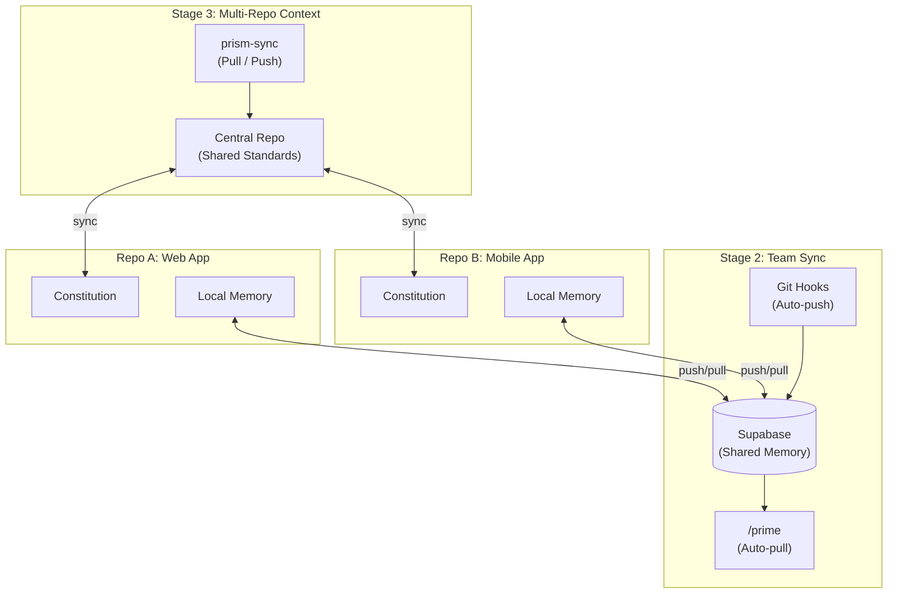
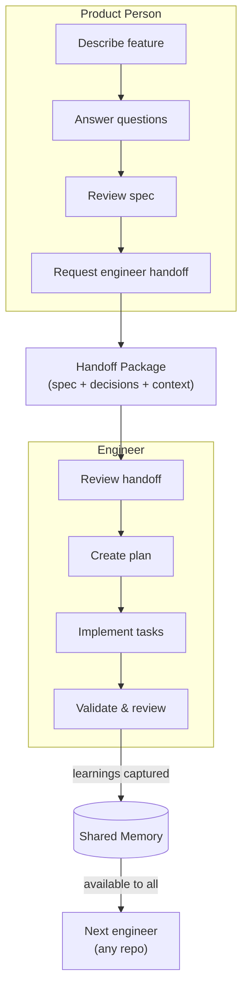
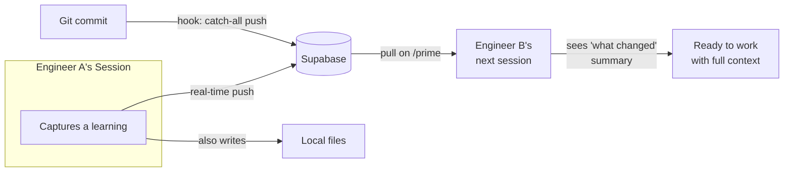
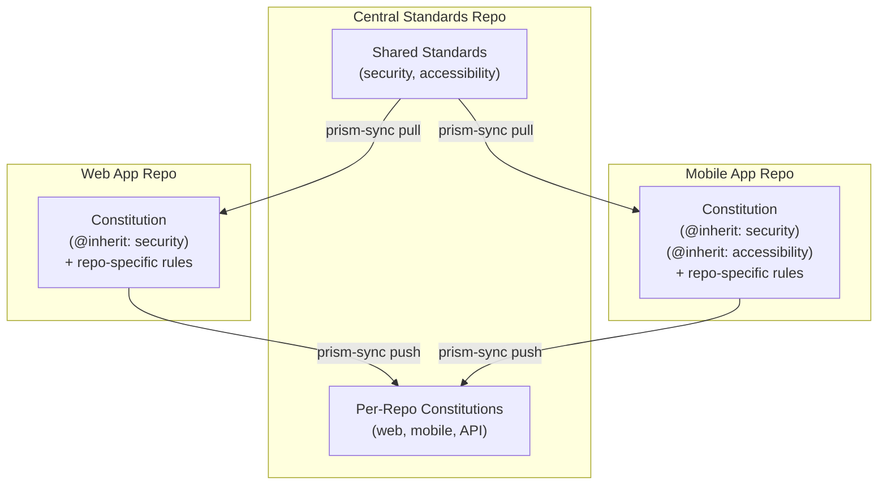

# How Prism Works Across Teams and Projects

This guide shows the future vision for Prism Stages 2 and 3: how product people and engineers collaborate through shared memory, synced standards, and structured handoffs across multiple project folders (git repositories where your code lives).

> **Note:** This describes the target state after Stage 2 (Team Sync) and Stage 3 (Multi-Repo Context) are implemented. Some features shown here are not yet built.

## The Big Picture

Prism connects three things that are usually disconnected: product decisions, engineering knowledge, and project standards. Stages 2 and 3 add the infrastructure to share all three across your team.

<!-- Alt text: A diagram showing two infrastructure layers. Stage 2 (Team Sync) has a Supabase database in the center connected to local memory in Repo A and Repo B via push/pull arrows, with git hooks pushing and /prime pulling. Stage 3 (Multi-Repo Context) has a central repo connected to constitutions in both repos via prism-sync tooling. -->

## How Product People and Engineers Collaborate

The workflow splits into two clear swim lanes. Product people own the "what" and engineers own the "how." The handoff package bridges the gap.

<!-- Alt text: A top-down flow with two swim lanes. The product person describes a feature, answers questions, reviews the spec, and requests an engineer handoff. This creates a Handoff Package containing spec, decisions, and context. The engineer reviews the handoff, creates a plan, implements tasks, and validates. Learnings from validation flow into shared memory, which is then available to any engineer in any repo. -->

### What the product person does

The product person drives three steps without writing code:

1. Describe the feature in plain language.
2. Answer Prism's clarifying questions.
3. Review the spec and request an engineer handoff.

Prism generates a Technical Review Package. This package bundles the spec, all decisions made, and relevant context into one document. The product person shares this with engineering.

### What the engineer does

The engineer receives the handoff and picks up from there:

1. Review the handoff package.
2. Approve or adjust the technical plan.
3. Implement task by task (Prism validates each one).
4. Complete the code and security review.

Every learning discovered during implementation is captured and pushed to shared memory.

**You should now see:** how the handoff package creates a clean boundary between product and engineering work.

## How Shared Memory Works (Stage 2)

Today, each engineer's learnings stay on their machine. Stage 2 changes this by syncing memory through a Supabase database (a cloud-hosted data store your team sets up once).

### What gets shared

| Category | Example | Who benefits |
|----------|---------|-------------|
| Patterns | "Use React Query's onMutate for optimistic updates" | Engineers starting similar work |
| Gotchas | "MapView crashes with more than 500 markers" | Engineers about to hit the same wall |
| Decisions | "Using CSS Grid for the filter panel layout" | Engineers who need to understand past choices |
| Components | "StationList lives at /components/ev/StationList.tsx" | Engineers navigating the codebase |
| Constraints | "API rate limit: 100 requests per minute" | Anyone building features that call the API |

### How syncing happens

<!-- Alt text: A left-to-right flow showing Engineer A captures a learning, which pushes to Supabase in real-time and writes to local files. A git commit triggers a catch-all push via hook. Supabase delivers the learning to Engineer B on their next /prime session start, where they see a what changed summary and are ready to work with full context. -->

Key details:

- Learnings push to the database the moment they are captured. No waiting for session end.
- A git hook acts as a safety net, pushing anything that was missed.
- When an engineer starts a session with `/prime`, new team memory loads automatically.
- A "what changed" summary shows what teammates added since your last session.
- If the database is unreachable, Prism works normally with local memory. It syncs when the connection returns.

### Automatic gotcha surfacing

When you describe your next task, Prism searches shared memory for relevant warnings. If a teammate already hit a problem related to your work, Prism tells you before you start.

> **Tip:** This means one engineer hitting a bug can save every future engineer from the same mistake, across all project folders connected to the same database.

**You should now see:** how learnings flow from one engineer's session into every teammate's future sessions.

## How Constitution Syncing Works (Stage 3)

Your project's constitution (the set of rules and preferences that guide how Prism works) currently lives in each project folder independently. Stage 3 adds a central standards repository (a shared project folder that holds your organization's rules).

### The central repo pattern

<!-- Alt text: A diagram showing a central standards repo at the top with shared standards and per-repo constitution copies. Arrows show prism-sync pull flowing down to the web app and mobile app constitutions, and prism-sync push flowing back up from each repo to the central copies. Each repo constitution inherits shared standards and adds its own rules. -->

### How it works

- Shared standards (security rules, accessibility requirements) live in the central repo.
- Each project folder's constitution references shared standards with `@inherit` markers.
- When you pull, inherited sections expand into your local constitution.
- When you push, local changes flow back to the central repo as a pull request.
- A status command shows which project folders are in sync, ahead, or behind.

### What this means for engineers

- A new project folder starts with your organization's standards already in place.
- When a security rule changes, one update reaches every project folder.
- Each team can still add repo-specific rules on top of shared ones.
- No more copy-pasting standards between projects. No more drift.

**You should now see:** how the central repo keeps standards consistent while letting each project folder customize its own rules.

## How Claude Code's Built-In Memory Fits In

Claude Code recently added automatic Session Memory. This is worth understanding because it overlaps with some of what Prism provides.

### What Claude Code's memory does

| Feature | How it works | Shared with team? |
|---------|-------------|-------------------|
| CLAUDE.md files | You write project rules manually. Checked into git. | Yes, via git |
| .claude/rules/ | Modular rule files, can use symlinks to share. | Yes, via git |
| Session Memory | Automatic background summaries of your sessions. | No, local only |
| User memory | Personal preferences at ~/.claude/CLAUDE.md. | No, local only |

### What Claude Code's memory does NOT do

- It does not sync learnings between team members.
- It does not share gotchas, patterns, or architectural decisions.
- It does not connect memory across different project folders.
- It does not surface relevant warnings from teammate experience.

### Where Prism adds value

| Need | Claude Code alone | With Prism Stage 2/3 |
|------|------------------|---------------------|
| Personal session recall | Session Memory handles this | Same, plus structured context |
| Team knowledge sharing | Not supported | Supabase-synced shared memory |
| Cross-repo standards | Manual CLAUDE.md copying | Central repo with auto-sync |
| Gotcha prevention | Not supported | Automatic relevance matching |
| Onboarding a new engineer | They start from zero | They get all team learnings on first `/prime` |

### Open question

Claude Code's Session Memory is still evolving. As it matures, there may be ways to use it alongside Prism's shared memory -- for example, letting Session Memory handle personal recall while Prism handles team-level knowledge. This is an area to watch.

> **Note:** Claude Code's `.claude/rules/` directory supports symlinks. This could complement Stage 3's constitution syncing by linking shared rule files across project folders.

**You should now see:** how Claude Code's memory solves the personal recall problem, while Prism's Stages 2 and 3 solve the team sharing problem.

## Putting It All Together

Here is how a typical week looks for a team using Prism with Stages 2 and 3:

**Monday:** Sara (PM) describes a new feature in the web app repo. Prism writes the spec, asks questions, and Sara answers them. She requests an engineer handoff.

**Tuesday:** Alex (engineer) opens the web app repo. `/prime` loads the latest team memory and shows Sara's handoff package. Alex plans and starts implementing. During implementation, Prism captures three learnings.

**Wednesday:** Jordan (engineer) opens the mobile app repo to build a similar feature. `/prime` loads Alex's learnings from yesterday. Prism warns: "Alex discovered that the map component crashes above 500 markers. Consider clustering." Jordan avoids the bug entirely.

**Thursday:** The platform team updates the shared security standards in the central repo. They run `prism-sync push --all`. Every repo's constitution gets a pull request with the new rules.

**Friday:** A new engineer joins the team. They clone the web app repo, run `prism setup --team`, and `/prime`. They immediately have access to every learning, decision, and gotcha the team has captured. No onboarding doc needed.

## What's Next

- Review the Stage 2 spec (TMS-001) for team memory sync details
- Review the Stage 3 spec (PRISM-002) for multi-repo constitution details
- Watch Claude Code's Session Memory evolution for integration opportunities
- Try the current single-repo workflow to build familiarity before Stages 2 and 3

## Troubleshooting

| Problem | Likely Cause | Fix |
|---------|-------------|-----|
| Team memory not loading | Setup not complete | Run `prism setup --team` to activate team sync |
| Constitution out of sync | Manual edits without pushing | Run `prism-sync status` to check, then `prism-sync push` |
| Learnings not appearing for teammates | Database unreachable during capture | Check connection, then run `prism sync` to drain the offline queue |
| New repo missing standards | Constitution not pulled from central | Run `prism-sync pull` or set up inheritance with `@inherit` markers |
