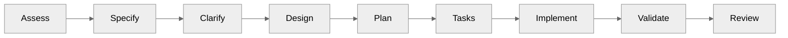
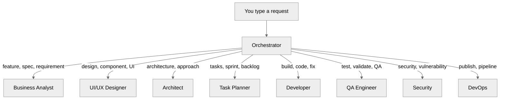
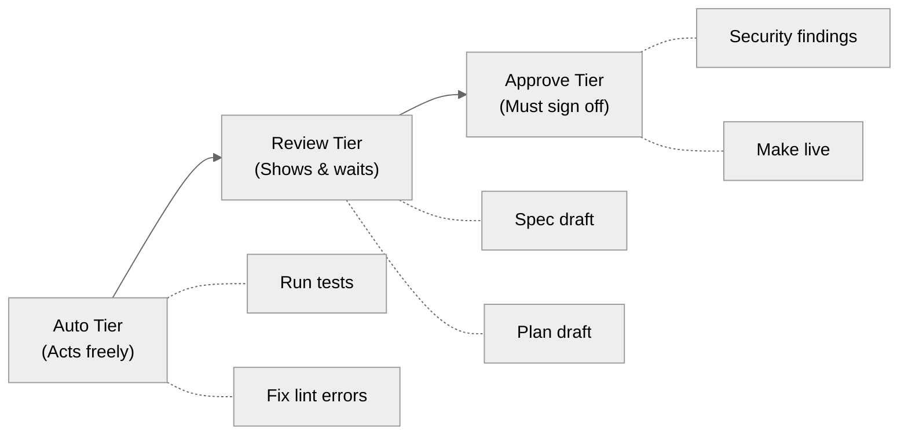
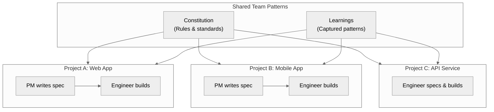

# How to Use Prism Across Teams and Projects

This guide shows how Prism's workflow and agent system helps multiple engineers and product people work together across different project folders.

## What You'll Need

- Prism installed in each project folder (the command line tool that powers your development workflow)
- At least one project with a constitution (the set of rules and preferences that guide how Prism works in your project)
- Team members who will collaborate on features

## How the Core Workflow Moves a Feature Forward

Every feature in Prism follows the same nine-step chain. This keeps work consistent no matter who starts the request or which project folder it lives in.

The chain works the same way whether one person drives it or five people hand off between steps.

<!-- Alt text: A left-to-right flowchart showing nine workflow phases in order: Assess, Specify, Clarify, Design, Plan, Tasks, Implement, Validate, and Review. Each phase connects to the next with an arrow. -->

Here is what happens at each step:

| Step | What Happens | Who Typically Leads |
|------|-------------|-------------------|
| Assess | Prism scores the request and picks a workflow track | Automatic |
| Specify | A spec is written from the feature description | Product person or engineer |
| Clarify | Open questions are asked and answered | Product person |
| Design | Components and user flows are designed | Designer or engineer |
| Plan | A technical plan is created from the spec | Engineer |
| Tasks | The plan is broken into small, ordered tasks | Engineer |
| Implement | Code is written task by task | Engineer |
| Validate | Tests and quality checks run automatically | Automatic |
| Review | Code and security reviews happen before merging | Engineer or lead |

> **Tip:** A product manager can drive the first three steps (Assess, Specify, Clarify) without writing any code. The engineer picks up at Plan.

**You should now see:** how the workflow creates a clean handoff point between product and engineering at step four (Design) or step five (Plan).

## How Agents Route and Hand Off Work

Prism uses nine specialized agents. Each agent owns a specific part of the workflow. When you type a request, the Orchestrator agent reads it and sends it to the right specialist.

<!-- Alt text: A top-down flowchart showing the user's request going to the Orchestrator, which routes to eight specialist agents based on trigger words. Business Analyst handles feature and spec requests. UI/UX Designer handles design requests. Architect handles architecture requests. Task Planner handles task and sprint requests. Developer handles build and code requests. QA Engineer handles test and validation requests. Security handles vulnerability requests. DevOps handles publishing requests. -->

When one agent finishes its work, it creates a structured handoff. The handoff includes four sections:

- **Completed** -- what was done
- **Artifacts** -- which files were created or changed
- **For Your Action** -- what the next agent needs to do
- **Context** -- decisions, constraints, and open questions

This handoff format is the same every time. It does not matter which agent sends it or which agent receives it.

> **Note:** Every handoff also carries a machine-readable state block. This means Prism can resume the workflow even if you close your session and come back later.

**You should now see:** how agents form a relay team, each passing a structured baton to the next.

## How Human Oversight Keeps You in Control

Not every step needs your approval. Prism uses three tiers to decide when to pause and ask.

| Tier | What Happens | Example |
|------|-------------|---------|
| Auto | Prism acts without asking | Running tests, fixing lint errors |
| Review | Prism shows you the result and waits for your OK | Spec review, plan approval |
| Approve | Prism stops and requires your sign-off | Security findings, making a project live |

<!-- Alt text: A flowchart showing three oversight tiers from left to right: Auto (acts freely, examples: run tests, fix lint errors), Review (shows and waits, examples: spec draft, plan draft), and Approve (must sign off, examples: security findings, make live). Each tier connects to its example actions with dotted lines. -->

The tier can escalate during a workflow. If the QA loop fails five times, it moves from Auto to Review and asks you what to do.

**You should now see:** how Prism balances speed with safety by only asking for input when it matters.

## How Multiple Engineers Share One Workflow

Here is where Prism's value grows. A product manager and an engineer in the same project folder already benefit from the workflow chain. But the same system works across teams and project folders too.

### The Single-Project Team

In one project folder, the workflow looks like this:

1. The product manager types a feature description.
2. Prism creates a spec and asks clarifying questions.
3. The product manager answers the questions.
4. The engineer picks up at the Plan step.
5. Prism breaks the plan into tasks for the engineer.
6. The engineer implements each task.
7. Prism validates and reviews the code automatically.

**You should now see:** a clean split between product work (steps 1-3) and engineering work (steps 4-7).

### The Multi-Project Team

When your team works across multiple project folders, Prism's constitution and learning system tie everything together.

<!-- Alt text: A flowchart showing shared team patterns (constitution and learnings) at the top connecting to three projects below. Project A (Web App) has a PM who writes specs and an engineer who builds. Project B (Mobile App) has a PM and engineer. Project C (API Service) has an engineer who both specs and builds. The constitution and learnings flow down into all three projects. -->

Here is what stays consistent across all project folders:

- **Constitution** -- Your coding standards, testing rules, and architecture choices travel with the team. Copy the constitution file to a new project and Prism enforces the same rules.
- **Learnings** -- When Prism catches a bug pattern or a fix that worked, it saves that learning. Your team can carry those learnings to other projects so the same mistakes are not repeated.
- **Workflow chain** -- The nine-step process is identical everywhere. A product manager who learned to write specs in Project A already knows how to do it in Project B.
- **Agent behavior** -- The agents respond the same way in every project. The Business Analyst always asks clarifying questions. The Architect always checks the constitution.

> **Tip:** To share a constitution across project folders, copy the `memory/constitution.md` file from one project to another. Prism will use it right away.

**You should now see:** how the constitution and learnings create a shared standard that travels between project folders.

### How a Feature Flows Across Team Members

Here is a realistic example of how three people work on one feature:

1. **Sara (Product Manager)** types: "I want to add dark mode to the app."
2. Prism creates a spec and flags two questions about toggle behavior.
3. Sara answers the questions. The spec is now complete.
4. **Alex (Frontend Engineer)** opens the same project folder and types: "Continue."
5. Prism shows Alex the finished spec and starts the Plan step.
6. Alex approves the plan. Prism creates six tasks.
7. Alex implements the first four tasks. Prism validates each one.
8. **Jordan (Senior Engineer)** reviews the code using Prism's review step.
9. Jordan approves. The feature is complete.

Each person saw only the parts of the workflow that mattered to them. Sara never saw task breakdowns. Alex never had to write the spec from scratch. Jordan only reviewed finished, validated code.

## What's Next

- Share this guide with your team as an overview of the Prism workflow
- Try running a feature through the full chain in a test project folder
- Copy your constitution to a second project folder to see how standards carry over
- Read the command reference for all available Prism commands

## Troubleshooting

| Problem | Likely Cause | Fix |
|---------|-------------|-----|
| Agent responds but seems confused | Trigger words matched the wrong agent | Rephrase your request with clearer keywords |
| Workflow does not resume after a break | Session context file is missing | Type "continue" or check that `memory/project-context.md` exists |
| Constitution rules not enforced in new project | Constitution file not copied | Copy `memory/constitution.md` from your source project |
| QA loop keeps failing | A persistent test or lint issue | After 5 attempts, Prism will ask you to intervene manually |
