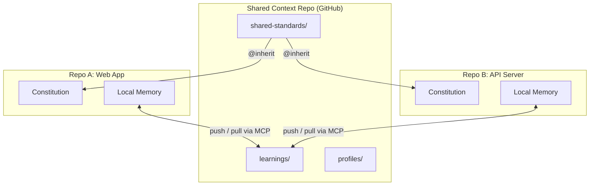
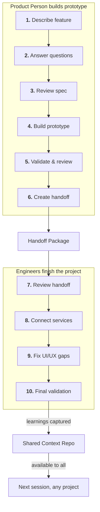
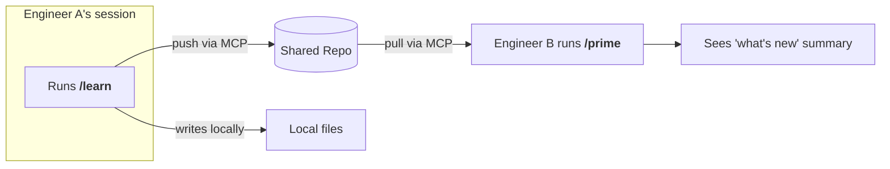

# How Prism Works Across Teams and Projects

This guide explains how Prism shares learnings, standards, and project context across multiple code projects through a shared GitHub repository.

## The Big Picture

Prism connects product decisions, engineering knowledge, and project standards. Shared context lets all of this flow between projects without manual copying.



<!-- Alt text: A diagram showing a shared context repo on GitHub with learnings, profiles, and shared-standards directories. Two project repos (Web App and API Server) push and pull learnings via MCP. Shared standards flow into each repo's constitution via @inherit markers. -->

## How Product People and Engineers Collaborate

Product people use Prism to build a working prototype. Engineers take over to connect real services, clean up code, and handle edge cases.



<!-- Alt text: A top-down flow with two swim lanes. The product person describes, clarifies, specs, builds, validates, and hands off. The engineer reviews, connects services, fixes gaps, and validates. Learnings flow into the shared context repo, available to anyone in any project. -->

### What the product person does

1. Describe the feature in plain language.
2. Answer Prism's clarifying questions.
3. Review and approve the spec.
4. Use Prism to build a functional prototype.
5. Validate and review the prototype.
6. Create a handoff package for engineering.

### What the engineer does

1. Review the handoff package and prototype.
2. Connect the prototype to real backend services.
3. Fix UI/UX issues that the prototype couldn't resolve.
4. Implement remaining features and run final validation.

Every learning discovered during this work is captured and pushed to the shared repo.

## How Shared Context Works

Each person's learnings sync through a shared GitHub repository accessed via GitHub MCP. No external databases or services needed.

### What gets shared

| Category | Example | Who benefits |
|----------|---------|-------------|
| Patterns | "Use React Query's onMutate for optimistic updates" | Anyone starting similar work |
| Gotchas | "DataGrid slows with more than 10,000 rows" | Anyone about to hit the same wall |
| Decisions | "Using Flexbox for the sidebar layout" | Anyone who needs to understand past choices |

### How syncing happens



<!-- Alt text: Engineer A runs /learn, which pushes to the shared repo via MCP and writes locally. The shared repo delivers the learning when Engineer B runs /prime, showing a what's new summary. -->

Key details:

- Learnings push to the shared repo the moment they are captured via `/learn`. No waiting.
- When anyone starts a session with `/prime`, new shared learnings load automatically.
- A "what's new" summary shows what was added since your last session.
- If GitHub MCP is unreachable, Prism works normally with local memory and a cached copy of shared learnings. It syncs when the connection returns.
- Failed pushes queue locally and replay automatically on the next `/prime`.

### Automatic gotcha surfacing

When you start work, Prism loads shared learnings from all connected projects. If someone already hit a problem related to your work, you see the warning before you start.

> **Tip:** One person hitting a bug can save every future session from the same mistake, across all projects connected to the same shared repo.

## How Shared Standards Work

Your project's constitution (the rules that guide how Prism works) can reference shared organizational standards stored in the shared repo.

### The @inherit pattern

```markdown
# Constitution: web-app

## Article 1: Technology Stack
[repo-specific content]

## Article 4: Security Mandates
<!-- @inherit: shared-standards/security-standards.md -->

## Article 5: Accessibility
<!-- @inherit: shared-standards/accessibility.md -->
```

### How it works

- Shared standards live in the `shared-standards/` directory of the shared repo.
- Each project's constitution references them with `<!-- @inherit: ... -->` markers.
- During `/prime`, Prism fetches the referenced files via MCP and expands them inline.
- If the shared standard is unreachable, Prism uses its cached copy.
- Local constitution is the source of truth. Shared standards are read-only from consumer projects.

### What this means for your team

- A new project starts with your organization's standards already available.
- When a security rule changes, one update in the shared repo reaches every project on next `/prime`.
- Each project can still add its own rules on top of shared ones.

## How Claude Code's Built-In Memory Fits In

Claude Code has automatic Session Memory. It overlaps with some of what Prism provides.

### Where Prism adds value

| Need | Claude Code alone | With Prism shared context |
|------|------------------|--------------------------|
| Personal session recall | Session Memory handles this | Same, plus structured context |
| Cross-project knowledge sharing | Not supported | Shared repo synced via MCP |
| Cross-repo standards | Manual CLAUDE.md copying | Shared standards with @inherit |
| Gotcha prevention | Not supported | Automatic loading from shared learnings |
| Starting a new project | Start from zero | Get all shared learnings on first `/prime` |

## Putting It All Together

Here is how a typical week looks for a team using Prism with shared context:

**Monday:** Sara (PM) describes a new feature in the web app repo. Prism writes the spec, asks questions, and Sara answers them. Sara builds a working prototype.

**Tuesday:** Sara validates the prototype and creates a handoff package. Alex (engineer) opens the same repo. `/prime` loads the latest shared learnings. Alex reviews the handoff and starts connecting to real services.

**Wednesday:** Jordan (engineer) opens the API server repo to build a related endpoint. `/prime` loads Alex's learnings from yesterday. Prism warns: "Alex discovered that the DataGrid component slows above 10,000 rows. Consider virtualization." Jordan avoids the issue entirely.

**Thursday:** The team updates shared security standards in the shared repo. Every project picks up the new rules on next `/prime`.

**Friday:** A new engineer joins. They clone a repo, run `prism connect my-org/platform-context`, then `/prime`. They immediately have access to every shared learning. No onboarding doc needed.

## Getting Started

1. Run `/connect` to set up shared context for your project.
2. See the [Shared Context Setup Guide](shared-context-setup.md) for detailed instructions.

## Troubleshooting

| Problem | Likely Cause | Fix |
|---------|-------------|-----|
| Shared learnings not loading | Shared context not set up | Run `/connect` to activate shared context |
| Constitution missing inherited standards | @inherit markers not expanded | Run `/prime` to pull and expand shared standards |
| Learnings not syncing | GitHub MCP unreachable | Check MCP connection. Learnings queue locally and sync on next `/prime` |
| New project missing shared learnings | Not connected to shared repo | Run `/connect my-org/platform-context` |
