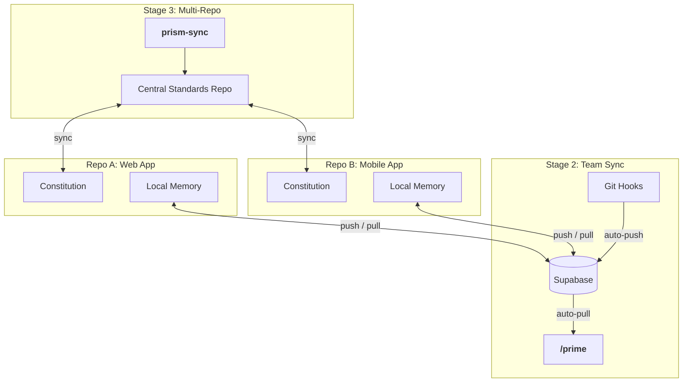
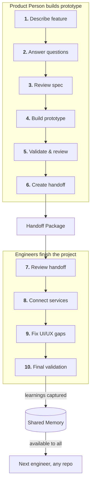
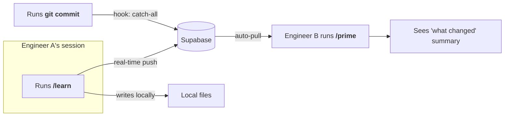
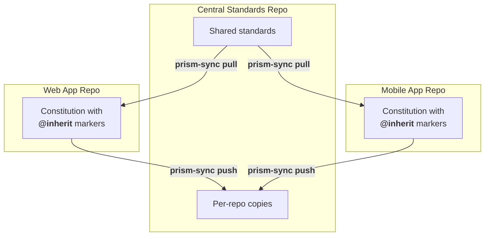

# How Prism Works Across Teams and Projects

This guide shows the future vision for Prism Stages 2 and 3: how product people and engineers collaborate through shared memory, synced standards, and structured handoffs across multiple project folders (git repositories where your code lives).

> **Note:** This describes the target state after Stage 2 (Team Sync) and Stage 3 (Multi-Repo Context) are implemented. Some features shown here are not yet built.

## The Big Picture

Prism connects three things that are usually disconnected: product decisions, engineering knowledge, and project standards. Stages 2 and 3 add the infrastructure to share all three across your team.

<!-- Alt text: A diagram showing two infrastructure layers. Stage 2 (Team Sync) has a Supabase database connected to local memory in Repo A and Repo B via push/pull arrows, with git hooks auto-pushing and /prime auto-pulling. Stage 3 (Multi-Repo) has a central standards repo connected to constitutions in both repos via prism-sync tooling. -->

## How Product People and Engineers Collaborate

Product people use Prism to build a working prototype -- spec through implementation. Engineers then take over to finish the project: connecting to real services, cleaning up code, and fixing what a prototype can't get right.

<!-- Alt text: A top-down flow with two swim lanes. The product person describes a feature, answers questions, reviews the spec, builds a prototype, validates, and creates a handoff package. The engineer reviews the handoff, connects backend services, fixes UI/UX gaps, and does final validation. Learnings flow into shared memory, available to any engineer in any repo. -->

### What the product person does

The product person drives the feature from idea through working prototype:

1. Describe the feature in plain language.
2. Answer Prism's clarifying questions.
3. Review and approve the spec.
4. Use Prism to build a functional prototype.
5. Validate and review the prototype.
6. Create a handoff package for engineering.

The handoff package bundles the spec, all decisions made, the prototype code, and relevant context into one document. The product person shares this with engineering.

### What the engineer does

The engineer receives the handoff and finishes the project:

1. Review the handoff package and prototype.
2. Connect the prototype to real backend services.
3. Fix UI/UX issues that Prism couldn't resolve.
4. Implement remaining features and run final validation.

Engineers might also refactor prototype code, add edge case handling, or optimize performance. Every learning discovered during this work is captured and pushed to shared memory.

**You should now see:** how the product person builds something real before handing off, and how engineers finish what the prototype started.

## How Shared Memory Works (Stage 2)

Today, each person's learnings stay on their machine. Stage 2 changes this by syncing memory through a Supabase database (a cloud-hosted data store your team sets up once).

### What gets shared

| Category | Example | Who benefits |
|----------|---------|-------------|
| Patterns | "Use React Query's onMutate for optimistic updates" | Engineers starting similar work |
| Gotchas | "DataGrid slows with more than 10,000 rows" | Anyone about to hit the same wall |
| Decisions | "Using Flexbox for the sidebar layout" | Anyone who needs to understand past choices |
| Components | "ProductList at /components/catalog/ProductList.tsx" | Anyone navigating the codebase |
| Constraints | "Weather API rate limit: 100 requests per minute" | Anyone building features that call the API |

### How syncing happens

<!-- Alt text: A left-to-right flow showing Engineer A runs /learn, which pushes to Supabase in real-time and writes to local files. Running git commit triggers a catch-all hook push. Supabase delivers the learning when Engineer B runs /prime, where they see a what changed summary. -->

Key details:

- Learnings sync through an external database, not through git. This keeps your project folder clean -- no repo bloat from hundreds of memory files committed over time.
- Learnings push to the database the moment they are captured via `/learn`. No waiting for session end.
- A git hook on `git commit` acts as a safety net, pushing anything that was missed.
- When anyone starts a session with `/prime`, new team memory loads automatically.
- A "what changed" summary shows what teammates added since your last session.
- If the database is unreachable, Prism works normally with local memory. It syncs when the connection returns.

### Why Supabase (and what else works)

The Stage 2 spec uses Supabase as the default because it bundles several things teams need in one service: a Postgres database, GitHub OAuth for sign-in, row-level security so each repo's memory stays isolated, and an optional vector extension for similarity search.

That said, Supabase is not the only option. Any Postgres database with the right extensions works. Here is what you actually need:

| Capability | Supabase provides | Postgres alternative |
|-----------|-------------------|---------------------|
| Data storage | Managed Postgres | Any Postgres instance (self-hosted, RDS, Neon, etc.) |
| Authentication | Built-in GitHub OAuth | Add your own OAuth or API key layer |
| Row-level security | Built-in RLS policies | Standard Postgres RLS (same SQL) |
| Similarity search | pgvector extension included | Install pgvector on any Postgres 12+ |
| API layer | Auto-generated REST API | Add PostgREST, Hasura, or a custom API |

You could also connect Prism to a non-Postgres backend through an MCP server or custom API, as long as it supports the same read/write operations. The sync protocol is straightforward: push memory items on capture, pull new items on session start, and queue operations when the connection is down.

> **Tip:** If your organization already runs Postgres, you can skip Supabase entirely. Install pgvector, set up the schema from the TMS-001 spec, and point Prism at your existing database. You only lose the managed OAuth flow, which you can replace with API keys or your existing identity provider.

### Automatic gotcha surfacing

When you describe your next task, Prism searches shared memory for relevant warnings. If a teammate already hit a problem related to your work, Prism tells you before you start.

> **Tip:** This means one person hitting a bug can save every future teammate from the same mistake, across all project folders connected to the same database.

**You should now see:** how learnings flow from one person's session into every teammate's future sessions.

## How Constitution Syncing Works (Stage 3)

Your project's constitution (the set of rules and preferences that guide how Prism works) currently lives in each project folder independently. Stage 3 adds a central standards repository (a shared project folder that holds your organization's rules).

### The central repo pattern

<!-- Alt text: A diagram showing a central standards repo at the top with shared standards and per-repo copies. Arrows show prism-sync pull flowing down to web app and mobile app constitutions that use @inherit markers, and prism-sync push flowing back up from each repo to the central copies. -->

### How it works

- Shared standards (security rules, accessibility requirements) live in the central repo.
- Each project folder's constitution references shared standards with `@inherit` markers.
- Running `prism-sync pull` expands inherited sections into your local constitution.
- Running `prism-sync push` sends local changes back to the central repo as a pull request.
- Running `prism-sync status` shows which project folders are in sync, ahead, or behind.

### What this means for your team

- A new project folder starts with your organization's standards already in place.
- When a security rule changes, one update reaches every project folder.
- Each team can still add repo-specific rules on top of shared ones.
- No more copy-pasting standards between projects. No more drift.

**You should now see:** how the central repo keeps standards consistent while letting each project folder customize its own rules.

## How Claude Code's Built-In Memory Fits In

Claude Code recently added automatic Session Memory. This is worth understanding because it overlaps with some of what Prism provides.

### What Claude Code's memory does

| Feature | How it works | Shared with team? |
|---------|-------------|-------------------|
| CLAUDE.md files | You write project rules manually. Checked into git. | Yes, via git |
| .claude/rules/ | Modular rule files, can use symlinks to share. | Yes, via git |
| Session Memory | Automatic background summaries of your sessions. | No, local only |
| User memory | Personal preferences at ~/.claude/CLAUDE.md. | No, local only |

### What Claude Code's memory does NOT do

- It does not sync learnings between team members.
- It does not share gotchas, patterns, or architectural decisions.
- It does not connect memory across different project folders.
- It does not surface relevant warnings from teammate experience.

### Where Prism adds value

| Need | Claude Code alone | With Prism Stage 2/3 |
|------|------------------|---------------------|
| Personal session recall | Session Memory handles this | Same, plus structured context |
| Team knowledge sharing | Not supported | Supabase-synced shared memory |
| Cross-repo standards | Manual CLAUDE.md copying | Central repo with auto-sync |
| Gotcha prevention | Not supported | Automatic relevance matching |
| Onboarding a new team member | They start from zero | They get all team learnings on first `/prime` |

### Open question

Claude Code's Session Memory is still evolving. As it matures, there may be ways to use it alongside Prism's shared memory -- for example, letting Session Memory handle personal recall while Prism handles team-level knowledge. This is an area to watch.

> **Note:** Claude Code's `.claude/rules/` directory supports symlinks. This could complement Stage 3's constitution syncing by linking shared rule files across project folders.

**You should now see:** how Claude Code's memory solves the personal recall problem, while Prism's Stages 2 and 3 solve the team sharing problem.

## Putting It All Together

Here is how a typical week looks for a team using Prism with Stages 2 and 3:

**Monday:** Sara (PM) describes a new feature in the web app repo. Prism writes the spec, asks questions, and Sara answers them. Sara then uses Prism to build a working prototype with a product catalog page and filtering.

**Tuesday:** Sara validates the prototype and creates a handoff package. Alex (engineer) opens the same repo. `/prime` loads the latest team memory. Alex reviews the handoff, sees the prototype, and starts connecting it to the real Weather API and product database.

**Wednesday:** Jordan (engineer) opens the mobile app repo to build a similar feature. `/prime` loads Alex's learnings from yesterday. Prism warns: "Alex discovered that the DataGrid component slows above 10,000 rows. Consider virtualization." Jordan avoids the performance issue entirely.

**Thursday:** The platform team updates the shared security standards in the central repo. They run `prism-sync push --all`. Every repo's constitution gets a pull request with the new rules.

**Friday:** A new engineer joins the team. They clone the web app repo, run `prism setup --team`, and then `/prime`. They immediately have access to every learning, decision, and gotcha the team has captured. No onboarding doc needed.

## What's Next

- Review the Stage 2 spec (TMS-001) for team memory sync details
- Review the Stage 3 spec (PRISM-002) for multi-repo constitution details
- Watch Claude Code's Session Memory evolution for integration opportunities
- Try the current single-repo workflow to build familiarity before Stages 2 and 3

## Troubleshooting

| Problem | Likely Cause | Fix |
|---------|-------------|-----|
| Team memory not loading | Setup not complete | Run `prism setup --team` to activate team sync |
| Constitution out of sync | Manual edits without pushing | Run `prism-sync status` to check, then `prism-sync push` |
| Learnings not appearing for teammates | Database unreachable during capture | Check connection, then run `prism sync` to drain the offline queue |
| New repo missing standards | Constitution not pulled from central | Run `prism-sync pull` or set up inheritance with `@inherit` markers |
