# Prism OS Command & Workflow Diagrams

*Comprehensive reference for all commands, flows, agents, and expected outputs*

---

## Table of Contents

1. [Global Command Router](#1-global-command-router)
2. [Track Selection Flow](#2-track-selection-flow)
3. [Standard Track (Full Workflow)](#3-standard-track-full-workflow)
4. [Quick Flow Track](#4-quick-flow-track)
5. [Enterprise Track](#5-enterprise-track)
6. [Discovery Track (Greenfield)](#6-discovery-track-greenfield)
7. [Constitution Creation Flow](#7-constitution-creation-flow)
8. [Learning Loop Flow](#8-learning-loop-flow)
9. [QA Fix Loop Detail](#9-qa-fix-loop-detail)
10. [Agent Summary Reference](#10-agent-summary-reference)
11. [Workflow Chains](#11-workflow-chains)
12. [File Output Summary by Workflow](#12-file-output-summary-by-workflow)

---

## 1. Global Command Router

```
┌─────────────────────────────────────────────────────────────────────────────┐
│                           /prism [args]                                     │
└─────────────────────────────────────────────────────────────────────────────┘
                                    │
                    ┌───────────────┼───────────────┐
                    ▼               ▼               ▼
              No args          "feature"        Keyword
                    │               │               │
                    ▼               ▼               ▼
         ┌──────────────┐  ┌──────────────┐  ┌──────────────────────────────┐
         │ Show Status  │  │ Start Feature│  │ Route by Keyword             │
         │ + Offer Menu │  │ Workflow     │  ├──────────────────────────────┤
         └──────────────┘  └──────────────┘  │ continue → Resume workflow   │
                                             │ status   → Status display    │
                                             │ help     → Show commands     │
                                             └──────────────────────────────┘
```

### Command Reference Table

Individual workflow phases are accessed via standalone slash commands, not as
`/prism` subcommands. The `/prism` command itself handles entry, status,
resume, and help.

| Command | Function | Primary Agent/Skill |
|---------|----------|---------------------|
| `/prism` | Show status, offer menu | Orchestrator |
| `/prism "feature"` | Start feature workflow | Orchestrator → Track routing |
| `/prism continue` | Resume current workflow | Orchestrator → Phase resume |
| `/prism status` | Display progress | Orchestrator (delegates to /prism-status) |
| `/prism help` | Show available commands | Orchestrator |
| `/spec "description"` | Write/edit specification | Business Analyst / spec-writer |
| `/clarify` | Resolve spec ambiguities | Business Analyst / clarifier |
| `/prism-plan` | Generate implementation plan | Architect / technical-planner |
| `/prism-tasks` | Break plan into executable tasks | Task Planner / task-decomposer |
| `/validate` | Run QA validation checks | QA Engineer / qa-validator |
| `/review` | Run code review | Security / code-reviewer |
| `/constitution` | Create/view constitution | constitution-writer |
| `/prime` | Load project context for session | Context Primer |
| `/learn` | View/search project learnings | Learning Reader |
| `/prism-status` | Show workflow status | Status Reporter |
| `/prism-update` | Check for & install updates | Global update script |

**Note:** `/prism-plan`, `/prism-tasks`, and `/prism-status` use prefixed names
to avoid conflicts with Claude Code built-in commands.

---

## 2. Track Selection Flow

Track selection has two distinct detection paths. **Discovery detection**
happens first via `codebase-assessment` (checking for greenfield/scaffolded
signals). Only if the codebase is mature does the request proceed to
**complexity scoring** via `complexity-assessor`.

```
┌─────────────────────────────────────────────────────────────────────────────┐
│                    /prism "Add user authentication"                         │
└─────────────────────────────────────────────────────────────────────────────┘
                                    │
                                    ▼
                    ┌───────────────────────────────┐
                    │  STEP 1: Discovery Detection  │
                    │  ────────────────────────────  │
                    │  Checks (highest priority):    │
                    │  • Trigger words ("new project"│
                    │    "start fresh", "greenfield")│
                    │  • No constitution exists       │
                    │  • No project-context exists    │
                    │  • Empty/minimal directory      │
                    └───────────────────────────────┘
                                    │
                        ┌───────────┴───────────┐
                        │                       │
                   Greenfield/             Mature codebase
                   Scaffolded              (or no signals)
                        │                       │
                        ▼                       ▼
                  ┌──────────┐    ┌───────────────────────────────┐
                  │DISCOVERY │    │  STEP 2: Complexity Scoring   │
                  │  TRACK   │    │  ────────────────────────────  │
                  │          │    │  Skill: complexity-assessor   │
                  │(codebase-│    │  7 Dimensions (each 1-3):     │
                  │assessment│    │  • Scope                      │
                  │→ full    │    │  • Files affected             │
                  │ chain)   │    │  • Dependencies               │
                  └──────────┘    │  • Data changes               │
                                  │  • Integration complexity     │
                                  │  • Risk factors               │
                                  │  • Ambiguity                  │
                                  └───────────────────────────────┘
                                                │
                                       Score: 7-21
                                                │
                              ┌─────────────────┼─────────────────┐
                              │                 │                 │
                         Score 7-10        Score 11-16       Score 17-21
                              │                 │                 │
                              ▼                 ▼                 ▼
                        ┌──────────┐      ┌──────────┐      ┌──────────┐
                        │  QUICK   │      │ STANDARD │      │ENTERPRISE│
                        │   FLOW   │      │  TRACK   │      │  TRACK   │
                        └──────────┘      └──────────┘      └──────────┘
```

### Scoring Dimensions

| Dimension | Low (1) | Medium (2) | High (3) |
|-----------|---------|------------|----------|
| **Scope** | Single capability | Multiple related | System-wide |
| **Files** | 1-5 files | 5-15 files | 15+ files |
| **Dependencies** | None new | 1-2 new | 3+ new |
| **Data Changes** | None | Minor schema | Major migration |
| **Integration** | Internal only | 1 external | Multiple external |
| **Risk** | Easily reversible | Some risk | Production/security |
| **Ambiguity** | Clear requirements | Some questions | Many unknowns |

### Override Triggers

Regardless of score, certain signals force a minimum track:

- Security-related → Minimum Standard
- Database migration → Minimum Standard
- Production deployment → Minimum Standard
- New service/system → Minimum Enterprise
- Compliance requirements → Enterprise

### Track Comparison Matrix

| Aspect | Quick Flow | Standard | Enterprise | Discovery |
|--------|------------|----------|------------|-----------|
| **Complexity Score** | 7-10 | 11-16 | 17-21 | N/A (greenfield detection) |
| **Clarify Phase** | Skipped | Up to 3 rounds | Up to 3 rounds | Problem framing |
| **Architect Phase** | Skipped | Required | Required + ADRs | Stack evaluation |
| **UI/UX Designer** | Skipped | If UI feature | If UI feature | Framework selection |
| **Research Phase** | Skipped | Skipped | Required | N/A |
| **Task Count** | 1-5 | 5-20 | 20+ | Varies |
| **Security Review** | Optional | Optional | Required | N/A |
| **QA Fix Iterations** | 1 attempt | Up to 5 | Up to 5 | N/A |
| **Code Review** | Skipped | Required | Required | N/A |

### Track Escalation

Tracks can escalate upward during execution:

| From | To | Trigger |
|------|----|---------|
| Quick Flow | Standard | Scope grows (>5 files), unexpected dependencies, ambiguity found, user requests |
| Standard | Enterprise | Not automatic — user must explicitly request Enterprise rigor or override triggers must apply at initial assessment |

Standard does not auto-escalate to Enterprise mid-workflow. If Enterprise-level
complexity emerges during Standard execution, the Orchestrator flags it and
offers the user the choice to restart with Enterprise track.

---

## 3. Standard Track (Full Workflow)

**Chain:** `full-pipeline` (entry skill: `complexity-assessor`)

### Mermaid Diagram

```mermaid
flowchart TD
    subgraph Phase1["Phase 1: Specify + Clarify"]
        A["/prism 'feature request'"] --> B["ORCHESTRATOR"]
        B --> C["Skill: complexity-assessor"]
        C --> D{"Score 11-16?"}
        D -->|Yes| E["Route: Standard Track"]
        E --> F["BUSINESS ANALYST"]
        F --> G["Skill: spec-writer"]
        G --> H["Output: spec.md"]
        H --> I{"Ambiguities?"}
        I -->|Yes| J["Skill: clarifier"]
        J --> K{"Resolved?"}
        K -->|No, round < 3| J
        K -->|Yes| L["Output: clarifications.md"]
        I -->|No| L
    end

    subgraph Phase2["Phase 2: Plan"]
        L --> M{"UI Feature?"}
        M -->|Yes| N["UI/UX DESIGNER"]
        N --> O["Skills: framework-selector, ux-patterns, ui-designer, accessibility"]
        O --> P["Output: design decisions"]
        P --> Q["ARCHITECT"]
        M -->|No| Q
        Q --> R["Skill: technical-planner"]
        R --> S["Output: plan.md"]
        S --> T{"ADRs needed?"}
        T -->|Yes| U["Skill: adr-writer"]
        U --> V["Output: adr-NNN-*.md"]
    end

    subgraph Phase3["Phase 3: Tasks"]
        V --> W["TASK PLANNER"]
        S --> W
        W --> X["Skill: task-decomposer"]
        X --> Y["Output: tasks.md (5-20 tasks)"]
    end

    subgraph Phase4["Phase 4: Implement"]
        Y --> Z["DEVELOPER"]
        Z --> AA["Skill: learning-reader (load context)"]
        AA --> AB["Implement Task N"]
        AB --> AC["Skill: learning-capture"]
        AC --> AD["Skill: qa-validator"]
        AD --> AE{"Pass?"}
        AE -->|No, attempt < 5| AF["Skill: qa-fixer"]
        AF --> AD
        AE -->|No, 5 attempts| AG["Escalate to Human"]
        AE -->|Yes| AH{"More Tasks?"}
        AH -->|Yes| Z
        AH -->|No| AI["All Tasks Complete"]
    end

    subgraph Phase5["Phase 5: Review"]
        AI --> AJ["Skill: code-reviewer"]
        AJ --> AK{"Security-related?"}
        AK -->|Yes| AL["Skill: security-reviewer"]
        AK -->|No| AM["Complete"]
        AL --> AM
    end
```



### ASCII Version

```
STANDARD TRACK (Score 11-16)
Chain: full-pipeline
══════════════════════════════════════════════════════════════════════════════

PHASE 1: SPECIFY + CLARIFY
───────────────────────────
  Feature Request
        │
        ▼
  ┌─────────────┐     ┌─────────────────────┐     ┌──────────────────┐
  │ ORCHESTRATOR│────▶│ complexity-assessor │────▶│ BUSINESS ANALYST │
  └─────────────┘     └─────────────────────┘     └──────────────────┘
                                                          │
                                                          ▼
                                                  ┌───────────────┐
                                                  │  spec-writer  │
                                                  └───────────────┘
                                                          │
                                                          ▼
                                                  📄 spec.md
                                                          │
                                                          ▼
                                                  Ambiguities?
                                                   │        │
                                                  Yes       No
                                                   │        │
                                                   ▼        │
                                           ┌──────────────┐ │
                                       ┌──▶│  clarifier   │ │
                                       │   └──────────────┘ │
                                       │         │          │
                                       │         ▼          │
                                       │   Resolved?        │
                                       │    │       │       │
                                       │   No      Yes      │
                                       │ (< 3)     │       │
                                       │    │       │       │
                                       └────┘       ▼       │
                                            📄 clarifications.md
                                                    │◀──────┘

PHASE 2: PLAN
─────────────
        │
        ▼
  UI Feature? ────Yes────▶ ┌────────────────┐
        │                  │ UI/UX DESIGNER │
        │                  └────────────────┘
        │                          │
        │                          ▼
        │                  ┌────────────────────────────────────┐
        │                  │ framework-selector, ux-patterns,   │
        │                  │ ui-designer, accessibility,        │
        │                  │ figma-review, design-system-reader │
        │                  └────────────────────────────────────┘
        │                          │
        No                         │
        │                          │
        ▼                          ▼
  ┌─────────────────────────────────────┐
  │            ARCHITECT                │
  └─────────────────────────────────────┘
                    │
                    ▼
          ┌──────────────────┐
          │ technical-planner│
          └──────────────────┘
                    │
                    ▼
          📄 plan.md
                    │
               ADRs needed?
               │        │
              Yes       No
               │        │
               ▼        │
         ┌───────────┐  │
         │ adr-writer│  │
         └───────────┘  │
               │        │
               ▼        │
         📄 adr-NNN-*.md│
               │        │
               └────────┘

PHASE 3: TASKS
──────────────
                    │
                    ▼
          ┌──────────────────┐
          │   TASK PLANNER   │
          └──────────────────┘
                    │
                    ▼
          ┌──────────────────┐
          │  task-decomposer │
          └──────────────────┘
                    │
                    ▼
          📄 tasks.md (5-20 tasks)

PHASE 4: IMPLEMENT (Per-Task Loop)
──────────────────────────────────
                    │
                    ▼
          ┌──────────────────┐
     ┌───▶│    DEVELOPER     │
     │    └──────────────────┘
     │              │
     │              ▼
     │    ┌──────────────────┐
     │    │ learning-reader  │ (load relevant context)
     │    └──────────────────┘
     │              │
     │              ▼
     │      Implement Task N
     │              │
     │              ▼
     │    ┌──────────────────┐
     │    │ learning-capture │ (record findings)
     │    └──────────────────┘
     │              │
     │              ▼
     │    ┌──────────────────┐
     │    │  qa-validator    │
     │    └──────────────────┘
     │              │
     │              ▼
     │          Pass? ───Yes───▶ Mark task complete
     │              │                    │
     │             No                    ▼
     │         (< 5 attempts)    More Tasks? ───Yes───┐
     │              │                    │             │
     │              ▼                   No             │
     │    ┌──────────────────┐          │              │
     │    │    qa-fixer      │          │              │
     │    └──────────────────┘          │              │
     │              │                   │              │
     │              ▼                   │              │
     │        Re-validate ──────┘       │              │
     │                                  │              │
     │    (After 5 attempts)            │              │
     │    🚨 ESCALATE TO HUMAN          │              │
     │                                  │              │
     └──────────────────────────────────┘◀─────────────┘

PHASE 5: REVIEW
───────────────
                    │
                    ▼
          ┌──────────────────┐
          │  code-reviewer   │
          └──────────────────┘
                    │
                    ▼
          Security-related?
               │        │
              Yes       No
               │        │
               ▼        │
       ┌──────────────┐ │
       │  security-   │ │
       │  reviewer    │ │
       └──────────────┘ │
               │        │
               ▼        ▼
            ✅ Complete
```

---

## 4. Quick Flow Track

**Chain:** `quick-flow` (entry skill: `complexity-assessor`)

```
QUICK FLOW (Score 7-10)
Chain: quick-flow
══════════════════════════════════════════════════════════════════════════════

  "Fix typo in login button"
            │
            ▼
    ┌─────────────┐
    │ ORCHESTRATOR│
    └─────────────┘
            │
            ▼
   ┌────────────────────┐
   │complexity-assessor │
   │    Score: 7/21     │
   └────────────────────┘
            │
            ▼
   Route: QUICK FLOW
            │
            ▼
   ┌────────────────────┐
   │ BUSINESS ANALYST   │
   └────────────────────┘
            │
            ▼
   ┌────────────────────┐
   │    quick-spec      │  ◀── Standalone skill (delegates to spec-writer
   └────────────────────┘      with simplified constraints)
            │
            ▼
    📄 quick-spec (inline, not persisted unless requested)
            │
            │  ╔═══════════════════════════════╗
            │  ║  SKIPPED:                     ║
            │  ║  • Clarifier (no ambiguity)   ║
            │  ║  • UI/UX Designer             ║
            │  ║  • Architect (trivial)        ║
            │  ║  • Code Review                ║
            │  ╚═══════════════════════════════╝
            │
            ▼
   ┌────────────────────┐
   │   TASK PLANNER     │
   └────────────────────┘
            │
            ▼
   ┌────────────────────┐
   │  task-decomposer   │  ◀── Simplified: max 5 tasks, flat list
   └────────────────────┘
            │
            ▼
    📄 tasks.md (1-5 tasks)
            │
            ▼
   ┌────────────────────┐
   │    DEVELOPER       │
   └────────────────────┘
            │
            ▼
   ┌────────────────────┐
   │   qa-validator     │  ◀── Abbreviated validation
   └────────────────────┘
            │
            ▼
        Pass? ───Yes───▶ ✅ Complete
            │
           No
            │
            ▼
   ┌────────────────────┐
   │    qa-fixer        │  ◀── Single fix attempt only
   └────────────────────┘
            │
            ▼
        Fixed? ───Yes───▶ ✅ Complete
            │
           No
            │
            ▼
    🚨 ESCALATE TO HUMAN
```

### Quick Flow Characteristics

| Aspect | Value |
|--------|-------|
| **Trigger** | Score 7-10 (low complexity) |
| **Example requests** | Typo fixes, copy changes, simple config updates, small bug fixes |
| **Agents involved** | Orchestrator → BA → Task Planner → Developer → QA Engineer |
| **Skipped phases** | Clarify, UI/UX Design, Architecture, Code Review |
| **Spec type** | `quick-spec` skill (invokes spec-writer with simplified constraints) |
| **Task count** | 1-5 maximum |
| **QA fix attempts** | 1 (escalate immediately if fix fails) |

### Scope Escalation

Quick Flow can escalate to Standard track when:
1. **Scope grows:** More than 5 files affected
2. **Complexity emerges:** Unexpected dependencies discovered
3. **Ambiguity found:** Can't proceed without clarification
4. **User requests:** "Actually, let's do this properly"

Escalation preserves the quick-spec as a starting point, converts it to
full spec-template format, and enters Standard flow at spec-writer.

---

## 5. Enterprise Track

**Chain:** `full-pipeline` (entry skill: `complexity-assessor`, Enterprise variant)

```
ENTERPRISE TRACK (Score 17-21)
Chain: full-pipeline (Enterprise variant)
══════════════════════════════════════════════════════════════════════════════

  "Implement SOC2-compliant multi-tenant auth system"
            │
            ▼
    ┌─────────────┐
    │ ORCHESTRATOR│
    └─────────────┘
            │
            ▼
   ┌────────────────────┐
   │complexity-assessor │
   │    Score: 21/21    │
   └────────────────────┘
            │
            ▼
   Route: ENTERPRISE
            │
┌───────────┴───────────────────────────────────────────────────────────────┐
│ EXTENDED PHASE 1: SPECIFY + CLARIFY                                       │
├───────────────────────────────────────────────────────────────────────────┤
│                                                                           │
│    ┌────────────────────┐                                                 │
│    │ BUSINESS ANALYST   │                                                 │
│    └────────────────────┘                                                 │
│            │                                                              │
│            ▼                                                              │
│    ┌────────────────────┐                                                 │
│    │    spec-writer     │  ◀── Full template                              │
│    └────────────────────┘                                                 │
│            │                                                              │
│            ▼                                                              │
│    📄 spec.md                                                             │
│            │                                                              │
│            ▼                                                              │
│    ┌────────────────────┐                                                 │
│    │     clarifier      │  ◀── Up to 3 rounds (same cap as Standard;      │
│    └────────────────────┘      Enterprise rigor is in later phases)       │
│            │                                                              │
│            ▼                                                              │
│    📄 clarifications.md                                                   │
│                                                                           │
└───────────────────────────────────────────────────────────────────────────┘
            │
            ▼
┌───────────────────────────────────────────────────────────────────────────┐
│ EXTENDED PHASE 2: RESEARCH + PLAN                                         │
├───────────────────────────────────────────────────────────────────────────┤
│                                                                           │
│    ┌────────────────────┐         ┌────────────────┐                      │
│    │ UI/UX DESIGNER     │────────▶│   ARCHITECT    │                      │
│    │ (if UI feature)    │         └────────────────┘                      │
│    └────────────────────┘                 │                                │
│                                           ▼                                │
│                                  ┌─────────────────────┐                  │
│                                  │     researcher      │  ◀── Enterprise  │
│                                  │ (parallel research) │      only        │
│                                  └─────────────────────┘                  │
│                                           │                                │
│                                           ▼                                │
│                                  ┌─────────────────────┐                  │
│                                  │  technical-planner  │                  │
│                                  └─────────────────────┘                  │
│                                           │                                │
│                                           ▼                                │
│                                  ┌─────────────────────┐                  │
│                                  │ ADRs REQUIRED       │  ◀── Mandatory   │
│                                  │ (via adr-writer)    │      for         │
│                                  └─────────────────────┘      Enterprise  │
│                                           │                                │
│                                           ▼                                │
│                                  📄 plan.md                                │
│                                  📄 adr-NNN-*.md                           │
│                                                                           │
└───────────────────────────────────────────────────────────────────────────┘
            │
            ▼
┌───────────────────────────────────────────────────────────────────────────┐
│ PHASE 3: TASKS                                                            │
├───────────────────────────────────────────────────────────────────────────┤
│                                                                           │
│    ┌────────────────────┐                                                 │
│    │   TASK PLANNER     │                                                 │
│    └────────────────────┘                                                 │
│            │                                                              │
│            ▼                                                              │
│    📄 tasks.md (20+ tasks)                                                │
│                                                                           │
└───────────────────────────────────────────────────────────────────────────┘
            │
            ▼
    [Implement → Validate → Review phases same as Standard,
     but with Security review REQUIRED, not optional]
```

### Enterprise Track Characteristics

| Aspect | Value |
|--------|-------|
| **Trigger** | Score 17-21 (high complexity) |
| **Example requests** | SOC2 compliance, multi-tenant systems, critical infrastructure |
| **Research phase** | Required (via `researcher` skill) |
| **Clarification rounds** | Up to 3 (same cap as Standard) |
| **ADRs** | Required (via `adr-writer` skill) |
| **Security review** | Required (not optional) |
| **Task count** | 20+ |
| **QA fix attempts** | Up to 5 (same as Standard) |

### Enterprise vs Standard Differences

| Aspect | Standard | Enterprise |
|--------|----------|------------|
| Research phase | Skipped | Required |
| ADRs | Optional (if decisions needed) | Required |
| Security review | Optional | Required |
| Task count | 5-20 | 20+ |
| Score range | 11-16 | 17-21 |
| Clarification rounds | Up to 3 | Up to 3 (same cap) |

---

## 6. Discovery Track (Greenfield)

**Chain:** `discovery-chain` (entry skill: `codebase-assessment`)

Discovery is detected **before** complexity scoring. The Orchestrator checks
for greenfield signals (trigger words, missing constitution/context files,
empty directory) and routes to the Discovery chain directly, bypassing
`complexity-assessor` entirely.

```
DISCOVERY TRACK (No existing codebase)
Chain: discovery-chain
══════════════════════════════════════════════════════════════════════════════

  "I want to build a habit tracker app but don't know where to start"
            │
            ▼
    ┌─────────────┐
    │ ORCHESTRATOR│
    └─────────────┘
            │
            ▼
   ┌────────────────────────┐
   │  codebase-assessment   │
   │  Result: GREENFIELD    │
   │  (or SCAFFOLDED)       │
   └────────────────────────┘
            │
            ▼
   Route: DISCOVERY TRACK

═══════════════════════════════════════════════════════════════════════════════
STAGE 1: PROBLEM FRAMING
═══════════════════════════════════════════════════════════════════════════════
            │
            ▼
   ┌────────────────────┐
   │ BUSINESS ANALYST   │
   └────────────────────┘
            │
            ▼
   ┌────────────────────┐
   │  problem-framing   │
   └────────────────────┘
            │
            ▼
   📄 Problem statement captured
   ├── The Problem
   ├── Target Users
   ├── User Goals
   ├── Success Criteria
   └── Assumptions

═══════════════════════════════════════════════════════════════════════════════
STAGE 2: CONSTRAINT DISCOVERY
═══════════════════════════════════════════════════════════════════════════════
            │
            ▼
   ┌────────────────────────┐
   │ constraint-discovery   │
   └────────────────────────┘
            │
            ▼
   Constraints captured:
   ├── Budget
   ├── Timeline
   ├── Team size
   ├── Platforms
   └── Compliance requirements

═══════════════════════════════════════════════════════════════════════════════
STAGE 3: STACK RECOMMENDATION
═══════════════════════════════════════════════════════════════════════════════
            │
            ▼
   ┌────────────────────┐
   │     ARCHITECT      │
   └────────────────────┘
            │
            ▼
   ┌──────────────────────┐
   │ stack-recommendation │
   └──────────────────────┘
            │
            ▼
   ┌──────────────────────────────────────────────────────────────────────────┐
   │ STACK OPTIONS                                                            │
   ├──────────────────────────────────────────────────────────────────────────┤
   │                                                                          │
   │  Option A: [Framework + Stack]                                           │
   │  ├── Pros: [...]                                                         │
   │  ├── Cons: [...]                                                         │
   │  └── Fit: ★★★★☆                                                         │
   │                                                                          │
   │  Option B: [Framework + Stack]                                           │
   │  ├── Pros: [...]                                                         │
   │  ├── Cons: [...]                                                         │
   │  └── Fit: ★★★★☆                                                         │
   │                                                                          │
   │  RECOMMENDATION: [Best fit option]                                       │
   │  Reason: [Based on constraints]                                          │
   │                                                                          │
   └──────────────────────────────────────────────────────────────────────────┘
            │
            ▼
   👤 USER SELECTS STACK
            │
            ▼

═══════════════════════════════════════════════════════════════════════════════
STAGE 4: PROJECT FOUNDATION
═══════════════════════════════════════════════════════════════════════════════
            │
            ▼
   ┌────────────────────────┐
   │   foundation-writer    │
   └────────────────────────┘
            │
            ▼
   📄 /memory/project-foundation.md
   ├── Tech Stack (locked in)
   ├── Architecture Patterns
   ├── Quality Standards
   └── Initial Roadmap
            │
            ▼
   👤 USER APPROVES FOUNDATION
            │
            ▼

═══════════════════════════════════════════════════════════════════════════════
STAGE 5: CONSTITUTION (Pre-Populated)
═══════════════════════════════════════════════════════════════════════════════
            │
            ▼
   ┌────────────────────────┐
   │  constitution-writer   │  ◀── Pre-populated from foundation
   └────────────────────────┘
            │
            ▼
   📄 /memory/constitution.md
            │
            ▼
   ✅ READY FOR FEATURE DEVELOPMENT
      (First feature request goes to Standard/Quick workflow)
```

### Discovery Track Stages

| Stage | Agent | Skill | Output |
|-------|-------|-------|--------|
| 1. Problem Framing | Business Analyst | problem-framing | Problem statement |
| 2. Constraints | Business Analyst | constraint-discovery | Constraints |
| 3. Stack Recommendation | Architect | stack-recommendation | Stack options + selection |
| 4. Foundation | Orchestrator | foundation-writer | project-foundation.md |
| 5. Constitution | Orchestrator | constitution-writer | constitution.md |

### Discovery Variants

| Variant | Behavior |
|---------|----------|
| **Greenfield** | Full flow — all questions asked, full stack comparison |
| **Scaffolded** | Abbreviated — detects existing setup, skips answered questions, validates existing choice |
| **Mature** | Exits Discovery → routes to Standard/Quick workflow via complexity-assessor |

---

## 7. Constitution Creation Flow

```
/constitution
══════════════════════════════════════════════════════════════════════════════

                    ┌────────────────────┐
                    │  Existing Project? │
                    └────────────────────┘
                             │
           ┌─────────────────┼─────────────────┐
           │                 │                  │
    Has manifests     From Discovery      Greenfield
    (package.json)    (foundation exists)  (empty dir)
           │                 │                  │
           ▼                 ▼                  ▼
    ┌──────────────┐  ┌──────────────┐  ┌──────────────┐
    │  ASSESSMENT  │  │  FOUNDATION  │  │  STANDARD    │
    │  PATH        │  │  PATH        │  │  PATH        │
    │(codebase-    │  │(pre-populate │  │(full guided  │
    │ assessment)  │  │ from found.) │  │ questions)   │
    └──────────────┘  └──────────────┘  └──────────────┘
           │                 │                  │
           └─────────────────┼──────────────────┘
                             │
                             ▼
┌───────────────────────────────────────────────────────────────────────────┐
│ CONSTITUTION WRITER v2.0                                                  │
├───────────────────────────────────────────────────────────────────────────┤
│                                                                           │
│  TIERED QUESTION STRATEGY                                                 │
│  ─────────────────────────                                                │
│  Tier 1 — Auto-Decide (never ask user):                                   │
│    TypeScript strictness, naming conventions, import organization,        │
│    error handling, architecture patterns, file length limits,             │
│    formatters, linters                                                    │
│                                                                           │
│  Tier 2 — Translate (ask in plain language):                              │
│    Test coverage, offline tolerance, external service deps,               │
│    accessibility level                                                    │
│                                                                           │
│  Tier 3 — Ask directly (business decisions):                              │
│    Approval requirements, sign-off needs, project type/rigor              │
│                                                                           │
│  ─────────────────────────────────────────────────────────────────────── │
│                                                                           │
│  ROUND 1: STACK VALIDATION                                                │
│  ─────────────────────────                                                │
│                                                                           │
│  Assessment Path:                                                         │
│  "I detected you're using React, TypeScript, Supabase.                    │
│   Is this correct? Anything missing?"                                     │
│                                                                           │
│  Foundation Path: (skipped — already confirmed during Discovery)          │
│                                                                           │
│  Standard Path (no detection):                                            │
│  "What are you building with?                                             │
│   • What programming language?                                            │
│   • Using a framework?                                                    │
│   • Using a database?"                                                    │
│                                                                           │
│  ─────────────────────────────────────────────────────────────────────── │
│                                                                           │
│  ROUND 2: PROJECT TYPE (Cascading)                                        │
│  ─────────────────────────────────                                        │
│  "What kind of project is this?                                           │
│                                                                           │
│   Why this matters: This shapes how much testing, security checks,        │
│   and documentation I set up.                                             │
│                                                                           │
│   1. MVP / Prototype — Ship fast, add polish later                        │
│   2. Production App — Balance speed with stability                        │
│   3. Enterprise — Maximum rigor and documentation"                        │
│                                                                           │
│       ╔═══════════════════════════════════════════════════════════════╗   │
│       ║ CASCADE CONFIGURATION (auto-set based on project type):       ║   │
│       ║                                                               ║   │
│       ║              │  MVP         │ Production  │ Enterprise       ║   │
│       ║ ─────────────┼──────────────┼─────────────┼──────────────── ║   │
│       ║ Test coverage│ Essential    │ 60%+        │ 80%+            ║   │
│       ║ Test-first   │ Not required │ Complex feat│ All features    ║   │
│       ║ Security     │ Standard     │ + auth rev  │ Max + audit     ║   │
│       ║ Approvals    │ Major only   │ Deps+DB+auth│ All changes     ║   │
│       ║ Documentation│ Light        │ Standard    │ Comprehensive   ║   │
│       ║ Code review  │ Optional     │ Key areas   │ Everything      ║   │
│       ║ E2E testing  │ Critical only│ Key journeys│ All flows       ║   │
│       ╚═══════════════════════════════════════════════════════════════╝   │
│                                                                           │
│  ─────────────────────────────────────────────────────────────────────── │
│                                                                           │
│  ROUND 3: OPTIONAL PREFERENCES                                            │
│  ─────────────────────────────                                            │
│  "A few optional preferences (say 'skip' to use smart defaults):          │
│                                                                           │
│   1. Should I ask before adding external services? [Yes/No]               │
│   2. Should the app work offline? [Yes/No]                                │
│   3. How accessible should this be? [Standard/Enhanced/WCAG AAA]"         │
│                                                                           │
│  Each question includes "Why this matters" context.                       │
│                                                                           │
└───────────────────────────────────────────────────────────────────────────┘
           │
           ▼
    ┌──────────────────────────────────────────────────────────────────────┐
    │ 📄 /memory/constitution.md                                           │
    ├──────────────────────────────────────────────────────────────────────┤
    │ # Project Constitution                                               │
    │                                                                      │
    │ ## Article 1: Technology Stack                                       │
    │ ## Article 2: Code Standards                                        │
    │ ## Article 3: Testing Requirements                                  │
    │ ## Article 4: Security Mandates                                     │
    │ ## Article 5: Architecture Principles                               │
    │ ## Article 6: Simplicity / Approvals                                │
    │ ## Article 7: Accessibility                                         │
    │                                                                      │
    │ Includes inline jargon translations:                                 │
    │ - "TypeScript strict mode (catches more bugs before users)"          │
    │ - "RLS (keeps each user's data private)"                             │
    └──────────────────────────────────────────────────────────────────────┘
           │
           ▼
    ┌──────────────────┐
    │ .gitignore update│
    └──────────────────┘
    • Auto-add: memory/project-context.md, specs/**/clarifications.md
    • Prompt user: "Share constitution via git?" [Y/N]
```

### Constitution Writer v2.0 Requirements

| Requirement | Description |
|-------------|-------------|
| **Tiered Questions** | Auto-decide technical, translate impact, ask only business |
| **Max 3 Rounds** | Never exceed 3 question rounds |
| **Zero Jargon** | All questions understandable by non-developers |
| **Cascade Configuration** | Project type auto-sets testing, review, docs standards |
| **Smart Detection** | Pre-populate from codebase-assessment or foundation |
| **Three Entry Paths** | Assessment (existing repo), Foundation (Discovery), Standard (manual) |
| **Gitignore Handling** | Auto-add ephemeral files, prompt about constitution |
| **Friendly Errors** | All errors shown in plain language with actionable next steps |

---

## 8. Learning Loop Flow

```
LEARNING LOOP
══════════════════════════════════════════════════════════════════════════════

Learning files are organized per-feature in a directory structure:

  memory/learnings/
  ├── active/
  │   ├── patterns.md          ← Validated reusable rules
  │   ├── gotchas.md           ← Project-specific traps
  │   ├── decisions.md         ← Architecture decisions log
  │   └── features/
  │       ├── 001-user-auth.md ← Per-feature learnings
  │       └── 002-dashboard.md
  └── archive/                 ← Pruned/outdated learnings

═══════════════════════════════════════════════════════════════════════════════

BEFORE TASK EXECUTION
─────────────────────
           │
           ▼
    ┌──────────────────┐
    │  learning-reader │
    └──────────────────┘
           │
           ▼
    ┌──────────────────────────────────────────────────────────────────────┐
    │ Always loads (if they exist):                                        │
    │ • memory/learnings/active/patterns.md                                │
    │ • memory/learnings/active/gotchas.md                                 │
    │                                                                      │
    │ Conditionally loads:                                                 │
    │ • memory/learnings/active/features/[feature-id].md                   │
    │   (only for current feature)                                         │
    │ • memory/learnings/active/decisions.md                               │
    │   (only when task involves one of these):                            │
    │     - Architecture or design choices                                 │
    │     - Technology selection                                           │
    │     - Integration approaches                                         │
    │     - Database schema changes                                        │
    │   (skipped for routine implementation tasks to save context)         │
    │                                                                      │
    │ Surfaces 1-3 most relevant items:                                    │
    │ ┌────────────────────────────────────────────────────────────────┐   │
    │ │ RELEVANT LEARNING:                                             │   │
    │ │                                                                │   │
    │ │ When working with Supabase auth in this project:               │   │
    │ │ • Always use `supabase.auth.getSession()` not `getUser()`      │   │
    │ │ • Session refresh happens automatically, don't add manual      │   │
    │ └────────────────────────────────────────────────────────────────┘   │
    │                                                                      │
    │ Token budget: ~2,400 typical / ~3,200 max (~4% of context)          │
    │                                                                      │
    └──────────────────────────────────────────────────────────────────────┘
           │
           ▼
    ┌──────────────────┐
    │    DEVELOPER     │
    │  (Implements)    │
    └──────────────────┘
           │
           ▼

AFTER TASK COMPLETION
─────────────────────
           │
           ▼
    ┌──────────────────┐
    │ learning-capture │
    └──────────────────┘
           │
           ▼
    ┌──────────────────────────────────────────────────────────────────────┐
    │ Determines what to capture:                                          │
    │                                                                      │
    │ | Question                            | Category          |          │
    │ |-------------------------------------|-------------------|          │
    │ | Encountered something unexpected?   | Gotcha            |          │
    │ | Made an architectural choice?       | Decision          |          │
    │ | Discovered a reusable rule?         | Pattern candidate |          │
    │ | What was actually done?             | Task note         |          │
    │                                                                      │
    │ Writes to: memory/learnings/active/features/[feature-id].md          │
    │                                                                      │
    │ Skips capture for:                                                   │
    │ • Trivial tasks (docs-only, config tweaks, formatting)               │
    │ • Tasks marked [no-learn] in tasks.md                                │
    │ • Duplicate learnings already captured this session                  │
    │                                                                      │
    └──────────────────────────────────────────────────────────────────────┘
           │
           ▼
    Promoted to patterns.md or gotchas.md via learning-review skill
    (prune, promote, archive)
```

### Learning System Skills

| Skill | Purpose | Invoked By |
|-------|---------|------------|
| `learning-reader` | Load relevant learnings before tasks | Orchestrator, Developer |
| `learning-capture` | Record learnings after task completion (silent, non-blocking) | Developer |
| `learning-review` | Prune, promote, archive learnings | Manual via `/learn` |

---

## 9. QA Fix Loop Detail

```
QA FIX LOOP
══════════════════════════════════════════════════════════════════════════════

    Implementation Complete
           │
           ▼
    ┌──────────────────┐
    │   QA ENGINEER    │
    └──────────────────┘
           │
           ▼
    ┌──────────────────┐
    │   qa-validator   │
    └──────────────────┘
           │
           ▼
    ┌─────────────────────────────────────────────────────────────────────┐
    │ VALIDATION CHECKS:                                                  │
    │ ├── Unit tests                       ✅ Pass                        │
    │ ├── Lint/Format                      ❌ 3 errors                    │
    │ ├── Type check                       ✅ Pass                        │
    │ ├── Requirements coverage            ✅ Pass                        │
    │ ├── Regression check                 ⏸️ Blocked                     │
    │ ├── Accessibility audit (if UI)      ✅ Pass                        │
    │ └── Constitution compliance          ✅ Pass                        │
    └─────────────────────────────────────────────────────────────────────┘
           │
           ▼
    Validation: FAILED
           │
           ▼
    ┌──────────────────┐
    │    qa-fixer      │  ◀── Attempt 1 (aggressive auto-fix)
    └──────────────────┘
           │
           ▼
    Categorizes issues:
    ├── Auto-fixable: lint, format, imports → Apply immediately
    ├── Semi-auto: simple types, a11y → Attempt with flagging
    └── Manual-only: logic, security, behavior → Escalate
           │
           ▼
    Applies fixes, verifies each
           │
           ▼
    ┌──────────────────┐
    │   qa-validator   │  ◀── Re-validate
    └──────────────────┘
           │
           ▼
    Pass? ───Yes───▶ Continue to Code Review
           │
          No
           │
           ▼
    (Repeat up to 5 total iterations)


══════════════════════════════════════════════════════════════════════════════
ITERATION STRATEGY
══════════════════════════════════════════════════════════════════════════════

    Iteration 1-2: AGGRESSIVE
    ├── Apply all auto-fixable changes
    └── Attempt semi-auto fixes

    Iteration 3-4: CONSERVATIVE
    ├── Only auto-fix clear issues
    ├── Flag more for review
    └── Start documenting persistent issues

    Iteration 5: FINAL ATTEMPT
    ├── Document all remaining issues
    ├── Prepare escalation report
    └── Suggest manual fixes


══════════════════════════════════════════════════════════════════════════════
ESCALATION SCENARIO (After 5 failed iterations)
══════════════════════════════════════════════════════════════════════════════

    ┌──────────────────┐
    │    qa-fixer      │  ◀── Iteration 5 FAILED
    └──────────────────┘
           │
           ▼
    ┌─────────────────────────────────────────────────────────────────────┐
    │ 🚨 ESCALATION TO HUMAN                                              │
    │                                                                     │
    │ Fix loop limit reached (5 iterations).                              │
    │                                                                     │
    │ Persistent Issues:                                                  │
    │ 1. [Issue description] — Attempted [N] times                        │
    │ 2. [Issue description] — Attempted [N] times                        │
    │                                                                     │
    │ Analysis: [Why these can't be auto-fixed]                           │
    │                                                                     │
    │ Options:                                                            │
    │ [1] Fix manually                                                    │
    │ [2] Skip this task                                                  │
    │ [3] Stop implementation                                             │
    │                                                                     │
    └─────────────────────────────────────────────────────────────────────┘
```

### QA Loop Behavior by Track

| Track | Max Iterations | Behavior |
|-------|----------------|----------|
| **Quick Flow** | 1 | Single fix attempt, then escalate |
| **Standard** | 5 | Aggressive → Conservative → Final |
| **Enterprise** | 5 | Same as Standard |

### Escalation Triggers (Immediate, Any Iteration)

- Security-related issue detected
- Fix would change behavior (not just style)
- Fix causes new issues
- Test assertions need changing (flagged for review)
- Multiple interrelated issues

### Safety Guardrails — Never Auto-Fix

- Security-related code
- Business logic
- Data handling/validation
- Authentication/authorization
- API contracts

---

## 10. Agent Summary Reference

```
┌─────────────────────────────────────────────────────────────────────────────┐
│                        PRISM OS AGENT REFERENCE                             │
│                        9 Core Agents                                        │
├─────────────────────────────────────────────────────────────────────────────┤
│                                                                             │
│  ORCHESTRATOR                                                               │
│  ─────────────────                                                          │
│  Tools: Read, Write, Glob, Grep                                             │
│  Human Tier: Auto                                                           │
│  Invoked: Start of every workflow                                           │
│  Role: Central routing, workflow state, context management,                 │
│        natural language pattern recognition, handoff protocols              │
│                                                                             │
│  BUSINESS ANALYST                                                           │
│  ─────────────────────                                                      │
│  Tools: Read, Write, Edit, Glob, Grep                                       │
│  Human Tier: Review                                                         │
│  Skills: spec-writer, quick-spec, clarifier, problem-framing                │
│  Invoked: Specify and Clarify phases                                        │
│  Role: Requirements gathering, spec creation, clarification,                │
│        user advocacy                                                        │
│                                                                             │
│  UI/UX DESIGNER                                                             │
│  ─────────────────────                                                      │
│  Tools: Read, Write, Edit, Glob, Grep, WebFetch, WebSearch                  │
│  Human Tier: Review                                                         │
│  Skills: framework-selector, ux-patterns, ui-designer,                      │
│          accessibility, figma-review, design-system-reader                  │
│  Framework Skills: react-ui, react-native-ui, flutter-ui,                   │
│                    vue-ui, swift-ui                                          │
│  Invoked: Plan phase (UI features only)                                     │
│  Role: Framework selection, component architecture, UX patterns,            │
│        WCAG 2.1 AA accessibility, Figma integration                        │
│                                                                             │
│  ARCHITECT                                                                  │
│  ────────────────                                                           │
│  Tools: Read, Write, Edit, Bash, Glob, Grep, WebFetch, WebSearch            │
│  Human Tier: Review                                                         │
│  Skills: technical-planner, stack-recommendation, adr-writer,               │
│          constraint-discovery                                               │
│  Invoked: Plan phase (skipped in Quick Flow)                                │
│  Role: Technical design, research, implementation planning,                 │
│        ADR documentation, constitution gate validation                      │
│                                                                             │
│  TASK PLANNER                                                               │
│  ─────────────────                                                          │
│  Tools: Read, Write, Edit, Glob, Grep                                       │
│  Human Tier: Auto                                                           │
│  Skills: task-decomposer, sprint-planner, story-preparer                    │
│  Invoked: Tasks phase                                                       │
│  Role: Task decomposition, dependency mapping, parallelization,             │
│        progress tracking                                                    │
│                                                                             │
│  DEVELOPER                                                                  │
│  ──────────────                                                             │
│  Tools: Read, Write, Edit, Bash, Glob, Grep                                 │
│  Human Tier: Auto                                                           │
│  Skills: learning-reader (before task), learning-capture (after task)        │
│  Invoked: Implement phase (loops through all tasks)                         │
│  Role: Code implementation, test-first patterns, clean code,                │
│        constitution compliance                                              │
│                                                                             │
│  QA ENGINEER                                                                │
│  ────────────────                                                           │
│  Tools: Read, Write, Edit, Bash, Glob, Grep                                 │
│  Human Tier: Auto                                                           │
│  Skills: qa-validator, qa-fixer                                             │
│  Invoked: Validate phase (after each task implementation)                   │
│  Role: Automated quality checks, requirements verification,                 │
│        issue identification, fix coordination (up to 5 iterations)          │
│                                                                             │
│  SECURITY                                                                   │
│  ──────────                                                                 │
│  Tools: Read, Grep, Glob, Bash                                              │
│  Human Tier: Approve                                                        │
│  Skills: security-reviewer                                                  │
│  Invoked: Review phase (optional for Standard, required for Enterprise)     │
│  Role: OWASP compliance, auth validation, dependency audit,                 │
│        vulnerability assessment                                             │
│                                                                             │
│  DEVOPS                                                                     │
│  ────────                                                                   │
│  Tools: Read, Write, Edit, Bash, Glob, Grep                                 │
│  Human Tier: Approve                                                        │
│  Skills: deploy-checker                                                     │
│  Invoked: Review phase (deployment validation, release coordination)        │
│  Role: Deployment validation, CI/CD management, infrastructure,             │
│        release coordination                                                 │
│                                                                             │
└─────────────────────────────────────────────────────────────────────────────┘
```

**Important:** The clarifier is a **skill** (invoked by the Business Analyst),
not a standalone agent. The researcher is also a **skill** (invoked by the
Architect during Enterprise track), not a standalone agent.

### Agent Invocation Matrix

| Phase | Quick Flow | Standard | Enterprise | Discovery |
|-------|------------|----------|------------|-----------|
| **Assess** | Orchestrator | Orchestrator | Orchestrator | Orchestrator |
| **Specify** | BA (quick-spec) | BA (spec-writer) | BA (spec-writer) | BA (problem-framing) |
| **Clarify** | - | BA (clarifier) | BA (clarifier, 3 rounds) | BA (constraint-discovery) |
| **Design** | - | UI/UX Designer* | UI/UX Designer* | Architect (stack-recommendation) |
| **Research** | - | - | Architect (researcher) | - |
| **Plan** | - | Architect | Architect + ADRs | - |
| **Tasks** | Task Planner | Task Planner | Task Planner | → constitution-writer |
| **Implement** | Developer | Developer | Developer | → Standard Track |
| **Validate** | QA Engineer (1 attempt) | QA Engineer (5 attempts) | QA Engineer (5 attempts) | - |
| **Review** | - | code-reviewer + Security** + DevOps** | code-reviewer + Security + DevOps | - |

\* Only for UI features
\*\* Optional for Standard, required for Enterprise

### Human Checkpoint Tiers

Each agent operates at a specific human oversight level:

| Tier | When Used | Agents | Examples |
|------|-----------|--------|---------|
| **Auto** | Work proceeds automatically | Orchestrator, Task Planner, Developer, QA Engineer | Assessment, quick-spec, clarification answers, task implementation |
| **Review** | User reviews before proceeding | Business Analyst, UI/UX Designer, Architect | Track selection, spec, design, plan, ADRs, code review |
| **Approve** | Explicit user approval required | Security, DevOps | Security findings, production deployments, stack selection |

### Additional Skills (Not Agent-Bound)

| Skill | Category | Purpose |
|-------|----------|---------|
| `researcher` | research | Technical research and investigation |
| `codebase-assessment` | research | Classify codebase (greenfield/scaffolded/mature) |
| `knowledge-search` | research | Search project knowledge base |
| `foundation-writer` | workflow | Compile Discovery outputs |
| `status-reporter` | workflow | Generate workflow status reports |
| `preflight-check` | workflow | Verify Prism OS installation |
| `handoff-packager` | workflow | Generate technical review packages |
| `visual-analyzer` | workflow | Analyze mockups/wireframes |
| `sprint-planner` | workflow | Organize tasks into sprints |
| `story-preparer` | workflow | Convert tasks to user story format |
| `code-reviewer` | review | General code review |
| `design-skill-creator` | ui | Meta-skill to create new framework skills |
| `learning-review` | learning | Prune, promote, archive learnings |

---

## 11. Workflow Chains

Chains are the execution mechanism that connects phases into complete
workflows. Each chain defines the skill sequence, state transitions,
and human checkpoints for a track.

| Chain | File | Track(s) | Entry Skill | Phases |
|-------|------|----------|-------------|--------|
| **Full Pipeline** | `full-pipeline.md` | Standard, Enterprise | complexity-assessor | Specify → Clarify → Design → Plan → Tasks → Implement → Validate → Review |
| **Quick Flow** | `quick-flow.md` | Quick | complexity-assessor | Specify (quick-spec) → Tasks → Implement → Validate |
| **Discovery** | `discovery-chain.md` | Discovery | codebase-assessment | Problem Framing → Constraints → Stack → Foundation → Constitution |

### Chain Execution Notes

- The `/prism` command reads chain definitions and executes them step by step.
- `/prism continue` resumes a chain at the current phase by reading
  `project-context.md` for workflow state.
- The per-task implementation loop (Developer → qa-validator → qa-fixer) is
  orchestrated by the `/prism` command's Step 4b, not by a separate chain file.
- Enterprise track uses the same `full-pipeline` chain as Standard, with
  additional steps activated by the track designation (researcher skill,
  mandatory ADRs, required security review).

---

## 12. File Output Summary by Workflow

```
OUTPUT FILES BY WORKFLOW STAGE
══════════════════════════════════════════════════════════════════════════════

SPECIFY PHASE
─────────────
📄 specs/[NNN-feature]/spec.md          ─── Full specification

CLARIFY PHASE
─────────────
📄 specs/[NNN-feature]/clarifications.md ─── Q&A log (ephemeral, gitignored)

PLAN PHASE
──────────
📄 specs/[NNN-feature]/plan.md          ─── Technical approach
📄 specs/[NNN-feature]/adr-NNN-*.md     ─── Architecture Decision Records

TASKS PHASE
───────────
📄 specs/[NNN-feature]/tasks.md         ─── Decomposed implementation tasks

IMPLEMENT PHASE
───────────────
📄 memory/learnings/active/features/[feature-id].md ─── Per-feature learnings
📄 memory/learnings/active/patterns.md  ─── Validated reusable rules
📄 memory/learnings/active/gotchas.md   ─── Project-specific traps
📄 memory/project-context.md            ─── Current state (auto-updated)
📄 [source files]                       ─── Actual implementation

VALIDATE PHASE
──────────────
📄 specs/[NNN-feature]/qa/task-{id}-validation.md ─── Per-task validation
📄 specs/[NNN-feature]/qa/task-{id}-fix-{N}.md    ─── Fix attempt reports

REVIEW PHASE
────────────
📄 specs/[NNN-feature]/reviews/         ─── Review reports

PERSISTENT FILES
────────────────
📄 memory/constitution.md               ─── Project guardrails (7 articles)
📄 memory/project-foundation.md         ─── Discovery outcomes (if applicable)
📄 memory/project-context.md            ─── Workflow state (auto-updated)
📄 memory/learnings/                    ─── Growing knowledge base
📄 CLAUDE.md                            ─── Prism pointer
📄 PRISM.md                             ─── Enforcement rules
```

### Directory Structure

```
project-root/
├── CLAUDE.md                            ─── Prism pointer (minimal)
├── PRISM.md                             ─── Enforcement rules (auto-generated)
├── .gitignore                           ─── Updated during constitution setup
│
├── memory/
│   ├── constitution.md                  ─── Project guardrails (7 articles)
│   ├── project-context.md               ─── Current workflow state (ephemeral)
│   ├── project-foundation.md            ─── Discovery outcomes (if applicable)
│   ├── README.md                        ─── Memory system docs
│   └── learnings/
│       ├── active/
│       │   ├── patterns.md              ─── Validated reusable rules
│       │   ├── gotchas.md               ─── Project-specific traps
│       │   ├── decisions.md             ─── Architecture decisions log
│       │   └── features/
│       │       └── [feature-id].md      ─── Per-feature learnings
│       └── archive/                     ─── Pruned/outdated learnings
│
├── specs/
│   └── [NNN-feature-name]/
│       ├── spec.md                      ─── Full specification
│       ├── clarifications.md            ─── Q&A log (gitignored)
│       ├── plan.md                      ─── Technical approach
│       ├── tasks.md                     ─── Implementation tasks
│       ├── adr-NNN-*.md                 ─── Decision records
│       ├── qa/
│       │   ├── task-{id}-validation.md  ─── Validation reports
│       │   └── task-{id}-fix-{N}.md     ─── Fix attempt reports
│       └── reviews/                     ─── Review reports
│
└── src/                                 ─── Actual implementation
    └── ...
```

---

## Quick Reference Card

### Track Selection

| Score Range | Track |
|-------------|-------|
| N/A (greenfield signals) | Discovery |
| 7-10 | Quick Flow |
| 11-16 | Standard |
| 17-21 | Enterprise |

### Agent Count by Track

| Track | Agents Used |
|-------|-------------|
| Quick Flow | 5 (Orchestrator, BA, Task Planner, Developer, QA Engineer) |
| Standard | 7-9 (above + Architect, UI/UX Designer if UI; Security + DevOps optional) |
| Enterprise | 8-9 (all agents; Security + DevOps required) |
| Discovery | 3 (Orchestrator, BA, Architect) → then Standard |

### Workflow Phases

```
Specify → Clarify → Plan → Tasks → Implement → Validate → Review
```

### Commands Quick Reference

| Command | Purpose |
|---------|---------|
| `/prism` | Status + menu |
| `/prism "desc"` | Start feature |
| `/prism continue` | Resume work |
| `/spec` | Create spec |
| `/clarify` | Resolve ambiguities |
| `/prism-plan` | Create plan |
| `/prism-tasks` | Break into tasks |
| `/validate` | Run QA |
| `/review` | Code review |
| `/constitution` | Project principles |
| `/prime` | Load context |
| `/learn` | View learnings |
| `/prism-status` | Workflow status |
| `/prism-update` | Check for updates |

### Key Skill Invocations

| Trigger | Skill Invoked |
|---------|---------------|
| Any feature request | complexity-assessor |
| New spec needed | spec-writer (or quick-spec for Quick Flow) |
| Spec has ambiguities | clarifier (by BA, max 3 rounds) |
| UI feature without framework | framework-selector |
| Enterprise track | researcher + adr-writer (required) |
| Task creation | task-decomposer |
| Before any implementation task | learning-reader |
| After any implementation task | learning-capture |
| Quality check | qa-validator (→ qa-fixer if issues) |
| After all tasks complete | code-reviewer |

---

*Prism OS Version: 1.5.1*
