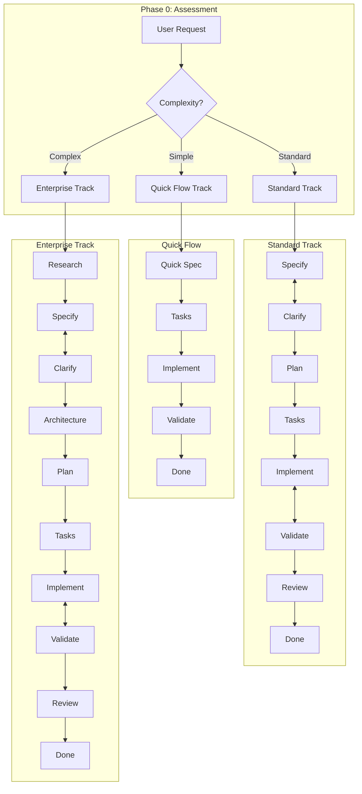

# Prism OS: AI Development Operating System

> A unified framework for spec-driven software development with Claude Code, designed for non-technical users.

---

## 1. Purpose & Audience

### Who This Is For

**Primary Users:** Product Managers, Business Analysts, Project Managers, and other non-technical stakeholders who need to direct AI-assisted software development without deep technical expertise.

**Secondary Users:** Developers and technical leads who want structured workflows that produce consistent, high-quality output.

### What This Solves

Traditional AI coding tools require users to think like developers—understanding file structures, choosing implementation approaches, and validating technical decisions. Prism inverts this: you describe *what* you want in plain language, and the system handles *how* to build it.

### Success Criteria

Prism succeeds when:

1. **A PM can request a feature** using natural language and receive a structured specification for review before any code is written
2. **Technical decisions are presented** as clear options with trade-offs, not assumed
3. **Work progresses through visible stages** with explicit approval gates
4. **Quality is validated automatically** before human review is needed
5. **Context is preserved** across sessions via project files, not user memory

### What This Is NOT

- Not a replacement for developers (it orchestrates AI agents, which still need human oversight)
- Not fully autonomous (humans approve specs, plans, and deployments)
- Not a project management tool (integrates with your existing tools, doesn't replace them)

---

## 2. Core Principles

These principles guide every decision in Prism. They are synthesized from the best patterns across 7 analyzed frameworks.

### Principle 1: Spec-First Development

> "Specifications are the source of truth. Code is generated from specs, not the other way around."

**What this means:** Before any code is written, there is a written specification that describes what will be built, why it matters, and what success looks like. If the spec is wrong, the code will be wrong—so we invest in getting the spec right.

**Source:** spec-kit (GitHub), agent-os

### Principle 2: Guided Decision-Making

> "Non-technical users should never face a technical choice without context."

**What this means:** When a technical decision is needed (framework choice, architecture pattern, security approach), the system presents options in plain language with trade-offs. Users choose based on business needs; the system handles technical implementation.

**Source:** BMAD-METHOD, cc-dev-team-agents

### Principle 3: Scale-Adaptive Tracks

> "The right amount of process for the right size of work."

**What this means:** A bug fix doesn't need a 30-page PRD. A new product doesn't ship with a 5-minute spec. Prism automatically selects the appropriate workflow depth based on complexity assessment.

| Track | For | Workflow Depth |
|-------|-----|----------------|
| **Quick Flow** | Bug fixes, small tweaks, well-understood changes | Lightweight spec → Tasks → Implement |
| **Standard** | Features, enhancements, moderate complexity | Full spec → Clarify → Plan → Tasks → Implement → Validate |
| **Enterprise** | New systems, architectural changes, compliance-heavy work | Extended spec → Research → Architecture → Plan → Tasks → Implement → Validate → Review |
| **Discovery** | Greenfield projects, new tech stack decisions | Problem → Constraints → Options → Decision → Foundation Doc |

**Source:** BMAD-METHOD, spec-kit

### Discovery Track

For greenfield projects without established tech stack or architecture.

**Entry Criteria:**
- User says "new project," "new idea," or "starting from scratch"
- No existing tech stack context provided
- User asks "what tech should I use?"

**Flow:**
```
PROBLEM → CONSTRAINTS → OPTIONS → DECISION → FOUNDATION DOC
```

**Phases:**
1. Problem Clarity — Define what we're solving and for whom
2. Constraints Gathering — Budget, timeline, team skills, compliance, scale
3. Tech Stack Options — Present 2-3 viable options as decision matrix
4. Decision Capture — Document chosen stack in Project Foundation format
5. Transition — Hand off to Standard track with foundation context

**Output:** `project-foundation.md` serving as context for all subsequent specs.

**Chain Definition:** `.claude/chains/discovery-chain.md`

### Principle 4: Constitutional Boundaries

> "Project rules are defined once and enforced always."

**What this means:** Each project has a constitution—immutable principles that guide all decisions. "We use TypeScript, not JavaScript." "All APIs require authentication." "No external dependencies without security review." The AI agents respect these boundaries without being reminded.

**Source:** spec-kit

### Principle 5: Human-in-the-Loop, Not Human-in-the-Way

> "Automate the routine. Pause for the consequential."

**What this means:** Not every action needs approval. Prism uses a three-tier model:
- **Auto:** Safe, reversible actions within approved scope
- **Review:** Changes to scope, design, or approach (async review, work continues)
- **Approve:** Production deployments, security changes, data migrations (work pauses until approved)

**Source:** cc-dev-team-agents, Auto-Claude

### Principle 6: Visible Progress

> "If you can't see it, you can't manage it."

**What this means:** Non-technical users can see exactly where work stands: which phase, which task, what's blocking. No black-box AI that emerges with code after hours of silence.

**Source:** BMAD-METHOD, agent-os

### Principle 7: Accessibility by Default

> "Build for everyone from the start, not as an afterthought."

**What this means:** All generated code, interfaces, and documentation meet WCAG 2.1 AA standards as a minimum, with AAA as the target where feasible. Accessibility is validated during the QA phase—not bolted on at the end.

**Requirements enforced:**
- Sufficient color contrast (4.5:1 for normal text, 3:1 for large text)
- Full keyboard navigation support
- Screen reader compatibility
- Visible focus indicators
- Proper form labels and error messages
- Semantic HTML structure

**Source:** Prism (synthesized requirement for inclusive design)

---

## 3. Workflow Model

### Overview



### Phase Definitions

#### Phase 0: Assessment (All Tracks)
**Purpose:** Determine the right workflow depth for the request.

**Entry:** User describes what they want to build.

**Process:**
1. `complexity-assessor` skill analyzes the request
2. Considers: scope, affected systems, risk level, unknowns
3. Recommends track (Quick/Standard/Enterprise)
4. User confirms or overrides

**Exit:** Track selected, workflow begins.

**Human Tier:** Auto (recommendation) + Review (confirmation)

---

#### Phase 1: Specify
**Purpose:** Convert user intent into a structured specification.

**Entry:** Track confirmed, user description available.

**Process:**
1. `spec-writer` skill creates specification from description
2. References constitution for project constraints
3. Analyzes any provided visuals (mockups, wireframes)
4. Produces `/specs/###-feature/spec.md`

**Exit:** Specification document with requirements, user scenarios, success criteria.

**Artifacts:**
- `spec.md` — Feature specification
- Ambiguity flags (if any)

**Human Tier:** Review (user reviews spec before proceeding)

---

#### Phase 2: Clarify
**Purpose:** Reduce ambiguity through structured Q&A.

**Entry:** Specification exists with identified ambiguities.

**Process:**
1. `clarifier` skill generates targeted questions
2. Questions categorized by type (scope, behavior, edge cases, etc.)
3. User provides answers
4. Specification updated with clarifications
5. Loop until all ambiguities resolved (max 3 iterations)

**Exit:** Clarified specification with no blocking ambiguities.

**Artifacts:**
- `clarifications.md` — Q&A record
- Updated `spec.md`

**Human Tier:** Auto (question generation) + user provides answers

---

#### Phase 3: Plan
**Purpose:** Create component design and technical implementation plan from clarified spec.

**Entry:** Clarified specification.

**Process:**
1. **If feature has UI components:**
   - `uiux-designer` agent determines framework (if not in constitution)
   - `ux-patterns` skill creates user flows
   - `ui-designer` skill creates component hierarchy
   - `accessibility` skill generates WCAG requirements
   - User reviews and approves design
2. `researcher` skill investigates unknowns (parallel)
3. `technical-planner` skill creates implementation plan (with UI framework as constraint)
4. Constitution gates checked (simplicity, anti-abstraction, integration-first, accessibility)
5. `adr-writer` skill documents significant decisions

**Exit:** Component design (if applicable) and technical plan with file changes, dependencies, and risk assessment.

**Artifacts:**
- `design.md` — Component architecture and UX patterns (if UI feature)
- `accessibility.md` — WCAG requirements (if UI feature)
- `plan.md` — Implementation plan
- `research.md` — Research findings (if applicable)
- `data-model.md` — Data changes (if applicable)
- `adr/` — Architecture Decision Records (if applicable)

**Human Tier:** Review (user reviews design + plan, approves approach)

---

#### Phase 4: Tasks
**Purpose:** Break plan into executable work items.

**Entry:** Approved implementation plan.

**Process:**
1. `task-decomposer` skill creates task breakdown
2. Tasks organized by phase (Setup, Foundation, Feature, Testing)
3. Dependencies identified
4. Parallelization opportunities marked

**Exit:** Task list ready for implementation.

**Artifacts:**
- `tasks.md` — Task breakdown with IDs, dependencies, phases

**Human Tier:** Auto (if ≤20 tasks) / Review (if >20 tasks)

---

#### Phase 5: Implement
**Purpose:** Execute tasks to produce working code.

**Entry:** Task list available.

**Process:**
1. Developer agent receives first task
2. Writes code using Claude Code capabilities
3. Follows test-first pattern (tests fail → implement → tests pass)
4. Marks task complete, proceeds to next
5. Repeats until all tasks done

**Exit:** Code implemented for all tasks.

**Artifacts:**
- Source code changes
- Test files
- Task status updates

**Human Tier:** Auto (within approved scope)

---

#### Phase 6: Validate
**Purpose:** Automated quality assurance.

**Entry:** Implementation complete for a task or feature.

**Process:**
1. `qa-validator` skill runs checks:
   - Tests pass
   - Lint/type checks pass
   - Requirements covered
   - No regressions
2. If issues found, `qa-fixer` skill attempts remediation
3. Loop max 5 times
4. Escalate to human if still failing

**Exit:** All quality checks pass, or escalated to human.

**Artifacts:**
- `qa/task-###-validation.md` — Validation reports

**Human Tier:** Auto (validation) / Review (if escalated)

---

#### Phase 7: Review
**Purpose:** Human-involved quality gates before completion.

**Entry:** Validation passed.

**Process:**
1. `code-reviewer` skill performs code review
2. `security-reviewer` skill checks security (if applicable)
3. Results summarized for human review
4. Human approves or requests changes

**Exit:** Approved for merge/deployment.

**Artifacts:**
- Review summaries
- Approval record

**Human Tier:** Review (code) / Approve (production deployment)

---

## 4. Agent Team Architecture

### The Core Team

Prism OS uses 9 specialized agents. Each has clear responsibilities, trigger words for automatic invocation, and defined phase assignments.

```
┌─────────────────────────────────────────────────────────────────────┐
│                         ORCHESTRATOR                                 │
│            Routes requests, manages workflow, tracks progress        │
└─────────────────────────────────────────────────────────────────────┘
                                  │
          ┌───────────────────────┼───────────────────────┐
          │                       │                       │
          ▼                       ▼                       ▼
┌───────────────────┐   ┌─────────────────┐   ┌─────────────────┐
│  BUSINESS ANALYST │   │  UI/UX DESIGNER │   │    ARCHITECT    │
│   Specs, Clarity  │   │ Components, A11y│   │  Design, Plans  │
└───────────────────┘   └─────────────────┘   └─────────────────┘
          │                       │                       │
          └───────────────────────┼───────────────────────┘
                                  │
                    ┌─────────────┴─────────────┐
                    │                           │
                    ▼                           ▼
          ┌─────────────────┐         ┌─────────────────────┐
          │   TASK PLANNER  │         │      DEVELOPER      │
          │  Tasks, Stories │         │   Implementation    │
          └─────────────────┘         └─────────────────────┘
                                              │
          ┌───────────────────────────────────┼───────────────────────┐
          │                                   │                       │
          ▼                                   ▼                       ▼
┌─────────────────┐               ┌─────────────────┐     ┌─────────────────┐
│   QA ENGINEER   │               │    SECURITY     │     │     DEVOPS      │
│   Validation    │               │  Security Review│     │   Deployment    │
└─────────────────┘               └─────────────────┘     └─────────────────┘
```

### Agent Definitions

#### Orchestrator
**Role:** Traffic controller and progress tracker.

**Responsibilities:**
- Route incoming requests to appropriate agents
- Track workflow state and phase transitions
- Provide status updates to users
- Escalate when work is blocked

**Trigger Words:** "help", "start", "status", "what should", "where are we"

**Active Phases:** All

**Skills Invoked:** `complexity-assessor`

**Tools:** Read, Glob, Grep (read-only assessment)

---

#### Business Analyst
**Role:** Requirements expert and spec author.

**Responsibilities:**
- Gather requirements from user descriptions
- Create and maintain specifications
- Drive clarification conversations
- Ensure specs are complete before planning

**Trigger Words:** "feature", "requirement", "user story", "spec", "I want", "we need"

**Active Phases:** Specify, Clarify

**Skills Invoked:** `spec-writer`, `clarifier`, `visual-analyzer`

**Tools:** Read, Write, Edit, Glob, Grep

---

#### UI/UX Designer
**Role:** Component designer, UX specialist, and accessibility champion.

**Responsibilities:**
- Determine UI framework based on target platforms
- Design component hierarchies and structures
- Define UX patterns and user flows
- Ensure accessibility (WCAG 2.1 AA minimum)
- Integrate with Figma when available
- Analyze existing design systems for consistency

**Trigger Words:** "design", "UI", "UX", "component", "layout", "screen", "mockup", "wireframe", "accessible", "Figma"

**Active Phases:** Plan (before Architect)

**Skills Invoked:** `framework-selector`, `ux-patterns`, `ui-designer`, `accessibility`, `design-system-reader`, `figma-review`

**Tools:** Read, Write, Edit, Glob, Grep, WebFetch, WebSearch

---

#### Architect
**Role:** Technical designer and decision maker.

**Responsibilities:**
- Research technical approaches
- Create implementation plans
- Document architecture decisions (ADRs)
- Validate against constitution gates

**Trigger Words:** "architecture", "design", "how should", "approach", "technical", "system"

**Active Phases:** Plan (primary), Research (Enterprise track)

**Skills Invoked:** `technical-planner`, `researcher`, `adr-writer`

**Tools:** Read, Write, Edit, Bash, Glob, Grep, WebFetch, WebSearch

---

#### Task Planner
**Role:** Work breakdown and sprint coordination.

**Responsibilities:**
- Break plans into executable tasks
- Identify dependencies and parallelization
- Prepare stories for implementation
- Track task completion

**Trigger Words:** "break down", "tasks", "sprint", "stories", "backlog", "prioritize"

**Active Phases:** Tasks

**Skills Invoked:** `task-decomposer`, `story-preparer`, `sprint-planner`

**Tools:** Read, Write, Edit, Glob, Grep

---

#### Developer
**Role:** Code implementation specialist.

**Responsibilities:**
- Write code to fulfill tasks
- Follow test-first patterns
- Fix bugs and issues
- Implement QA fixes when needed

**Trigger Words:** "implement", "build", "code", "fix", "bug", "write"

**Active Phases:** Implement, Validate (fixes)

**Skills Invoked:** Native Claude Code capabilities (not skill-based)

**Tools:** Read, Write, Edit, Bash, Glob, Grep

---

#### QA Engineer
**Role:** Quality assurance and validation.

**Responsibilities:**
- Run automated quality checks
- Verify requirements coverage
- Identify and categorize issues
- Coordinate fix loops

**Trigger Words:** "test", "validate", "check", "quality", "QA", "regression"

**Active Phases:** Validate

**Skills Invoked:** `qa-validator`, `qa-fixer`

**Tools:** Read, Write, Edit, Bash, Glob, Grep

---

#### Security
**Role:** Security review and vulnerability assessment.

**Responsibilities:**
- Review code for security issues
- Check for OWASP vulnerabilities
- Validate authentication/authorization
- Assess dependency security

**Trigger Words:** "security", "vulnerability", "auth", "OWASP", "secure", "credentials"

**Active Phases:** Review

**Skills Invoked:** `security-reviewer`

**Tools:** Read, Grep, Glob, Bash (read-heavy, limited write)

---

#### DevOps
**Role:** Deployment and infrastructure.

**Responsibilities:**
- Manage CI/CD pipelines
- Validate deployment readiness
- Handle infrastructure changes
- Coordinate releases

**Trigger Words:** "deploy", "CI/CD", "pipeline", "infrastructure", "release", "production"

**Active Phases:** Review (deployment)

**Skills Invoked:** `deploy-checker`

**Tools:** Read, Write, Edit, Bash, Glob, Grep

---

### Delegation Protocol

When Claude receives a request:

1. **Orchestrator analyzes** the request context and keywords
2. **Matches trigger words** to determine primary agent
3. **Delegates to agent** with full context
4. **Agent executes** within its phase and tool permissions
5. **Returns results** to Orchestrator for status tracking

### Trigger-Based Routing

The Orchestrator routes requests based on trigger words and workflow context.

#### Trigger Word Matrix

| Agent | Primary Triggers | Secondary Triggers | Priority |
|-------|------------------|-------------------|----------|
| **Business Analyst** | "feature", "requirement", "spec" | "I want", "we need", "user story" | High |
| **UI/UX Designer** | "UI", "UX", "component", "design" | "layout", "screen", "mockup", "Figma", "accessible" | High |
| **Architect** | "architecture", "technical", "system" | "how should", "approach" | High |
| **Security** | "security", "vulnerability", "auth" | "OWASP", "secure", "credentials" | High |
| **Task Planner** | "break down", "tasks", "sprint" | "stories", "backlog", "prioritize" | Medium |
| **Developer** | "implement", "build", "code" | "fix", "bug", "write" | Medium |
| **QA Engineer** | "test", "validate", "quality" | "check", "QA", "regression" | Medium |
| **DevOps** | "deploy", "CI/CD", "pipeline" | "infrastructure", "release", "production" | Medium |
| **Orchestrator** | "help", "status", "start" | "what should", "where are we" | Fallback |

#### Routing Precedence

1. **Explicit triggers** — If request matches primary trigger, route directly
2. **Phase context** — If in active phase, prefer phase owner:
   - Specify/Clarify → Business Analyst
   - Design (UI features) → UI/UX Designer
   - Plan → Architect
   - Tasks → Task Planner
   - Implement → Developer
   - Validate → QA Engineer
   - Review → Security/DevOps
3. **Specificity** — More specific match wins over general match
4. **Fallback** — If unclear, Orchestrator asks for clarification

#### Ambiguous Request Handling

When a request matches multiple agents:

```
Option A: Route to phase owner (if in active phase)
Option B: Route to most specific keyword match
Option C: Ask user to clarify intent
```

**Default:** Option B (reduces friction), with Option C for truly ambiguous cases.

Example:
- "Test the security" → QA Engineer (more specific: "test")
- "Security test results" → Security (context: security-focused)
- "Make it more secure and faster" → Ask: "Security review or performance optimization?"

### Escalation Protocol

Escalation occurs when:
- Agent encounters a blocker it cannot resolve
- Work requires skills outside agent's scope
- Human approval is required per tier classification
- Maximum retry/loop limits are reached

**Escalation Path:**
```
Agent → Orchestrator → Human (with context summary)
```

### Handoff Protocol

When work transitions between agents, use the standardized handoff format. Full template at `/templates/handoff-template.md`.

#### Standard Handoff Structure

```markdown
## Handoff: [Source Agent] → [Target Agent]

**Feature:** [Name]
**Phase Transition:** [From] → [To]

### Completed
- [Summary of work done]

### Artifacts
- [Files created/modified with paths]

### For Your Action
- [Specific next steps for receiving agent]

### Context
- [Relevant decisions, constraints, or concerns]

### State Transfer
{JSON with chain_id, spec_path, track, iteration counts}
```

#### Standard Transitions

| From | To | Trigger | Key Data |
|------|-----|---------|----------|
| Business Analyst | Architect | Spec complete | spec.md, clarifications.md |
| Architect | Task Planner | Plan approved | plan.md, ADRs |
| Task Planner | Developer | Tasks ready | tasks.md, first task |
| Developer | QA Engineer | Task complete | changed files, tests |
| QA Engineer | Security/DevOps | Validation passed | validation report |

#### Handoff Validation

Receiving agent must verify:
- All artifacts exist and accessible
- Context sufficient to proceed
- No blocking issues
- Format complete

If validation fails, return handoff with specific issues.

---

## 5. Spec Templates

### Philosophy

Templates should be **concise by default** with **optional extended sections**. A PM should be able to fill out the core template in 10 minutes. Extended sections are available for complex features but never required.

### Template Location

```
/templates/
├── spec-template.md          # Feature specification
├── plan-template.md          # Implementation plan
├── tasks-template.md         # Task breakdown
├── constitution-template.md  # Project principles
├── adr-template.md           # Architecture decisions
├── handoff-template.md       # Agent-to-agent transitions
└── prompts/                  # Guided prompt scripts
    ├── spec-prompts.md       # Questions to elicit spec content
    ├── plan-prompts.md       # Questions for planning
    ├── clarify-prompts.md    # Clarification question templates
    └── constitution-prompts.md # Project setup questions
```

### Core Spec Template

```markdown
# Feature Specification: [FEATURE NAME]

## Summary
[2-3 sentence description of what this feature does and why it matters]

## User Scenarios

### P1 (Must Have)
- [ ] **US-001:** As a [user type], I want [capability] so that [benefit]
- [ ] **US-002:** ...

### P2 (Should Have)
- [ ] **US-003:** ...

### P3 (Nice to Have)
- [ ] **US-004:** ...

## Requirements

### Functional Requirements
| ID | Requirement | Priority | Acceptance Criteria |
|----|-------------|----------|---------------------|
| FR-001 | [What the system must do] | P1 | [How to verify] |
| FR-002 | ... | ... | ... |

### Key Entities
- **[Entity Name]:** [Description and key attributes]

## Success Criteria
- [ ] [Measurable outcome 1]
- [ ] [Measurable outcome 2]

## Out of Scope
- [Explicitly excluded item 1]
- [Explicitly excluded item 2]

---
<!-- Extended sections below are optional -->

## Technical Constraints (Optional)
[Any known technical limitations or requirements]

## Dependencies (Optional)
[External systems, APIs, or features this depends on]

## Security Considerations (Optional)
[Authentication, authorization, data sensitivity notes]

## Visual References (Optional)
[Links to mockups, wireframes, or design files]
```

### Constitution Template

```markdown
# Project Constitution: [PROJECT NAME]

> These principles are immutable. All agents respect these boundaries.

## Article 1: Technology Stack
- **Language:** [e.g., TypeScript]
- **Framework:** [e.g., Next.js]
- **Database:** [e.g., PostgreSQL]
- **Rationale:** [Why these choices]

## Article 2: Code Standards
- [Standard 1: e.g., "All functions must have explicit return types"]
- [Standard 2: e.g., "No `any` types except in test files"]

## Article 3: Testing Requirements
- [Requirement 1: e.g., "All public functions must have unit tests"]
- [Requirement 2: e.g., "Integration tests required for API endpoints"]

## Article 4: Security Mandates
- [Mandate 1: e.g., "All API endpoints require authentication"]
- [Mandate 2: e.g., "No secrets in code; use environment variables"]

## Article 5: Architecture Principles
- [Principle 1: e.g., "Prefer composition over inheritance"]
- [Principle 2: e.g., "No direct database access from UI components"]

## Article 6: Approval Requirements
- [Requirement 1: e.g., "New dependencies require security review"]
- [Requirement 2: e.g., "Database migrations require DBA approval"]

## Article 7: Accessibility Requirements
- **Minimum Standard:** WCAG 2.1 Level AA compliance
- **Target Standard:** WCAG 2.1 Level AAA where feasible
- **Color Contrast:** Minimum 4.5:1 for normal text, 3:1 for large text and UI components
- **Keyboard Navigation:** All interactive elements must be keyboard accessible
- **Screen Reader Support:** Proper ARIA labels, roles, and live regions
- **Focus Management:** Visible focus indicators on all interactive elements
- **Form Accessibility:** All inputs must have associated labels; errors must be announced
- **Semantic Structure:** Use proper heading hierarchy and landmark regions
- **Validation:** Accessibility checks included in QA validation phase
```

### Guided Prompts

Located in `/templates/prompts/`, these help non-technical users fill out templates through conversation.

**Example: spec-prompts.md**
```markdown
# Guided Spec Creation

## Getting Started
"Let's create a specification for your feature. I'll ask you some questions to understand what you need."

## Core Questions

### 1. The Basics
- "In one sentence, what does this feature do?"
- "Who will use this feature? (e.g., admin users, customers, internal team)"
- "Why is this feature needed? What problem does it solve?"

### 2. User Scenarios
- "Walk me through how someone would use this feature, step by step."
- "What's the most important thing this feature must do? (This becomes P1)"
- "What would be nice to have but isn't critical? (This becomes P2/P3)"

### 3. Success Criteria
- "How will you know this feature is working correctly?"
- "What would make you say 'yes, this is done'?"

### 4. Boundaries
- "What should this feature NOT do? (Helps prevent scope creep)"
- "Are there any features that sound related but aren't part of this?"

### 5. Technical Context (Optional)
- "Does this need to work with any existing systems?"
- "Are there any security or compliance requirements?"
- "Do you have mockups or designs to reference?"
```

---

## 6. Skills Framework

### Overview

Skills are reusable, chainable workflow units. Each skill has defined inputs, outputs, and can invoke other skills.

### Skill Categories

| Category | Purpose | Skills |
|----------|---------|--------|
| **Workflow** | Core development workflow | `spec-writer`, `clarifier`, `technical-planner`, `task-decomposer`, `complexity-assessor`, `handoff-packager`, `constitution-writer`, `status-reporter`, `foundation-writer`, `visual-analyzer` |
| **Design** | UI/UX design and accessibility | `framework-selector`, `ux-patterns`, `ui-designer`, `accessibility`, `design-system-reader`, `figma-review` |
| **UI Implementation** | Framework-specific UI code | `react-ui`, `react-native-ui`, `flutter-ui`, `vue-ui`, `swift-ui`, `design-skill-creator` |
| **Engineering** | Code and architecture | `adr-writer` |
| **Quality** | Validation and fixing | `qa-validator`, `qa-fixer` |
| **Review** | Code, security, deploy checks | `code-reviewer`, `security-reviewer`, `deploy-checker` |
| **Research** | Information gathering | `researcher`, `knowledge-search`, `codebase-assessment`, `problem-framing`, `constraint-discovery`, `stack-recommendation` |
| **Learning** | Institutional memory | `learning-capture`, `learning-reader`, `learning-review` |

### Skill Invocation Patterns

**1. Direct Invocation (User or Agent)**
```
/spec-writer "Add user authentication with OAuth2"
```

**2. Chain Invocation (Skill-to-Skill)**
```
spec-writer detects ambiguity → invokes clarifier → returns to spec-writer
```

**3. Trigger-Based (Automatic Routing)**
```
User says "I need a feature for..." → Orchestrator routes to Business Analyst → invokes spec-writer
```

### Skill Chain Definitions

#### Chain 1: Full Pipeline
**Use Case:** Standard and Enterprise tracks

```
complexity-assessor
       ↓
spec-writer ←→ clarifier (loop)
       ↓
technical-planner ← researcher (parallel)
       ↓
task-decomposer
       ↓
[Per Task: Developer agent → qa-validator ←→ qa-fixer (loop)]
       ↓
code-reviewer + security-reviewer (parallel)
       ↓
Complete
```

#### Chain 2: Quick Flow
**Use Case:** Bug fixes, small changes

```
complexity-assessor → quick-spec → task-decomposer → implement → qa-validator → Complete
```

#### Chain 3: Research-First
**Use Case:** New technology decisions

```
researcher (parallel) → technical-planner → adr-writer → [continue to implementation]
```

#### Chain 4: Validate → Review
**Use Case:** Quality gate before deployment

```
qa-validator
    ↓ (fail)
qa-fixer ←→ qa-validator (loop max 5)
    ↓ (pass)
code-reviewer + security-reviewer (parallel)
    ↓
deploy-checker
    ↓
Human Approval (if production)
```

### Skill Data Contracts

Each skill has explicit input/output contracts. Summary:

| Skill | Primary Input | Primary Output |
|-------|--------------|----------------|
| `spec-writer` | Feature description (string) | `/specs/###/spec.md` |
| `clarifier` | Spec path + ambiguity flags | `/specs/###/clarifications.md` |
| `technical-planner` | Spec path | `/specs/###/plan.md` |
| `task-decomposer` | Plan path | `/specs/###/tasks.md` |
| `qa-validator` | Task ID + changed files | `/specs/###/qa/validation.md` |
| `qa-fixer` | Validation report + issues | `/specs/###/qa/fix-report.md` |
| `code-reviewer` | Changed files + spec | `/specs/###/reviews/code-review.md` |
| `security-reviewer` | Changed files + constitution | `/specs/###/reviews/security-review.md` |
| `deploy-checker` | Spec + review reports | `/specs/###/reviews/deploy-readiness.md` |
| `handoff-packager` | Spec path + feature ID | `/specs/###/technical-review-package.md` |

### Adding New Skills

See `docs/extending-skills.md` for the guide on creating new skills and integrating them into chains.

---

## 7. Human Interaction Protocol

### The Three-Tier Model

| Tier | Behavior | User Experience |
|------|----------|-----------------|
| **Auto** | Agent acts immediately, logs action | User sees result in status update |
| **Review** | Agent acts, flags for async review | User reviews when convenient, work continues |
| **Approve** | Agent pauses, waits for explicit approval | User must approve before work proceeds |

### Tier Classification by Action

| Action Type | Default Tier | Escalates To |
|-------------|-------------|--------------|
| Status queries | Auto | — |
| Research tasks | Auto | — |
| Spec drafts | Review | — |
| Clarification questions | Auto (questions) | User answers |
| Plan creation | Review | Approve (if architectural) |
| Task breakdown | Auto (≤20 tasks) | Review (>20 tasks) |
| Code implementation | Auto | Review (if scope changes) |
| QA validation | Auto | Review (if escalated) |
| Code review | Review | — |
| Security review | Approve | — |
| Production deployment | Approve | — |
| Database migrations | Approve | — |
| New dependencies | Review | Approve (if security-sensitive) |

### Presenting Technical Choices

When a technical decision is needed, present it as:

```markdown
## Decision Needed: [Topic]

**Context:** [Why this decision matters, in plain language]

**Options:**

### Option A: [Name] (Recommended)
- **What it means:** [Plain language explanation]
- **Pros:** [Benefits]
- **Cons:** [Drawbacks]
- **Best for:** [When to choose this]

### Option B: [Name]
- **What it means:** [Plain language explanation]
- **Pros:** [Benefits]
- **Cons:** [Drawbacks]
- **Best for:** [When to choose this]

**My Recommendation:** Option A because [brief rationale].

**Your choice?**
```

### Escalation Triggers

Automatic escalation to human occurs when:

1. **Loop limits reached:** QA fix loop hits 5 iterations
2. **Scope change detected:** Implementation would modify files outside approved scope
3. **Constitution violation:** Proposed change violates project principles
4. **Blocking ambiguity:** Spec cannot proceed without user clarification
5. **Security concern:** Potential vulnerability detected
6. **Resource limits:** Task count exceeds thresholds

### Status Communication

Users receive status in this format:

```markdown
## Current Status

**Phase:** [Current phase]
**Track:** [Quick/Standard/Enterprise]
**Feature:** [Feature name]

### Progress
- [x] Specify — Complete
- [x] Clarify — Complete
- [ ] Plan — In Progress (70%)
- [ ] Tasks — Pending
- [ ] Implement — Pending
- [ ] Validate — Pending
- [ ] Review — Pending

### Current Activity
[What's happening right now]

### Blockers
[Any issues requiring attention, or "None"]

### Next Human Touchpoint
[What you'll need to review/approve next]
```

---

## 8. Source Attribution

Prism synthesizes patterns from 7 analyzed frameworks. Here's what came from where:

| Pattern | Source | Why Selected |
|---------|--------|--------------|
| **Spec-First Development** | spec-kit, agent-os | Fundamental to quality AI output |
| **Constitutional Principles** | spec-kit | Ensures cross-session consistency |
| **Scale-Adaptive Tracks** | BMAD-METHOD | Right-sizes methodology overhead |
| **3-Tier Human Oversight** | cc-dev-team-agents | Balances autonomy with control |
| **QA Validation Loop** | Auto-Claude | Enables autonomous quality assurance |
| **8-Agent Core Team** | cc-dev-team-agents | Maps to real engineering teams |
| **Trigger-Based Routing** | cc-dev-team-agents | Reduces cognitive load for users |
| **Agent Personas** | BMAD-METHOD | Makes agents relatable and predictable |
| **Handoff Protocol** | cc-dev-team-agents, BMAD | Clear transitions between agents |
| **Concise Spec Templates** | agent-os | Accessible without overwhelming |
| **Clarification Taxonomy** | spec-kit | Systematic ambiguity reduction |
| **Tool Permission Stratification** | awesome-subagents | Security through least privilege |
| **Specialist Pool** | awesome-subagents | Extensibility for edge cases |
| **File-Based Persistence** | BMAD-METHOD | Simple, no external infrastructure |

### Patterns Explicitly NOT Adopted

| Pattern | Source | Why Rejected |
|---------|--------|--------------|
| 137-agent default roster | awesome-subagents | Overwhelming for non-technical users |
| Graphiti memory graph | Auto-Claude, Archon | Complex setup, not essential |
| 40+ item mandatory checklist | spec-kit | Intimidating, made optional instead |
| External CLI dependencies | BMAD-METHOD | Prefer native Claude Code |
| Framework coupling (VoltAgent) | awesome-subagents | Keep system self-contained |
| Human approval every step | BMAD (strict) | Too slow, use 3-tier instead |

---

## 9. Learning Loop

### Overview

Prism captures learnings automatically as you work. This builds institutional memory that helps avoid repeating mistakes and surfaces validated patterns over time.

### How It Works

```
┌─────────────────────────────────────────────────────────────────┐
│                    Before Each Task                              │
│  ┌─────────────────────────────────────────────────────────┐    │
│  │  learning-reader loads:                                  │    │
│  │  • Patterns (rules to follow)                           │    │
│  │  • Gotchas (traps to avoid)                             │    │
│  │  • Current feature notes                                │    │
│  └─────────────────────────────────────────────────────────┘    │
└─────────────────────────────────────────────────────────────────┘
                              ↓
                    [Task Implementation]
                              ↓
┌─────────────────────────────────────────────────────────────────┐
│                    After Each Task                               │
│  ┌─────────────────────────────────────────────────────────┐    │
│  │  learning-capture records:                               │    │
│  │  • What was done (task notes)                           │    │
│  │  • Surprises encountered (gotchas)                      │    │
│  │  • Choices made (decisions)                             │    │
│  │  • Potential patterns [PATTERN?]                        │    │
│  └─────────────────────────────────────────────────────────┘    │
└─────────────────────────────────────────────────────────────────┘
```

### Learning Categories

| Category | What It Contains | Loaded |
|----------|------------------|--------|
| **Patterns** | Validated rules to follow | Always |
| **Gotchas** | Project-specific traps to avoid | Always |
| **Decisions** | Architectural choices and rationale | On demand |
| **Feature Notes** | Per-feature task details | Current feature only |

### Token Budget

Learnings are capped to preserve context:

| Category | Max Items | Est. Tokens |
|----------|-----------|-------------|
| Patterns | 30 | ~900 |
| Gotchas | 30 | ~900 |
| Decisions | 20 | ~800 |
| Feature notes | 20 per feature | ~600 |

**Typical load:** ~2,400 tokens (~3% of context)

### Lifecycle

1. **Capture** — Learnings recorded automatically after each task
2. **Reference** — Relevant learnings loaded before each task
3. **Review** — Periodic pruning and promotion via `/learn --review`
4. **Promote** — Validated patterns moved to patterns.md
5. **Archive** — Completed feature notes moved to archived/

### Manual Review

To review and clean up learnings:

```
/learn --review
```

This prompts you to:
- Promote validated pattern candidates
- Archive completed feature notes
- Remove duplicates
- Prune stale entries

### File Structure

```
/memory/learnings/
├── active/
│   ├── patterns.md       # Promoted patterns (always loaded)
│   ├── gotchas.md        # Project traps (always loaded)
│   ├── decisions.md      # Architectural choices (on demand)
│   └── features/
│       └── [feature-id].md   # Per-feature task notes
└── archived/             # Historical learnings
```

---

## Quick Reference

### Primary Command

**`/prism`** is the unified entry point for all Prism OS workflows:

| Usage | What it Does |
|-------|-------------|
| `/prism` | Show status dashboard and suggest next action |
| `/prism "description"` | Start building a new feature |
| `/prism continue` | Resume where you left off |
| `/prism status` | Detailed workflow status |
| `/prism help` | Show available commands |

**Natural language also works:** Just describe what you want!
- "I want to add user authentication"
- "Build me a dashboard"
- "What am I working on?"
- "Keep going"

### All Slash Commands

| Command | Purpose |
|---------|---------|
| `/prism` | **Unified entry point (recommended)** |
| `/spec [description]` | Create a new feature specification |
| `/clarify` | Start clarification Q&A for current spec |
| `/plan` | Generate implementation plan from spec |
| `/tasks` | Break plan into executable tasks |
| `/validate` | Run QA validation checks |
| `/status` | Show current workflow status |
| `/constitution` | View or edit project constitution |
| `/learn` | View, search, or review project learnings |
| `/prime [focus]` | Load project context for a session |
| `/handoff` | Generate implementation package for external teams or Claude Code |

### Key Files

| File | Purpose |
|------|---------|
| `/memory/constitution.md` | Project principles (immutable) |
| `/memory/project-context.md` | Current project state (used by /prism) |
| `/memory/learnings/active/patterns.md` | Validated patterns to follow |
| `/memory/learnings/active/gotchas.md` | Project-specific traps to avoid |
| `/specs/###-feature/spec.md` | Feature specification |
| `/specs/###-feature/plan.md` | Implementation plan |
| `/specs/###-feature/tasks.md` | Task breakdown |
| `/templates/` | All templates and prompts |

### Getting Help

- **"What should I do next?"** → Orchestrator provides guidance
- **"I'm stuck on..."** → Orchestrator identifies blockers and solutions
- **"Show me the status"** → Current phase, progress, next touchpoint
- **`/prism help`** → Show all available commands
