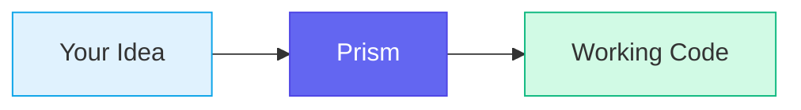
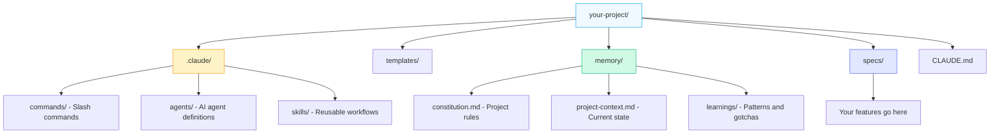
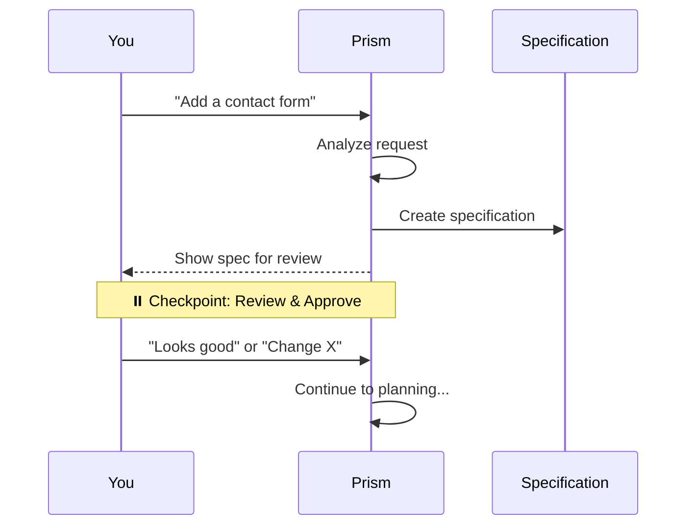
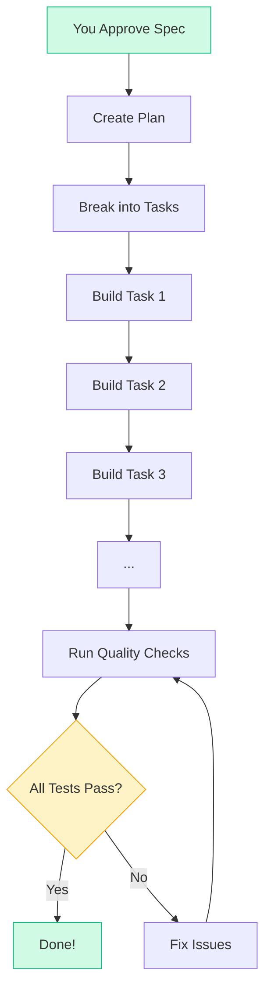
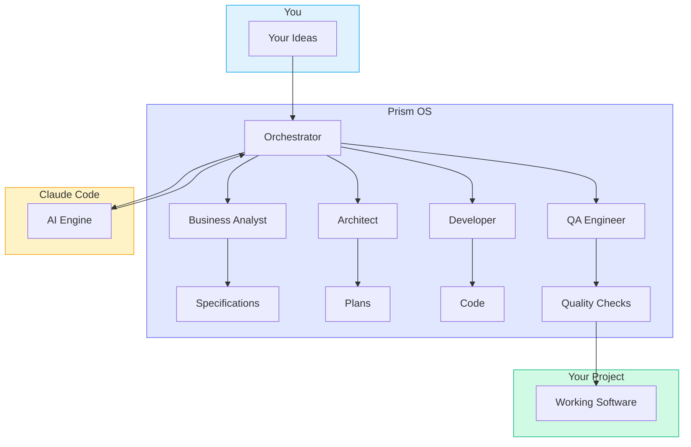
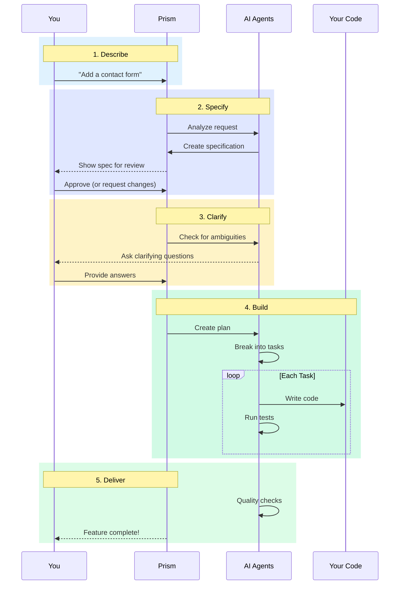

# Quick Start Guide

> Go from idea to working code in plain English. No coding required.

---

## What is Prism?

Prism is like having a technical team that speaks your language. You describe what you want to build in plain English, and Prism turns that into working software — with checkpoints along the way where you review and approve.

Think of it like this: You're the architect describing your dream house. Prism is the construction crew that builds it, but checks in with you at each major step to make sure they understood correctly.



---

## Prerequisites

Before you start, you'll need a few things installed. Don't worry — we'll show you how to check.

**Dependency chain:** Node.js → Claude Code → Prism OS

### For Claude Code (required)

#### Node.js 18+

Claude Code requires Node.js to run.

**Check if you have it:**
```bash
node --version
```

You should see `v18.x.x` or higher. If not, [download Node.js here](https://nodejs.org/).

#### Claude Code CLI

Claude Code is the AI that powers Prism. You'll need an Anthropic subscription.

| Plan | Best For |
|------|----------|
| **Claude Pro** | Personal projects, learning |
| **Claude Max** | Heavy usage, multiple projects |
| **API** | Developers, production apps |

> **Recommendation:** Start with Claude Pro. You can upgrade later if needed.
> See [anthropic.com/pricing](https://www.anthropic.com/pricing) for pricing.

**Check if installed:**
```bash
claude --version
```

If not installed:
```bash
npm install -g @anthropic-ai/claude-code
```

Then authenticate:
```bash
claude auth login
```

> **Don't have an account?** Sign up at [anthropic.com](https://anthropic.com) and subscribe to a plan.

### For Prism OS

#### Git

Git tracks changes to your code. Most developers already have it.

**Check if you have it:**
```bash
git --version
```

If you see "command not found":
- **Mac:** Install Xcode Command Line Tools: `xcode-select --install`
- **Windows:** [Download Git here](https://git-scm.com/download/win)
- **Linux:** `sudo apt install git` (Ubuntu/Debian)

#### A Project Directory

You need a directory for your project. If you don't have one yet:
```bash
mkdir my-project
cd my-project
git init
```

### Starting from Zero? (No Project Yet)

If you have an idea but no code yet — that's perfect. Prism is designed for exactly this.

```bash
mkdir my-new-app
cd my-new-app
git init
```

After installing Prism, run `/prism`. It will detect you're starting fresh and guide you through **Discovery** — a conversation that helps you choose a tech stack:

```
> /prism

I notice this is a new project. Let's set things up!
I'll ask a few questions to recommend a tech stack.

What are you building?
> A website where users can track their habits

Will users need to create accounts?
> Yes

Based on your answers, here are my recommendations:

Option A: Next.js Fullstack (Recommended)
├── TypeScript + Next.js + PostgreSQL
├── Free hosting on Vercel
└── Great for web apps with user accounts

Option B: Django Fullstack
├── Python + Django + PostgreSQL
└── Excellent for rapid development

Which option? (A/B)
> A

Great choice! Now let's complete your project constitution...
```

You don't need to know what framework or database to use — Prism recommends options based on what you're building.

---

## Installation

Installing Prism adds the AI-powered workflow system to your project.

### Step 1: Get Prism

Clone the Prism repository to a permanent location on your computer:

```bash
cd ~
git clone <REPOSITORY_URL>
```

> **What this does:** Downloads Prism to your home folder (`~/prism-os`). You only do this once, and it works for all your projects.
>
> Replace `<REPOSITORY_URL>` with the URL you received. If you're in a private beta, use the URL provided by your organization.

### Step 2: Navigate to Your Project

Open a terminal and go to your project folder:

```bash
cd ~/Projects/my-app
```

Replace `~/Projects/my-app` with your actual project path.

> **Finding Your Project Path:**
> - **Mac:** Right-click your project folder in Finder → "Get Info" → copy the path after "Where:"
> - **Windows:** Right-click folder → "Copy as path"
> - **VS Code:** Right-click folder in sidebar → "Copy Path"

### Step 3: Run the Installer

```bash
~/prism-os/install.sh --local ~/prism-os
```

> **Note:** If you cloned Prism somewhere other than `~/prism-os`, replace both paths above with your actual location.

You'll see output like this:
```
Prism OS Installer v1.0.0
━━━━━━━━━━━━━━━━━━━━━━━━━━━━━━━━━━━━━

Checking prerequisites...
✓ Git repository detected
✓ Claude Code CLI found (1.0.0)

Creating directory structure...
✓ Created .claude/ directory structure
✓ Created templates/ directory
✓ Created memory/ directory
✓ Created specs/ directory
✓ Created docs/ directory

Installing Prism OS files...
✓ Installed CLAUDE.md
✓ Installed templates/
✓ Installed .claude/ (commands, agents, skills)
✓ Created .prism-os-version
✓ Created memory/constitution.md (template)
✓ Created memory/project-context.md

━━━━━━━━━━━━━━━━━━━━━━━━━━━━━━━━━━━━━
Prism OS installed successfully!
```

### Step 4: Verify Installation

```bash
/path/to/prism-os/install.sh --verify
```

You should see checkmarks next to all required files.

### What Did Installation Create?

The installer added these folders to your project:



| Folder | What It Contains |
|--------|------------------|
| `.claude/` | The AI's instructions for each command |
| `templates/` | Document templates for specs, plans, etc. |
| `memory/` | Project rules, state, and learnings |
| `specs/` | Feature specifications you create |
| `CLAUDE.md` | The main configuration file |

---

## Initialize Your Project

Before building features, tell Prism about your project. This is a one-time setup.

### Step 1: Start Claude Code

From your project folder:
```bash
claude
```

This opens an interactive session with Claude Code. You'll see a prompt where you can type commands.

### Step 2: Set Up Project Principles

Type:
```
/constitution
```

Prism will ask questions about your project in plain language:

```
Let's set up your project constitution.
I'll ask a few questions about your preferences.

What programming language will this project use?
> TypeScript

What framework, if any?
> Next.js

What database will you use?
> PostgreSQL
```

Answer each question based on your project (or skip if unsure — you can update later).

### What This Creates

Your answers become your project's **constitution** — rules that Prism follows for all features:

```
Technology Stack
├── Language: TypeScript
├── Framework: Next.js
├── Database: PostgreSQL
└── Auth: NextAuth.js

Standards
├── Test Coverage: 60% minimum
├── Code Style: Prettier defaults
└── Accessibility: WCAG 2.1 AA
```

---

## Start Your First Feature

Now the fun part — building something!

### What `/prism` Does Automatically

The first time you run `/prism` (and every time after), Prism runs a quick preflight check. It verifies your installation is correct, sets up enforcement rules in your project's `CLAUDE.md`, and detects any stale context that needs correcting. You don't need to do anything — this happens in the background. If something needs attention, Prism tells you.

### Step 1: Describe What You Want

In your Claude Code session, just describe the feature in plain English:

```
/prism "Add a contact form where visitors can send messages to our support team"
```

Or simply type naturally:
```
I want to add a contact form to the website
```

Prism understands both.

### Step 2: Watch Prism Create the Specification

Prism analyzes your request and creates a structured specification — a detailed description of what will be built.



You'll see something like:

```
Creating specification for: Contact Form
━━━━━━━━━━━━━━━━━━━━━━━━━━━━━━━━━━━━━━━━━━━━━━━━━━━━

Track: Standard (feature with moderate complexity)

User Scenarios (P1 = Must Have)
├── US-001 [P1]: As a visitor, I can submit a message
├── US-002 [P1]: As a visitor, I see confirmation my message was sent
└── US-003 [P2]: As a visitor, I receive an email copy

Requirements
├── FR-001 [P1]: Form accepts name, email, message
├── FR-002 [P1]: Form validates email format
├── FR-003 [P1]: Success message shown on submit
└── NFR-001 [P1]: Form works on mobile devices

Does this match what you want? (Y/n)
```

### Step 3: Review and Approve

This is your checkpoint. Read through the specification and:

- **If it looks right:** Type `Y` or `yes` or just press Enter
- **If something's wrong:** Describe what needs to change
- **If you have questions:** Just ask

For example:
```
> The form should also have a phone number field

Got it. I'll add an optional phone number field to the specification.
```

### Step 4: Answer Clarification Questions

Prism may ask follow-up questions to remove ambiguity:

```
Clarification Questions
━━━━━━━━━━━━━━━━━━━━━━━━━━━━━━━━━━━━━━━━━━━━━━━━━━━━

Q1: How should the form prevent spam?
   A) CAPTCHA (user solves a puzzle)
   B) Honeypot field (invisible trap for bots) ← Recommended
   C) Rate limiting (max submissions per hour)

Your choice (A/B/C):
```

Just type your choice (like `B`). Prism updates the specification with your answer.

---

## Watch Prism Build

After you approve the specification, Prism automatically:

1. Creates an implementation plan
2. Breaks it into tasks
3. Starts building



### What You'll See in the Terminal

As Prism works, you'll see progress updates:

```
📋 Feature: Contact Form
━━━━━━━━━━━━━━━━━━━━━━━━━━━━━━━━━━━━━━━━━━━━━━━━━━━━

✅ Specification - Complete (5 requirements)
✅ Clarification - 2 questions resolved
✅ Planning      - Complete
🔄 Tasks        - 4/7 complete

Current: Building form validation logic

[████████░░░░░░░░] 57%
```

### Check Status Anytime

If you want a detailed status update:
```
/prism status
```

Or just ask:
```
What's the progress?
```

### Stepping Away?

You can close the terminal and come back later. Your progress is saved. When you return:
```bash
claude
```

Then:
```
/prism continue
```

Prism picks up exactly where it left off.

---

## Done! Now What?

When Prism finishes, you'll see:

```
✅ Feature Complete: Contact Form
━━━━━━━━━━━━━━━━━━━━━━━━━━━━━━━━━━━━━━━━━━━━━━━━━━━━

All tasks completed successfully!

Files Created:
├── src/components/ContactForm.tsx
├── src/app/api/contact/route.ts
├── src/lib/validations/contact.ts
└── tests/contact-form.test.ts

Quality Checks:
├── ✅ All tests passing (12/12)
├── ✅ No linting errors
└── ✅ Accessibility validated

Next steps:
1. Review the changes in your code editor
2. Test the feature manually
3. Commit when ready: git add . && git commit -m "Add contact form"
```

### Review the Changes

Open your code editor and look at the new files. Even if you don't understand the code, you can:
- Check that file names make sense
- See that tests exist
- Look for any comments Prism added

### Test the Feature

If your project has a development server:
```bash
npm run dev
```

Then open your browser and try the new feature.

### What Prism Learned

During implementation, Prism automatically captured lessons for future features:
- **Patterns** — Reusable rules it discovered while building
- **Gotchas** — Traps it encountered and how to avoid them
- **Decisions** — Why certain choices were made

Run `/learn` to see what was captured. These learnings help future features go smoother — Prism remembers what worked and avoids past mistakes.

### Commit Your Changes

When you're happy with the feature, save it to your project history:

```bash
git add .
git commit -m "Add contact form feature"
```

> **New to Git?** Here's what these commands do:
> - `git add .` — Stages all changed files (tells Git "I want to save these")
> - `git commit -m "..."` — Saves a snapshot with a description
>
> Think of it like saving a document, but with a note about what changed.

**Want Prism to handle commits?** Just ask:
```
Commit these changes with a good message
```

Prism will create an appropriate commit message and run the commands for you.

---

## If Something Goes Wrong

Don't worry — things don't always go perfectly. Here's how to handle common situations.

### Prism Gets Stuck

If Prism seems frozen or you're not sure what's happening:

```
/prism status
```

This shows exactly where things stand. You might see:
```
⚠️ Blocked: Waiting for clarification

Question pending: "Should the form require all fields?"
```

Just answer the question to continue.

### The Spec Doesn't Match What You Want

Before approving, you can request changes:

```
Actually, I don't want the email confirmation feature.
Just show a success message on the page.
```

Prism will update the specification and show it again for approval.

### Tests Are Failing

Prism automatically tries to fix test failures. If it can't after several attempts, you'll see:

```
⚠️ Escalation: Test failures require attention

Failing: tests/contact-form.test.ts
- Expected: Form submits successfully
- Actual: API returns 500 error

This may require manual investigation.
Options:
1. Let me try a different approach
2. Skip this test for now
3. Get help from a developer

Your choice (1/2/3):
```

Choose option 1 to let Prism try again, or option 3 if you want to involve a developer.

### You Made a Mistake

You can always start over:

```
/spec "Add a contact form"
```

This creates a new specification from scratch.

---

## Updating Prism

When new versions of Prism are released, update your installation:

### Step 1: Update the Prism Source

```bash
cd ~/prism-os
git pull
```

### Step 2: Re-run the Installer

From your project directory:
```bash
~/prism-os/install.sh --local ~/prism-os
```

The installer won't overwrite your existing specifications or constitution.

### Step 3: Verify

```bash
~/prism-os/install.sh --verify
```

---

## Command Cheat Sheet

Here's everything you need, in one place:

| Command | What It Does |
|---------|--------------|
| `/prism` | Show status and what to do next |
| `/prism "..."` | Start building a feature from your description |
| `/prism continue` | Resume work on an in-progress feature |
| `/prism status` | See detailed progress |
| `/prism help` | Show all available commands |
| `/constitution` | Set up or update project rules |
| `/learn` | View patterns and lessons Prism has learned |

### Natural Language Alternatives

You don't have to remember commands. Just say what you mean:

| Instead of... | You can say... |
|---------------|----------------|
| `/prism "Add login"` | "I want to add user login" |
| `/prism status` | "What's the progress?" |
| `/prism continue` | "Keep going" or "Next step" |
| `/prism help` | "What can you do?" |

### All Commands

The commands above cover most use cases. For direct access to individual workflow phases, see the [Command Reference](command-reference.md):

| Command | Purpose |
|---------|---------|
| `/spec` | Create specification directly |
| `/clarify` | Resolve ambiguities |
| `/plan` | Generate implementation plan |
| `/tasks` | Break plan into tasks |
| `/validate` | Run QA checks |
| `/learn --review` | Clean up and promote learnings |
| `/prime` | Load project context |

---

## How It Works (Optional Reading)

> **Skip this section** if you just want to build things. Come back when you're curious about what's happening under the hood.

<details>
<summary>Click to expand: Architecture Overview</summary>

Here's how all the pieces fit together:



**You** describe what you want in plain English.

**Prism** routes your request to specialized AI agents:
- **Business Analyst** — Turns your description into a specification
- **Architect** — Designs how the code should be structured
- **Developer** — Writes the actual code
- **QA Engineer** — Tests everything works correctly

**Claude Code** powers these agents with advanced language understanding.

**Your Project** receives working, tested code.

</details>

<details>
<summary>Click to expand: The Full Workflow</summary>

Here's the complete journey from idea to working code:



</details>

---

## What's Next?

You've built your first feature. Here's how to keep going:

- **Build another feature:** Just describe it and Prism handles the rest
- **See a complex example:** Read the [User Authentication Walkthrough](examples/user-auth-feature/README.md)
- **Learn all commands:** See the [Command Reference](command-reference.md)
- **Troubleshoot issues:** Check the [Troubleshooting Guide](troubleshooting.md)
- **Understand the terms:** Browse the [Glossary](glossary.md)

---

*You're now ready to build software with Prism. Just describe what you want — and watch it happen.*
