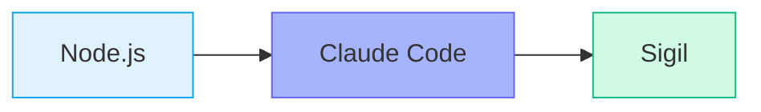
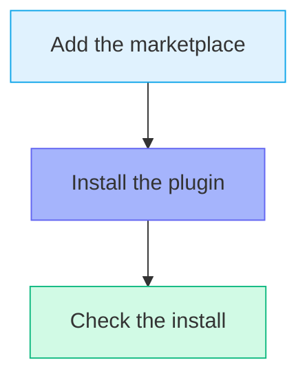
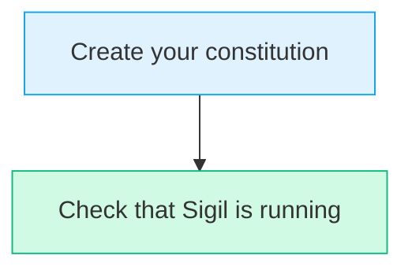

# Installation Guide

Get Sigil running on your computer in about ten minutes.

---

## What You Need First

Sigil needs two things already on your computer before you start. Think of it like stacking blocks: each piece sits on top of the last.



### Check for Node.js

Node.js (a free tool that runs programs on your computer) powers Claude Code. You need version 18 or newer.

Open your terminal (the app where you type commands) and type:

```bash
node --version
```

You should now see a number like `v18.x.x` or higher. If you get an error, [download Node.js here](https://nodejs.org/).

### Install Claude Code

Claude Code is Anthropic's AI coding assistant. Sigil runs inside it. Install it with NPM (Node Package Manager -- a tool that comes with Node.js for downloading programs):

```bash
npm install -g @anthropic-ai/claude-code
```

Next, check that it worked:

```bash
claude --version
```

You should now see a version number printed on screen.

### Sign In to Claude Code

Authentication (signing in to prove who you are) connects Claude Code to your account. You need a Claude Pro, Max, or API plan.

```bash
claude auth login
```

Follow the prompts on screen to finish signing in.

> **Note:** See [Anthropic's docs](https://docs.anthropic.com/en/docs/claude-code) for more help with setup.

---

## Install Sigil

A plugin (an add-on that gives a program new powers) is how Sigil connects to Claude Code. A marketplace (an online catalog of plugins) is where Claude Code finds it.



### From the Online Catalog

1. Add the Sigil catalog to Claude Code:

```bash
claude plugin marketplace add araserel/sigil-os
```

2. Install the Sigil add-on:

```bash
claude plugin install sigil@sigil-os
```

3. Check that it worked:

```bash
claude plugin list
```

You should now see `sigil` in the list that prints out.

### From a Local Copy

Use this if you are working on Sigil itself. Run these commands from the root folder of the sigil-os code (a repository -- a folder that tracks every change with Git):

```bash
claude plugin marketplace add ./
claude plugin install sigil@sigil-os
```

You should now see `sigil` when you run `claude plugin list`.

---

## First-Time Setup

After the install, you set up Sigil for your project. This takes about five minutes.



### Create Your Constitution

A constitution is a short file of rules that guide all work in your project. Sigil walks you through making one.

1. Start Claude Code:

```bash
claude
```

2. Run the setup command:

```
> /sigil-constitution
```

3. Answer three quick rounds of questions:
   - **Your tech stack** (auto-detected from your project)
   - **Project type** (MVP, Production, or Enterprise)
   - **Extra preferences** (optional)

Sigil fills in all the details for you based on your answers.

You should now see a new `.sigil/constitution.md` file in your project.

### Check That Sigil Is Running

Still inside Claude Code, run:

```
> /sigil status
```

You should now see the Sigil dashboard. It shows the version and all commands you can use.

---

## Quick Check

Use this list to make sure everything is ready:

- [ ] `claude --version` prints a version number
- [ ] `claude plugin list` shows `sigil`
- [ ] `/sigil status` shows the Sigil dashboard
- [ ] `.sigil/constitution.md` exists (after running `/sigil-constitution`)
- [ ] `SIGIL.md` exists at your project root (created on first run)

---

## Troubleshooting

### "Plugin not found" error

This means the catalog is missing or the add-on did not install.

Run both commands again:

```bash
claude plugin marketplace add araserel/sigil-os
claude plugin install sigil@sigil-os
```

You should now see `sigil` in the output of `claude plugin list`.

### "claude: command not found"

This means Claude Code is not installed. It might also mean your PATH (the list of folders your computer searches for programs) does not include it.

Run this to install it fresh:

```bash
curl -fsSL https://claude.ai/install.sh | sh
```

You should now be able to run `claude --version` without an error.

### "/sigil" command not recognized

The add-on may not be set up right.

1. Check what is installed: `claude plugin list`
2. If `sigil` is missing, reinstall: `claude plugin install sigil@sigil-os`
3. Close Claude Code and open it again.

You should now see `/sigil` work when you type it.

### SIGIL.md not created

The startup hook (a small script that runs each time you open Claude Code) may not have fired.

1. Start a new Claude Code session.
2. Run `/sigil` to trigger the startup check.

You should now see `SIGIL.md` in your project root folder.

### Claude Code ignores your rules

Your SIGIL.md file may be missing or out of date.

1. Delete `SIGIL.md` from your project root.
2. Start a new Claude Code session.
3. Run `/sigil` to create a fresh copy.

You should now see updated rules in the new `SIGIL.md` file.

---

## Updating Sigil

When a new version comes out, update with one command:

```bash
claude plugin update sigil@sigil-os
```

Or use the built-in command inside Claude Code:

```
/sigil-update
```

Your project files (`.sigil/`, `.sigil/specs/`) stay the same. Only the add-on parts change.

After updating:

1. Close Claude Code and open it again.
2. Run `/sigil` to refresh your rules.
3. Check the changelog for any extra steps.

You should now see the new version in `/sigil status`.

---

## Team Setup (Coming Soon)

In the future, teams will share one Sigil setup through a config (configuration -- a settings file that controls how a program behaves):

```json
{
  "plugins": {
    "sigil-os": {
      "enabled": true,
      "version": "2.0.0"
    }
  }
}
```

This file goes in `.claude/settings.json` at your project root. Team sync is planned for a later release.

---

## Next Steps

You are all set. Here is where to go from here:

1. **[Quick Start Guide](quick-start.md)** -- Build something in 30 minutes
2. **[User Guide](user-guide.md)** -- Full reference for daily use
3. **[Command Reference](command-reference.md)** -- Every command in one place

---

## Getting Help

If something is not working:

1. Read the [Troubleshooting Guide](troubleshooting.md) for common fixes.
2. Run the linter (a tool that checks your setup for problems):

```bash
python3 tools/workflow-linter.py --verbose --fix-suggestions
```

You should now see a report of any issues and how to fix them.
